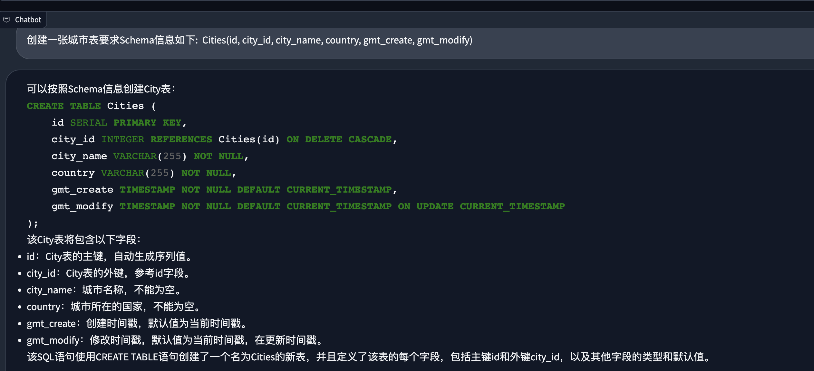

# DB-GPT

---

[中文版](README.md)

[](https://star-history.com/#csunny/DB-GPT)

A Open Database-GPT Experiment, interact your data and environment using the local GPT, no data leaks, 100% privately, 100% security.

## Features

We have currently released various features, which are listed below to showcase the capabilities that have been released so far:
- SQL language capabilities
  - SQL generation
  - SQL diagnosis
- Private domain Q&A and data processing
  - Database knowledge Q&A
  - Data processing
- Plugin model
  - Supports custom plugins to perform tasks, with native support for Auto-GPT plugins. For example:
    - Automatic SQL execution to obtain query results
    - Automatic crawling of learning knowledge
- Vector storage/indexing of knowledge base
  - Support for unstructured data
  - PDF, Markdown, CSV, WebURL


## Demo

Run on an RTX 4090 GPU. [YouTube](https://www.youtube.com/watch?v=1PWI6F89LPo)
### Run

<p align="center">
  
</p>

<p align="center">
  
</p>

### SQL Generate

1. Generate SQL based on schema information.

<p align="center">
   
</p>

2. Generate executable SQL. 
First, select the corresponding database, and then the model can generate SQL based on the corresponding database schema information. The successful execution result is demonstrated below:
<p align="center">
  
</p>

### Q&A

<p align="center">
  
</p>

1. Based on the default built-in knowledge base, question and answer.

<p align="center">
  
</p>

2. Add your own knowledge base.

<p align="center">
  
</p>

3. Learn by scraping data from the internet.
- TODO


## Architecture Design
[DB-GPT](https://github.com/csunny/DB-GPT) is an experimental open-source application that builds upon the [FastChat](https://github.com/lm-sys/FastChat) model and uses vicuna as its base model. Additionally, it looks like this application incorporates langchain and llama-index embedding knowledge to improve Database-QA capabilities. 

Overall, it appears to be a sophisticated and innovative tool for working with databases. If you have any specific questions about how to use or implement DB-GPT in your work, please let me know and I'll do my best to assist you.
<p align="center">
  
</p>

The core capabilities mainly include the following parts:

1. Knowledge base
2. LLMs management
3. Vector storage and indexing
4. Connections
5. Agent and plugins
6. Prompt generation and optimization
7. Multi-end product interface  

Below is a brief introduction to each module:

### Knowledge Base

As the most important scenario for current user needs, we natively support the construction and processing of knowledge bases. At the same time, in this project, we also provide various knowledge base management strategies, such as:
 1. Default built-in knowledge base 
 2. Customized new knowledge base 
 3. Building knowledge bases through plug-in capabilities and other usage scenarios. 

Users only need to organize their knowledge documents and use our existing capabilities to build the knowledge base required for large models.

### LLMs Management

In the underlying large model integration, we have designed an open interface that supports integration with various large models. At the same time, we have a very strict control and evaluation mechanism for the effectiveness of the integrated models. In terms of accuracy, the integrated models need to align with the capability of ChatGPT at a level of 85% or higher. We use higher standards to select models, hoping to save users the cumbersome testing and evaluation process in the process of use.

### Vector storage and indexing

In order to facilitate the management of knowledge after vectorization, we have built-in multiple vector storage engines, from memory-based Chroma to distributed Milvus. Users can choose different storage engines according to their own scenario needs. The storage of knowledge vectors is the cornerstone of AI capability enhancement. As the intermediate language for interaction between humans and large language models, vectors play a very important role in this project.

### Connections

In order to interact more conveniently with users' private environments, the project has designed a connection module, which can support connection to databases, Excel, knowledge bases, and other environments to achieve information and data exchange.

### Agent and Plugin

The ability of Agent and Plugin is the core of whether large models can be automated. In this project, we natively support the plugin mode, and large models can automatically achieve their goals. At the same time, in order to give full play to the advantages of the community, the plugins used in this project natively support the Auto-GPT plugin ecology, that is, Auto-GPT plugins can directly run in our project.

### Prompt Automatic Generation and Optimization

Prompt is a very important part of the interaction between the large model and the user, and to a certain extent, it determines the quality and accuracy of the answer generated by the large model. In this project, we will automatically optimize the corresponding prompt according to user input and usage scenarios, making it easier and more efficient for users to use large language models.

### Multi-Platform Product Interface

TODO: In terms of terminal display, we will provide a multi-platform product interface, including PC, mobile phone, command line, Slack and other platforms.

## Deployment

### 1. Hardware Requirements
As our project has the ability to achieve ChatGPT performance of over 85%, there are certain hardware requirements. However, overall, the project can be deployed and used on consumer-grade graphics cards. The specific hardware requirements for deployment are as follows:

| GPU  | VRAM Size | Performance                                 |
| --------- | --------- | ------------------------------------------- |
| RTX 4090  | 24 GB     | Smooth conversation inference        |
| RTX 3090  | 24 GB     | Smooth conversation inference, better than V100 |
| V100      | 16 GB     | Conversation inference possible, noticeable stutter |
### 2. Install

This project relies on a local MySQL database service, which you need to install locally. We recommend using Docker for installation.

```bash
$ docker run --name=mysql -p 3306:3306 -e MYSQL_ROOT_PASSWORD=aa12345678 -dit mysql:latest
```
We use [Chroma embedding database](https://github.com/chroma-core/chroma) as the default for our vector database, so there is no need for special installation. If you choose to connect to other databases, you can follow our tutorial for installation and configuration. 
For the entire installation process of DB-GPT, we use the miniconda3 virtual environment. Create a virtual environment and install the Python dependencies.
```
python>=3.10
conda create -n dbgpt_env python=3.10
conda activate dbgpt_env
pip install -r requirements.txt
```
Alternatively, you can use the following command:
```
cd DB-GPT
conda env create -f environment.yml
```
It is recommended to set the Python package path to avoid runtime errors due to package not found.
```
echo "/root/workspace/DB-GPT" > /root/miniconda3/env/dbgpt_env/lib/python3.10/site-packages/dbgpt.pth 
```


### 3. Run
You can refer to this document to obtain the Vicuna weights: [Vicuna](https://github.com/lm-sys/FastChat/blob/main/README.md#model-weights) .

If you have difficulty with this step, you can also directly use the model from [this link](https://huggingface.co/Tribbiani/vicuna-7b) as a replacement.

```bash
$ cd pilot/server
$ python vicuna_server.py
```

Run gradio webui

```bash
$ python webserver.py 
```

## Usage Instructions
We provide a user interface for Gradio, which allows you to use DB-GPT through our user interface. Additionally, we have prepared several reference articles (written in Chinese) that introduce the code and principles related to our project.
1.  [大模型实战系列(1) —— 强强联合Langchain-Vicuna应用实战](https://zhuanlan.zhihu.com/p/628750042)
2.  [大模型实战系列(2) —— DB-GPT 阿里云部署指南](https://zhuanlan.zhihu.com/p/629467580)
3.  [大模型实战系列(3) —— DB-GPT插件模型原理与使用](https://zhuanlan.zhihu.com/p/629623125)

## Thanks

- [FastChat](https://github.com/lm-sys/FastChat)
- [vicuna-13b](https://huggingface.co/Tribbiani/vicuna-13b)
- [langchain](https://github.com/hwchase17/langchain)
- [llama-index](https://github.com/jerryjliu/llama_index) and [In-Context Learning](https://arxiv.org/abs/2301.00234)

<!-- GITCONTRIBUTOR_START -->

## Contributors

|[<br/><sub><b>csunny</b></sub>](https://github.com/csunny)<br/>|[<br/><sub><b>xudafeng</b></sub>](https://github.com/xudafeng)<br/>|[<br/><sub><b>明天</b></sub>](https://github.com/yhjun1026)<br/> | [<br/><sub><b>Aries-ckt</b></sub>](https://github.com/Aries-ckt)<br/>|[<br/><sub><b>thebigbone</b></sub>](https://github.com/thebigbone)<br/>|
| :---: | :---: | :---: | :---: |:---: |


This project follows the git-contributor [spec](https://github.com/xudafeng/git-contributor), auto updated at `Sun May 14 2023 23:02:43 GMT+0800`.

<!-- GITCONTRIBUTOR_END -->

## Licence

The MIT License (MIT)
