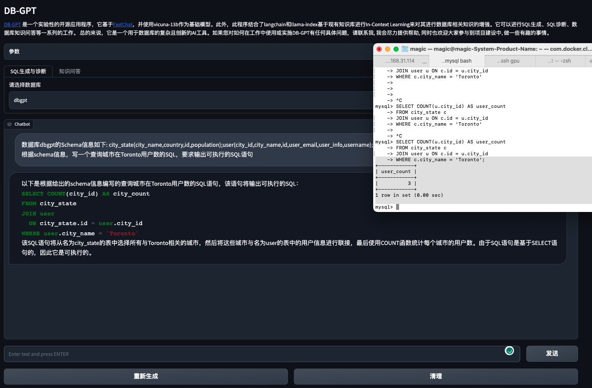
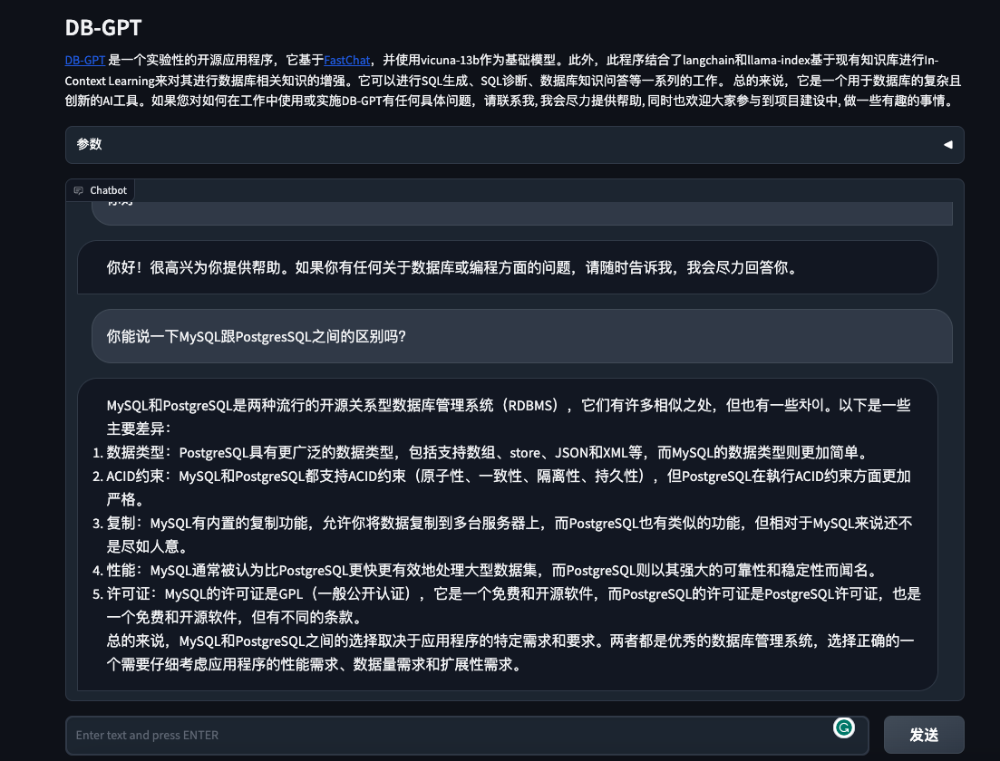
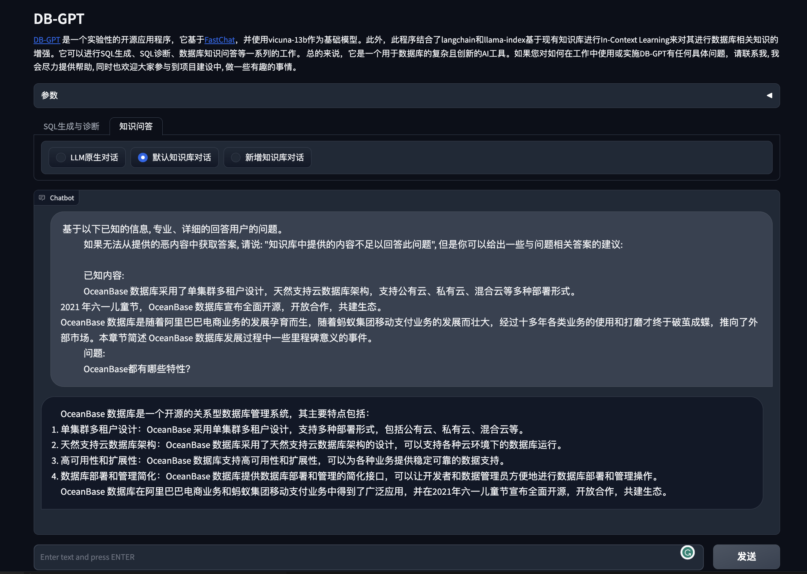

# DB-GPT

---

[中文版](README.md)

A Open Database-GPT Experiment, interact your data and environment using the local GPT, no data leaks, 100% privately, 100% security.

## Features

- SQL Project
  - SQL Generate
  - SQL-diagnosis
- Database-QA Based Knowledge 

## Architecture Design

<p align="center">
  
</p>

[DB-GPT](https://github.com/csunny/DB-GPT) is an experimental open-source application that builds upon the [FastChat](https://github.com/lm-sys/FastChat) model and uses vicuna as its base model. Additionally, it looks like this application incorporates langchain and llama-index embedding knowledge to improve Database-QA capabilities. 

Overall, it appears to be a sophisticated and innovative tool for working with databases. If you have any specific questions about how to use or implement DB-GPT in your work, please let me know and I'll do my best to assist you.

## Demo

Run on an RTX 4090 GPU (The origin mov not sped up!, [YouTube地址](https://www.youtube.com/watch?v=1PWI6F89LPo))

### Run

<p align="center">
  
</p>

### SQL Generate

First, select the DataBase, you can use Schema to generate the SQL.。

<p align="center">
  
</p>

<p align="center">
  
</p>

### Database-QA

<p align="center">
  
</p>

<p align="center">
  
</p>

## Deployment

### 1. Python Requirement

```bash
$ python>=3.9
$ pip install -r requirements.txt
```

or if you use conda envirenment, you can use this command

```bash
$ conda env create -f environment.yml
```

### 2. MySQL

In this project examples, we connect mysql and run SQL-Generate. so you need install mysql local for test. recommand docker

```bash
$ docker run --name=mysql -p 3306:3306 -e MYSQL_ROOT_PASSWORD=aa12345678 -dit mysql:latest
```

### 3. LLM

- [vicuna](https://github.com/lm-sys/FastChat/blob/main/README.md#model-weights)
- [Hugging Face](https://huggingface.co/Tribbiani/vicuna-7b)

```bash
$ cd pilot/server
$ python vicuna_server.py
```

Run gradio webui

```bash
$ python webserver.py 
```

## Thanks

- [FastChat](https://github.com/lm-sys/FastChat)
- [vicuna-13b](https://huggingface.co/Tribbiani/vicuna-13b)
- [langchain](https://github.com/hwchase17/langchain)
- [llama-index](https://github.com/jerryjliu/llama_index) and [In-Context Learning](https://arxiv.org/abs/2301.00234)

## Licence

The MIT License (MIT)
