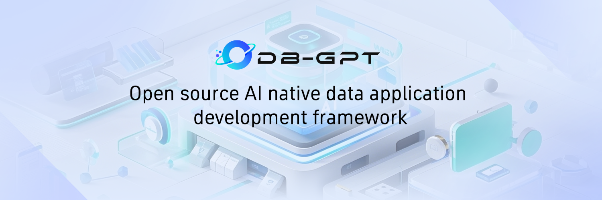

#  [translate:DB-GPT: AWEL ಮತ್ತು ಏಜೆಂಟ್ಗಳೊಂದಿಗೆ AI ನೇಟಿವ್ ಡೇಟಾ ಆಪ್ ಅಭಿವೃದ್ಧಿ ಫ್ರೇಮ್ವರ್ಕ್]

  

  

    <a href="https://github.com/eosphoros-ai/DB-GPT">
        
    </a>
    <a href="https://github.com/eosphoros-ai/DB-GPT">
        
    </a>
    <a href="http://dbgpt.cn/">
        
    </a>
    <a href="https://opensource.org/licenses/MIT">
      
    </a>
     <a href="https://github.com/eosphoros-ai/DB-GPT/releases">
      
    </a>
    <a href="https://github.com/eosphoros-ai/DB-GPT/issues">
      
    </a>
    <a href="https://x.com/DBGPT_AI">
      
    </a>
    <a href="https://medium.com/@dbgpt0506">
      
    </a>
    <a href="https://space.bilibili.com/3537113070963392">
      
    </a>
    <a href="https://join.slack.com/t/slack-inu2564/shared_invite/zt-29rcnyw2b-N~ubOD9kFc7b7MDOAM1otA">
      
    </a>
    <a href="https://codespaces.new/eosphoros-ai/DB-GPT">
      
    </a>
  

 

[**[translate:ದಾಖಲೆಗಳು]**](http://docs.dbgpt.cn/docs/overview/) | [**[translate:ನಮ್ಮನ್ನು ಸಂಪರ್ಕಿಸಿ]**](https://github.com/eosphoros-ai/DB-GPT/blob/main/README.zh.md#%E8%81%94%E7%B3%BB%E6%88%91%E4%BB%AC) | [**[translate:ಸಮುದಾಯ]**](https://github.com/eosphoros-ai/community) | [**[translate:ಲೇಖನ]**](https://arxiv.org/pdf/2312.17449.pdf)

## [translate:DB-GPT ಎಂದರೇನು?]

🤖 **[translate:DB-GPT ಒಂದು ಮುಕ್ತ ಮೂಲದ AI ನೇಟಿವ್ ಡೇಟಾ ಆಪ್ ಅಭಿವೃದ್ಧಿ ಫ್ರೇಮ್ವರ್ಕ್ ಆಗಿದ್ದು AWEL (Agentic Workflow Expression Language) ಮತ್ತು ಏಜೆಂಟ್ಗಳನ್ನು ಹೊಂದಿದೆ.]**

[translate:ಉದ್ದೇಶವು ಮಹೋಪಯೋಗಿಯಾಗದ ಮಾದರಿಗಳ ಕ್ಷೇತ್ರದಲ್ಲಿ ಮೂಲಸೌಕರ್ಯವನ್ನು ನಿರ್ಮಿಸುವುದು, ವಿವಿಧ ತಾಂತ್ರಿಕ ಸಾಮರ್ಥ್ಯಗಳಾದ ಬಹು-ಮಾದರಿ ನಿರ್ವಹಣೆ (SMMF), Text2SQL ಪರಿಣಾಮದ ಸುಧಾರಣೆ, RAG ಫ್ರೇಮ್ವರ್ಕ್ ಮತ್ತು ಸುಧಾರಣೆ, ಬಹು-ಏಜೆಂಟ್ಗಳ ಸಂಯೋಜನೆ, AWEL (ಏಜೆಂಟ್ ವರ್ಕ್‌ಫ್ಲೋ ಆಯೋಜನೆ) ಮುಂತಾದವುಗಳ ಅಭಿವೃದ್ಧಿಯ ಮೂಲಕ. ಇದರಿಂದ ದೊಡ್ಡ ಮಾದರಿ ಅಪ್ಲಿಕೇಶನ್ಗಳನ್ನು ಡೇಟಾದೊಂದಿಗೆ ಸುಲಭವಾಗಿ ಮತ್ತು ಅನುಕೂಲವಾಗಿ ನಿರ್ಮಿಸಬಹುದು.]

🚀 **[translate:ಡೇಟಾ 3.0 ಯುಗದಲ್ಲಿ, ಮಾದರಿಗಳು ಮತ್ತು ಡೇಟಾಬೇಸ್‌ಗಳ ಆಧಾರದ ಮೇಲೆ, ಸಂಸ್ಥೆಗಳು ಮತ್ತು ಡೆವಲಪರ್‌ಗಳು ಕಡಿಮೆ ಕೋಡ್‌ನಿಂದ ತಾವು ಬಯಸಿದ ಆಪ್ಲಿಕೇಶನ್ಗಳನ್ನು ನಿರ್ಮಿಸಬಹುದು.]**

### [translate:ಪರಿಚಯ]
[translate:DB-GPT ಯ ವಾಸ್ತುಶಿಲ್ಪವನ್ನು ಕೆಳಗಿನ ಚಿತ್ರದಲ್ಲಿ ತೋರಿಸಲಾಗಿದೆ:]

  

[translate:ಮುಖ್ಯ ಸಾಮರ್ಥ್ಯಗಳು ಕೆಳಗಿನ ಹಂತಗಳನ್ನು ಒಳಗೊಂಡಿವೆ:]

- **[translate:RAG (Retrieval Augmented Generation)]**: [translate:RAG ಪ್ರಸ್ತುತ ಅತ್ಯಂತ ಬಹುಪಾಲು ಜಾರಿಗೆ ಬರುವ ಹಾಗೂ ಅಗತ್ಯ ಕ್ಷೇತ್ರವಾಗಿದೆ. DB-GPT ಈಗಾಗಲೇ RAG ಆಧಾರಿತ ಫ್ರೇಮ್ವರ್ಕ್ ಅನ್ನು ಜಾರಿಗೊಳಿಸಿದ್ದು, ಬಳಕೆದಾರರು DB-GPT ನ RAG ಸಾಮರ್ಥ್ಯಗಳನ್ನು ಉಪಯೋಗಿಸಿ ಜ್ಞಾನ ಆಧಾರಿತ ಆಪ್‌ಗಳನ್ನು ನಿರ್ಮಿಸಬಹುದು.]
- **[translate:GBI (Generative Business Intelligence)]**: [translate:Generative BI DB-GPT ಯೋಜನೆಯ ಪ್ರಮುಖ ಸಾಮರ್ಥ್ಯಗಳಲ್ಲಿ ಒಂದಾಗಿದ್ದು, ಸಂಸ್ಥಾ ವರದಿ ವಿಶ್ಲೇಷಣೆ ಮತ್ತು ವ್ಯವಹಾರದಲ್ಲಿ ಬುದ್ಧಿವಂತಿಕೆಯನ್ನು ನಿರ್ಮಿಸಲು ಮೂಲ ಡೇಟಾ ತಂತ್ರಜ್ಞಾನವನ್ನು ಒದಗಿಸುತ್ತದೆ.]
- **[translate:Fine-tuning Framework]**: [translate:ಮಾದರಿ ಸೂಕ್ಷ್ಮ ಸುಧಾರಣೆ ತನ್ನದೇ ಆದ ಕ್ಷೇತ್ರಗಳಲ್ಲಿ ಅನುಷ್ಠಾನಗೊಳ್ಳಬೇಕಾದ ಅಗತ್ಯವಾದ ಸಾಮರ್ಥ್ಯವಾಗಿದೆ. DB-GPT ಸಂಪೂರ್ಣ ಸೂಕ್ಷ್ಮ ಸುಧಾರಣಾ ಫ್ರೇಮ್ವರ್ಕ್ ಅನ್ನು ನೀಡುತ್ತದೆ. ಇತ್ತೀಚಿನ ಸೂಕ್ಷ್ಮತ್ಯೂನಿಂಗ್ ಪ್ರಯತ್ನಗಳಲ್ಲಿ, Spider ಡೇಟಾಸೆಟ್ ಆಧಾರದ ಮೇಲೆ 82.5% ಶುದ್ಧತೆ ಸಾಧಿಸಲಾಗಿದೆ.]
- **[translate:ಡೇಟಾ ಆಧಾರಿತ ಬಹು-ಏಜೆಂಟ್ಸ್ ಫ್ರೇಮ್ವರ್ಕ್]**: [translate:DB-GPT ಡೇಟಾ ಆಧಾರಿತ ಸ್ವಯಂ ಬೆಳೆಯುವ ಬಹು-ಏಜೆಂಟ್ಸ್ ಮನಃಸ್ಥಿತಿಯನ್ನು ಒದಗಿಸುತ್ತದೆ, ನಿರಂತರವಾಗಿ ಡೇಟಾ ಆಧಾರದ ಮೇಲೆ ನಿರ್ಧಾರವನ್ನು ತೆಗೆದು, ಕಾರ್ಯಗತಗೊಳ್ಳುವುದು ಉದ್ದೇಶ.]
- **[translate:Data Factory]**: [translate:Data Factory roll is დიდი ಮಾದರಿಗಳ ಯುಗದಲ್ಲಿ ವಿಶ್ವಾಸಾರ್ಹ ಜ್ಞಾನ ಮತ್ತು ಡೇಟಾವನ್ನು ಸ್ವಚ್ಛಗೊಳಿಸುವುದು ಮತ್ತು ಪ್ರಕ್ರಿಯೆಗೊಳಿಸುವುದು.]
- **[translate:ಡೇಟಾ ಮೂಲಗಳು]**: [translate:ವಿವಿಧ ಡೇಟಾ ಮೂಲಗಳನ್ನು ಸಂಯೋಜಿಸುವ ಮೂಲಕ ಉತ್ಪಾದನಾ ವಿವರಣಾತ್ಮಕ ಡೇಟಾ DB-GPT ಅನ್ನು ಸಂಯೋಜಿಸುತ್ತದೆ.]

#### [translate:ಉಪಘಟಕಗಳು]
- [DB-GPT-Hub](https://github.com/eosphoros-ai/DB-GPT-Hub) [translate:Supervised Fine-Tuning (SFT) ದ್ವारा ಹೆಚ್ಚಿನ ಕಾರ್ಯಕ್ಷಮತೆಯ Text-to-SQL ವರ್ಕ್‌ಫ್ಲೋ.]
- [dbgpts](https://github.com/eosphoros-ai/dbgpts) [translate:ಇದು ಡೇಟಾ ಆಪ್ಸ್‌ಗಳು, AWEL ಆಪರೇಟರ್‌ಗಳು, AWEL ವರ್ಕ್‌ಫ್ಲೋ ಟೆಂಪ್ಲೇಟ್‌ಗಳು ಮತ್ತು ಏಜೆಂಟ್ಸ್‌ ಅನ್ನು ಹೊಂದಿರುವ ಅಧಿಕೃತ ರಿಪೊಸಿಟರಿ.]

#### [translate:DeepWiki]
- [DB-GPT](https://deepwiki.com/eosphoros-ai/DB-GPT)
- [DB-GPT-HUB](https://deepwiki.com/eosphoros-ai/DB-GPT-Hub)
- [dbgpts](https://deepwiki.com/eosphoros-ai/dbgpts)

#### [translate:Text2SQL ಸಣ್ಣಕ್ರಮಿಕತೆಯು]

| LLM | [translate:ಬೆಂಬಲಿಸಲಾಗಿದೆ] |
|:--------:|:---------:|
| LLaMA | ✅ |
| LLaMA-2 | ✅ |
| BLOOM | ✅ |
| BLOOMZ | ✅ |
| Falcon | ✅ |
| Baichuan | ✅ |
| Baichuan2 | ✅ |
| InternLM | ✅ |
| Qwen | ✅ |
| XVERSE | ✅ |
| ChatGLM2 | ✅ |

[translate:Text2SQL ಸಣ್ಣಕ್ರಮಿಕತೆ ಬಗ್ಗೆ ಹೆಚ್ಚಿನ ಮಾಹಿತಿ](https://github.com/eosphoros-ai/DB-GPT-Hub)

- [DB-GPT-Plugins](https://github.com/eosphoros-ai/DB-GPT-Plugins) [translate:Auto-GPT ಪ್ಲಗಿನ್ ಅನ್ನು ನೇರವಾಗಿ ಚಾಲನೆ ಮಾಡಲು DB-GPT ಪ್ಲಗಿನ್‌ಗಳು]
- [GPT-Vis](https://github.com/eosphoros-ai/GPT-Vis) [translate:ವಿಜುಯಲ್ ಪ್ರೋಟೋಕಾಲ್]

### [translate:AI-ನೇಟಿವ್ ಡೇಟಾ ಆಪ್]
---
- 🔥🔥🔥 [translate:V0.7.0 ಬಿಡುಗಡೆ | ಪ್ರಮುಖ ನವೀಕರಣಗಳ ಸಮೂಹ](http://docs.dbgpt.cn/blog/db-gpt-v070-release)
  - [translate:MCP ಪ್ರೋಟೋಕಾಲ್ ಬೆಂಬಲ](https://github.com/eosphoros-ai/DB-GPT/pull/2497)
  - [translate:DeepSeek R1 ಬೆಂಬಲ](https://github.com/deepseek-ai/DeepSeek-R1)
  - [translate:QwQ-32B ಬೆಂಬಲ](https://huggingface.co/Qwen/QwQ-32B)
  - [translate:ಮೂಲ ವಿಭಾಗಗಳ ಪುನರ್ ವಿನ್ಯಾಸ]
    - [dbgpt-app](./packages/dbgpt-app)
    - [dbgpt-core](./packages/dbgpt-core)
    - [dbgpt-serve](./packages/dbgpt-serve)
    - [dbgpt-client](./packages/dbgpt-client)
    - [dbgpt-accelerator](./packages/dbgpt-accelerator)
    - [dbgpt-ext](./packages/dbgpt-ext)
---

## [translate:ಇನ್ಸ್ಟಾಲೇಶನ್ / ತ್ವರಿತ ಪ್ರಾರಂಭ]

[**[translate:ಬಳಕೆ ಟ್ಯೂಟೋರಿಯಲ್]**](http://docs.dbgpt.cn/docs/overview)
- [**[translate:ವೈಸ್ಥಾಪನೆ]**](http://docs.dbgpt.cn/docs/installation)
  - [translate:Docker]
  - [translate:ಮೂಲ ಕೋಡ್]
- [**[translate:ಕ್ವಿಕ್‌ಸ್ಟಾರ್ಟ್]**](http://docs.dbgpt.cn/docs/quickstart)
- [**[translate:ಅಪ್ಲಿಕೇಶನ್]**](http://docs.dbgpt.cn/docs/operation_manual)
- [translate:ಅಭಿವೃದ್ಧಿ ಮಾರ್ಗದರ್ಶಿ](http://docs.dbgpt.cn/docs/cookbook/app/data_analysis_app_develop) 
  - [translate:ಆಪ್ ಬಳಕೆ](http://docs.dbgpt.cn/docs/application/app_usage)
  - [translate:AWEL ಫ್ಲೋ ಬಳಕೆ](http://docs.dbgpt.cn/docs/application/awel_flow_usage)
- [**[translate:ಡಿಬಗಿಂಗ್]**](http://docs.dbgpt.cn/docs/operation_manual/advanced_tutorial/debugging)
- [**[translate:ಆಧುನಿಕ ಬಳಕೆ]**](http://docs.dbgpt.cn/docs/application/advanced_tutorial/cli)
  - [translate:SMMF](http://docs.dbgpt.cn/docs/application/advanced_tutorial/smmf)
  - [translate:ಫೈನ್ ಟ್ಯೂನ್](http://docs.dbgpt.cn/docs/application/fine_tuning_manual/dbgpt_hub)
  - [translate:AWEL](http://docs.dbgpt.cn/docs/awel/tutorial)

## [translate:ವೈಶಿಷ್ಟ್ಯಗಳು]

[translate:ಪ್ರಸ್ತುತ, ನಮ್ಮ ಪ್ರಮುಖ ಸಾಮರ್ಥ್ಯಗಳನ್ನು ತೋರಿಸಲು ಕೆಲವು ಮುಖ್ಯ ವೈಶಿಷ್ಟ್ಯಗಳನ್ನು ಪರಿಚಯಿಸಲಾಗಿದೆ:]

- **[translate:ಖಾಸಗಿ ಡೊಮೇನ್ ಪ್ರಶ್ನೋತ್ತರ ಮತ್ತು ಡೇಟಾ ಸಂಸ್ಕರಣೆ]**

  [translate:DB-GPT ಯೋಜನೆ ಜ್ಞಾನಾಧಾರ ನಿರ್ಮಾಣವನ್ನು ಸುಧಾರಿಸಲು ಮತ್ತು ಸಂರಚಿತ ಹಾಗೂ ಅಸಂರಚಿತ ಡೇಟಾದ ಕಾರ್ಯಕ್ಷಮ ಸಂಗ್ರಹಣೆಯು ಮತ್ತು ಪುನರುಪಯೋಗದ ಕಾರ್ಯಗಳನ್ನು ಸಕ್ರಿಯಗೊಳಿಸಲು ವಿನ್ಯಾಸಗೊಳಿಸಲಾದ ವೈಶಿಷ್ಟ್ಯಗಳ ಪೈಕಿ ಹಲವು ಒದಗಿಸುತ್ತದೆ. ಇದರಲ್ಲಿ ಹಲವಾರು ಫೈಲ್ ಸ್ವರೂಪಗಳನ್ನು ಅಪ್‌ಲೋಡ್ ಮಾಡುವ ಅಂತರ್ನಿಹಿತ ಬೆಂಬಲ, ಕಸ್ಟಮ್ ಡೇಟಾ ಎಕ್ಸ್ಟ್ರ್ಯಾಕ್ಷನ್ ಪ್ಲಗಿನ್‌ಗಳ ಏಕೀಕರಣ ಮತ್ತು ಒಂದು ಏಕೀಕೃತ ವಕ್ಟರ್ ಸ್ಟೋರೇಜ್ ಮತ್ತು ರಿಟ್ರೀವೆಲ್ ವ್ಯವಸ್ಥೆಗಳನ್ನು ಒಳಗೊಂಡಿದೆ.]

- **[translate:ಬಹು ಡೇಟಾ ಮೂಲಗಳು ಮತ್ತು GBI (Generative Business Intelligence)]**

  [translate:DB-GPT ಯೋಜನೆ ವಿವಿಧ ಡೇಟಾ ಮೂಲಗಳಾದ Excel, ಡೇಟಾಬೇಸ್‌ಗಳು ಮತ್ತು ಡೇಟಾ ವೇರ್‌ಹೌಸ್‌ಗಳೊಂದಿಗೆ ನೈಸರ್ಗಿಕ ಭಾಷೆಯ ಸಂವಾದವನ್ನು ಅನುಗುಣಗೊಳಿಸುತ್ತದೆ. ಇದು ಈ ಮೂಲಗಳಿಂದ ಮಾಹಿತಿಯನ್ನು ವಿಚಾರಿಸುವ ಮತ್ತು ಪಡೆಯುವ ಪ್ರಕ್ರಿಯೆಯನ್ನು ಸರಳಗೊಳಿಸುತ್ತದೆ, ಬಳಕೆದಾರರಿಗೆ ಪ್ರೇರಿತ ಸಂವಾದಗಳನ್ನು ನಡೆಸಲು ಮತ್ತು ಒಳನೋಟಗಳನ್ನು ಪಡೆಯಲು ಅವಕಾಶ ನೀಡುತ್ತದೆ. ಜೊತೆಗೆ, DB-GPT ವಿಶ್ಲೇಷಣಾತ್ಮಕ ವರದಿಗಳನ್ನು ತಯಾರಿಸಲು ಸಹ ಬೆಂಬಲ ನೀಡುತ್ತದೆ, ಬಳಕೆದಾರರಿಗೆ ಬೆಲೆಬಾಳುವ ಡೇಟಾ ಸಂಗ್ರಹಣೆ ಮತ್ತು ವಿವರಣೆಗಳನ್ನು ಒದಗಿಸುತ್ತದೆ.]

- **[translate:ಬಹು ಏಜೆಂಟ್‌ಗಳು ಮತ್ತು ಪ್ಲಗಿನ್‌ಗಳು]**

  [translate:ಇದು ಕಸ್ಟಮ್ ಪ್ಲಗಿನ್‌ಗಳಿಗೆ ವಿವಿಧ ಕಾರ್ಯಗಳನ್ನು ನಿರ್ವಹಿಸಲು ಬೆಂಬಲ ನೀಡುತ್ತದೆ ಮತ್ತು Auto-GPT ಪ್ಲಗಿನ್ ಮಾದರಿಯನ್ನು ಸ್ವಾಭಾವಿಕವಾಗಿ ಏಕೀಕರಿಸುತ್ತದೆ. ಏಜೆಂಟ್ ಪ್ರೋಟೋಕಾಲ್ ಮಾನದಂಡವನ್ನು ಇದು ಪಾಲಿಸುತ್ತದೆ.]

- **[translate:ಸ್ವಯಂಯಂತ್ರಿತ Text2SQL ಫೈನ್-ಟ್ಯೂನಿಂಗ್]**

  [translate:ನಾವು Text2SQL ಡೇಟಾಸೆಟ್‌ಗಳು, LoRA/QLoRA/Pturning ಮುಂತಾದ ತಂತ್ರಗಳನ್ನು ಒಳಗೊಂಡ, LLM (Large Language Models) ಗಳ ಆಧಾರಿತ ಹಗುರವಾದ ಸ್ವಯಂಯಂತ್ರಿತ ಫೈನ್-ಟ್ಯೂನಿಂಗ್ ಪ್ರಕ್ರಿಯೆಯನ್ನು ಅಭಿವೃದ್ಧಿಪಡಿಸಿದ್ದೇವೆ. ಈ ಫ್ರೇಮ್ವರ್ಕ್ Text-to-SQL ಫೈನ್-ಟ್ಯೂನಿಂಗ್ ಅನ್ನು ಅಸೆಂಬ್ಲಿ ಲೈನ್ ಪ್ರಕ್ರಿಯೆಯಂತೆ ಸರಳಗೊಳಿಸುತ್ತದೆ.] [DB-GPT-Hub](https://github.com/eosphoros-ai/DB-GPT-Hub)

  - **[translate:SMMF (ಸೇವಾ ಆಧಾರಿತ ಬಹು-ಮಾದರಿ ನಿರ್ವಹಣಾ ಫ್ರೇಮ್ವರ್ಕ್)]**

    [translate:ನಾವು ಮುಕ್ತ ಮೂಲ ಮತ್ತು API ಏಜೆಂಟ್‌ಗಳಿಂದ ಬಂದ ಹಲವಾರು ದೊಡ್ಡ ಭಾಷಾ ಮಾದರಿಗಳಿಗೆ (LLMs) ವಿಶಾಲ ಬೆಂಬಲವನ್ನು ಒದಗಿಸುತ್ತೇವೆ, LLaMA/LLaMA2, Baichuan, ChatGLM, Wenxin, Tongyi, Zhipu ಮುಂತಾದವು ಸೇರಿದಂತೆ.]

  - [translate:ಸುದ್ದಿ:]
    <table>
      <thead>
        <tr>
          <th>[translate:ಪ್ರದಾತ]</th>
          <th>[translate:ಬೆಂಬಲಿತ]</th>
          <th>[translate:ಮಾದರಿಗಳು]</th>
        </tr>
      </thead>
      <tbody>
        <tr>
          <td align="center" valign="middle">DeepSeek</td>
          <td align="center" valign="middle">✅</td>
          <td>[translate:DeepSeek-R1], [translate:DeepSeek-V3], [translate:DeepSeek-Coder-V2-Instruct]</td>
        </tr>
        <tr>
          <td align="center" valign="middle">Qwen</td>
          <td align="center" valign="middle">✅</td>
          <td>[translate:Qwen3-235B-A22B], [translate:Qwen2.5-72B-Instruct], [translate:QwQ-32B]...</td>
        </tr>
        <tr>
          <td align="center">GLM</td>
          <td align="center">✅</td>
          <td>[translate:GLM-4-32B-0414], [translate:glm-4-9b-chat]</td>
        </tr>
        <tr>
          <td align="center">Llama</td>
          <td align="center">✅</td>
          <td>[translate:Meta-Llama-3.1-405B-Instruct], [translate:Meta-Llama-3-8B-Instruct]</td>
        </tr>
        <tr>
          <td align="center">Gemma</td>
          <td align="center">✅</td>
          <td>[translate:gemma-2-27b-it], [translate:gemma-2-9b-it]</td>
        </tr>
        <tr>
          <td align="center">Yi</td>
          <td align="center">✅</td>
          <td>[translate:Yi-1.5-9B-Chat], [translate:Yi-34B-Chat]</td>
        </tr>
        <tr>
          <td align="center">Starling</td>
          <td align="center">✅</td>
          <td>[translate:Starling-LM-7B-beta]</td>
        </tr>
        <tr>
          <td align="center">SOLAR</td>
          <td align="center">✅</td>
          <td>[translate:SOLAR-10.7B]</td>
        </tr>
        <tr>
          <td align="center">Mixtral</td>
          <td align="center">✅</td>
          <td>[translate:Mixtral-8x7B]</td>
        </tr>
        <tr>
          <td align="center">Phi</td>
          <td align="center">✅</td>
          <td>[translate:Phi-3]</td>
        </tr>
      </tbody>
    </table>

  - [translate:ಹೆಚ್ಚಿನ ಬೆಂಬಲಿತ LLMಗಳು](http://docs.dbgpt.site/docs/modules/smmf)

- **[translate:ಗೌಪ್ಯತೆ ಮತ್ತು ಭದ್ರತೆ]**

  [translate:ನಾವು ಖಾಸಗೀಕರಣಗೊಂಡ ದೊಡ್ಡ ಮಾದರಿ ಮತ್ತು ಪ್ರಾಕ್ಸಿ ಡಿಸೆನ್ಸಿಟೈಸೇಶನ್ ತಂತ್ರಜ್ಞಾನಗಳ ಮೂಲಕ ಡೇಟಾದ ಗೌಪ್ಯತೆ ಮತ್ತು ಸುರಕ್ಷತೆಯನ್ನು ಖಚಿತಪಡಿಸುತ್ತೇವೆ.]

- **[translate:ಡೇಟಾಸೋರ್ಸ್ ಬೆಂಬಲ]**
  - [translate:ಡೇಟಾಸೋರ್ಸ್‌ಗಳು](http://docs.dbgpt.cn/docs/modules/connections)

## [translate:ಚಿತ್ರಗಳು]
🌐 [translate:AutoDL ಇಮೇಜ್](https://www.codewithgpu.com/i/eosphoros-ai/DB-GPT/dbgpt)

## [translate:ಕೊಡುಗೆಗಳು]

- [translate:ಹೊಸ ಕೊಡುಗೆಗಳಿಗೆ ಸಂಬಂಧಿಸಿದ ಸವಿವರ ಮಾರ್ಗಸೂಚಿಗಳನ್ನು ನೋಡಲು, ದಯವಿಟ್ಟು “how to contribute” ಲಿಂಕ್‌ಗೆ ಭೇಟಿ ನೀಡಿ.](https://github.com/eosphoros-ai/DB-GPT/blob/main/CONTRIBUTING.md)

### [translate:ಕೊಡುಗೆದಾರರ ಭಿತ್ತಿ]
<a href="https://github.com/eosphoros-ai/DB-GPT/graphs/contributors">
  
</a>

## [translate:ಪರವಾನಗಿ]
[translate:MIT ಪರವಾನಗಿ (MIT License)]

## [translate:ಅಸ್ವೀಕರಣ]
- [translate:ಅಸ್ವೀಕರಣ](./DISCKAIMER.md)

## [translate:ಉಲ್ಲೇಖ (Citation)]
[translate:DB-GPT ಯ ವಾಸ್ತುಶಿಲ್ಪವನ್ನು ಬಲ್ಲಲು, ದಯವಿಟ್ಟು ಈ ಸಂಶೋಧನಾ ಲೇಖನಗಳನ್ನು ಉಲ್ಲೇಖಿಸಿ:]

- <a href="https://arxiv.org/abs/2312.17449" target="_blank">[translate:ಲೇಖನ 1]</a>
- <a href="https://arxiv.org/abs/2404.10209" target="_blank">[translate:ಲೇಖನ 2]</a>
- <a href="https://arxiv.org/abs/2412.13520" target="_blank">[translate:ಏಜೆಂಟ್ ಅಭಿವೃದ್ಧಿಗೆ ಸಂಬಂಧಿಸಿದ ಲೇಖನ]</a>

## [translate:ಸಂಪರ್ಕ ಮಾಹಿತಿ]

[translate:DB-GPT ಗೆ ಕೊಡುಗೆ ನೀಡಿರುವ ಪ್ರತಿಯೊಬ್ಬರಿಗೂ ಧನ್ಯವಾದಗಳು! ನಿಮ್ಮ ಕಲ್ಪನೆಗಳು, ಕೋಡ್, ಕಾಮೆಂಟ್‌ಗಳು ಮತ್ತು ಪ್ರಚಾರವು ನಮ್ಮ ಯೋಜನೆಯನ್ನು ಇನ್ನಷ್ಟು ಉತ್ತಮಗೊಳಿಸುತ್ತದೆ.]

[translate:ನಾವು ಸಮುದಾಯವನ್ನು ನಿರ್ಮಿಸುತ್ತಿದ್ದೇವೆ. ನೀವು ಯಾವುದೇ ಸಲಹೆ ಅಥವಾ ಆಲೋಚನೆಗಳನ್ನು ಹೊಂದಿದ್ದರೆ, ದಯವಿಟ್ಟು ನಮ್ಮನ್ನು ಸಂಪರ್ಕಿಸಿ.]

- [translate:Github ಸಮಸ್ಯೆಗಳು](https://github.com/eosphoros-ai/DB-GPT/issues) ⭐️ [translate:DB-GPT ಬಳಕೆ ಪ್ರಶ್ನೆಗಳಿಗಾಗಿ]
- [translate:Github ಚರ್ಚೆಗಳು](https://github.com/orgs/eosphoros-ai/discussions) ⭐️ [translate:ನಿಮ್ಮ ಅನುಭವವನ್ನು ಹಂಚಿಕೊಳ್ಳಿ]
- [translate:Twitter](https://x.com/DBGPT_AI) ⭐️ [translate:ನಮ್ಮೊಂದಿಗೆ ಸಂಪರ್ಕಿಸಲು ಹಿಂಜರಿ ಬೇಡಿ]

