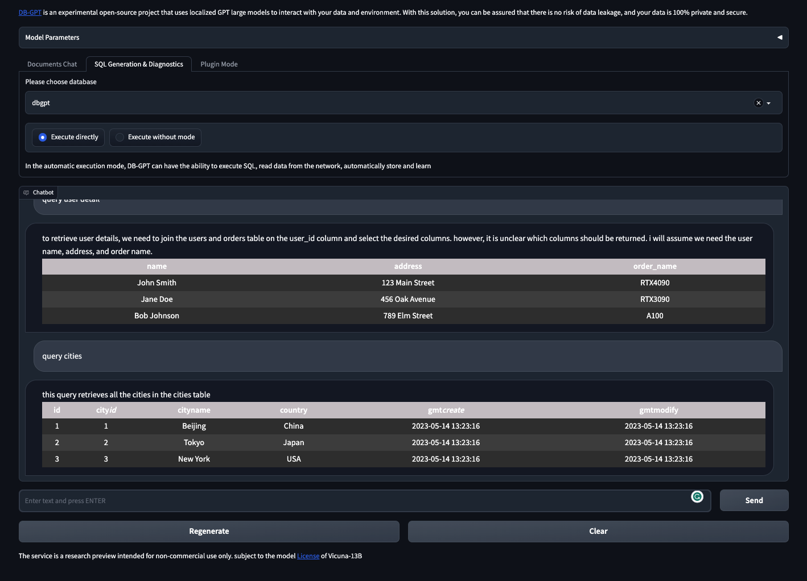
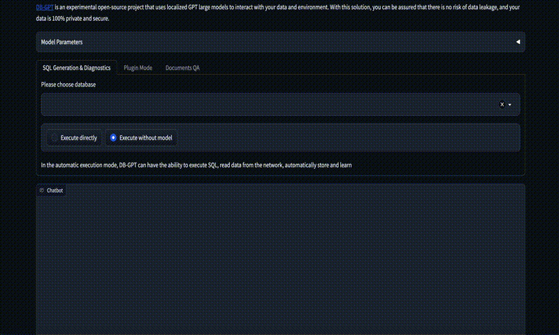
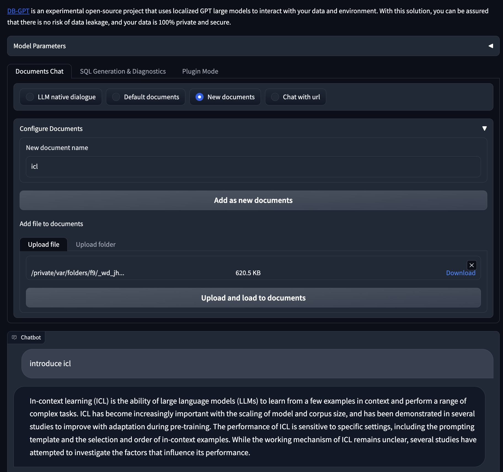
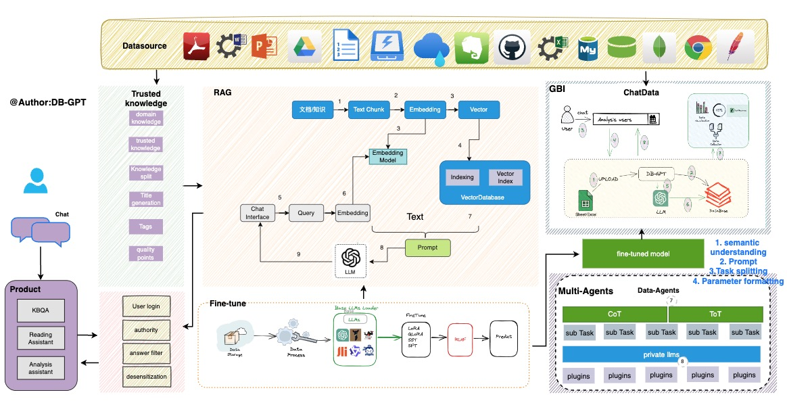

# DB-GPT: Revolutionizing Database Interactions with Private LLM Technology
 
<div align="center">
  <p>
    <a href="https://github.com/csunny/DB-GPT">
        
    </a>
    <a href="https://github.com/csunny/DB-GPT">
        
    </a>
  </p>

[**简体中文**](README.zh.md) |[**Discord**](https://discord.gg/4BNdxm5d) |[**Documents**](https://db-gpt.readthedocs.io/en/latest/)|[**Wechat**](https://github.com/csunny/DB-GPT/blob/main/README.zh.md#%E8%81%94%E7%B3%BB%E6%88%91%E4%BB%AC) 

</div>

## What is DB-GPT?

As large models are released and iterated upon, they are becoming increasingly intelligent. However, in the process of using large models, we face significant challenges in data security and privacy. We need to ensure that our sensitive data and environments remain completely controlled and avoid any data privacy leaks or security risks. Based on this, we have launched the DB-GPT project to build a complete private large model solution for all database-based scenarios. This solution supports local deployment, allowing it to be applied not only in independent private environments but also to be independently deployed and isolated according to business modules, ensuring that the ability of large models is absolutely private, secure, and controllable.

DB-GPT is an experimental open-source project that uses localized GPT large models to interact with your data and environment. With this solution, you can be assured that there is no risk of data leakage, and your data is 100% private and secure.

## News
- [2023/06/25]🔥support chatglm2-6b model. [documents](https://db-gpt.readthedocs.io/en/latest/modules/llms.html) 
- [2023/06/14] support gpt4all model, which can run at M1/M2, or cpu machine. [documents](https://db-gpt.readthedocs.io/en/latest/modules/llms.html) 
- [2023/06/01]🔥 On the basis of the Vicuna-13B basic model, task chain calls are implemented through plugins. For example, the implementation of creating a database with a single sentence.[demo](./assets/auto_plugin.gif)
- [2023/06/01]🔥 QLoRA guanaco(7b, 13b, 33b) support.
- [2023/05/28] Learning from crawling data from the Internet [demo](./assets/chaturl_en.gif)
- [2023/05/21] Generate SQL and execute it automatically. [demo](./assets/auto_sql_en.gif)
- [2023/05/15] Chat with documents. [demo](./assets/new_knownledge_en.gif)
- [2023/05/06] SQL generation and diagnosis. [demo](./assets/demo_en.gif)

## Demo

Run on an RTX 4090 GPU.

https://github.com/csunny/DB-GPT/assets/17919400/654b5a49-5ea4-4c02-b5b2-72d089dcc1f0

<!-- <video id="video" controls="" preload="auto" poster="assets/exector_sql.png">
      <source id="mp4" src="https://github.com/csunny/DB-GPT/assets/17919400/654b5a49-5ea4-4c02-b5b2-72d089dcc1f0" type="video/mp4">
</videos> -->

<p align="left">
  
</p>

<p align="left">
  
</p>

<p align="left">
  
</p>

## Features

Currently, we have released multiple key features, which are listed below to demonstrate our current capabilities:

- SQL language capabilities
  - SQL generation
  - SQL diagnosis
- Private domain Q&A and data processing
  -  Database knowledge Q&A
  - Data processing
- Plugins
  -  Support custom plugin execution tasks and natively support the Auto-GPT plugin, such as:
    - Automatic execution of SQL and retrieval of query results
    - Automatic crawling and learning of knowledge
- Unified vector storage/indexing of knowledge base
  - Support for unstructured data such as PDF, TXT, Markdown, CSV, DOC, PPT, and WebURL

- Milti LLMs Support
  - Supports multiple large language models, currently supporting Vicuna (7b, 13b), ChatGLM-6b (int4, int8), guanaco(7b,13b,33b), Gorilla(7b,13b)
  - TODO: codegen2, codet5p


## Introduction 
DB-GPT creates a vast model operating system using [FastChat](https://github.com/lm-sys/FastChat) and offers a large language model powered by [Vicuna](https://huggingface.co/Tribbiani/vicuna-7b). In addition, we provide private domain knowledge base question-answering capability through LangChain. Furthermore, we also provide support for additional plugins, and our design natively supports the Auto-GPT plugin.

Is the architecture of the entire DB-GPT shown in the following figure:

<p align="center">
  
</p>

The core capabilities mainly consist of the following parts:
1. Knowledge base capability: Supports private domain knowledge base question-answering capability.
2. Large-scale model management capability: Provides a large model operating environment based on FastChat.
3. Unified data vector storage and indexing: Provides a uniform way to store and index various data types.
4. Connection module: Used to connect different modules and data sources to achieve data flow and interaction.
5. Agent and plugins: Provides Agent and plugin mechanisms, allowing users to customize and enhance the system's behavior.
6. Prompt generation and optimization: Automatically generates high-quality prompts and optimizes them to improve system response efficiency.
7. Multi-platform product interface: Supports various client products, such as web, mobile applications, and desktop applications.


## Install 
[Quickstart](https://db-gpt.readthedocs.io/en/latest/getting_started/getting_started.html)

## Usage Instructions

- [Multi LLMs Usage](https://db-gpt.readthedocs.io/en/latest/modules/llms.html)
- [Create your own knowledge repository](https://db-gpt.readthedocs.io/en/latest/modules/knowledge.html)

We currently support many document formats: txt, pdf, md, html, doc, ppt, and url.
before execution:

```
python -m spacy download zh_core_web_sm

```
2.set .env configuration set your vector store type, eg:VECTOR_STORE_TYPE=Chroma, now we support Chroma and Milvus(version > 2.1)

3.Run the knowledge repository script in the tools directory.

```bash
& python tools/knowledge_init.py

--vector_name : your vector store name  default_value:default
--append: append mode, True:append, False: not append default_value:False
```

If nltk-related errors occur during the use of the knowledge base, you need to install the nltk toolkit. For more details, please refer to: [nltk documents](https://www.nltk.org/data.html)
Run the Python interpreter and type the commands:

```bash
>>> import nltk
>>> nltk.download()
```

## Acknowledgement

This project is standing on the shoulders of giants and is not going to work without the open-source communities. Special thanks to the following projects for their excellent contribution to the AI industry:
- [FastChat](https://github.com/lm-sys/FastChat) for providing chat services
- [vicuna-13b](https://lmsys.org/blog/2023-03-30-vicuna/) as the base model
- [langchain](https://langchain.readthedocs.io/) tool chain
- [Auto-GPT](https://github.com/Significant-Gravitas/Auto-GPT) universal plugin template
- [Hugging Face](https://huggingface.co/) for big model management
- [Chroma](https://github.com/chroma-core/chroma) for vector storage
- [Milvus](https://milvus.io/) for distributed vector storage
- [ChatGLM](https://github.com/THUDM/ChatGLM-6B) as the base model
- [llama_index](https://github.com/jerryjliu/llama_index) for enhancing database-related knowledge using [in-context learning](https://arxiv.org/abs/2301.00234) based on existing knowledge bases.

## Contribution

- Please run `black .` before submitting the code.

## Licence

The MIT License (MIT)

## Contact Information
We are working on building a community, if you have any ideas about building the community, feel free to contact us. [Discord](https://discord.gg/4BNdxm5d)

[](https://star-history.com/#csunny/DB-GPT)

