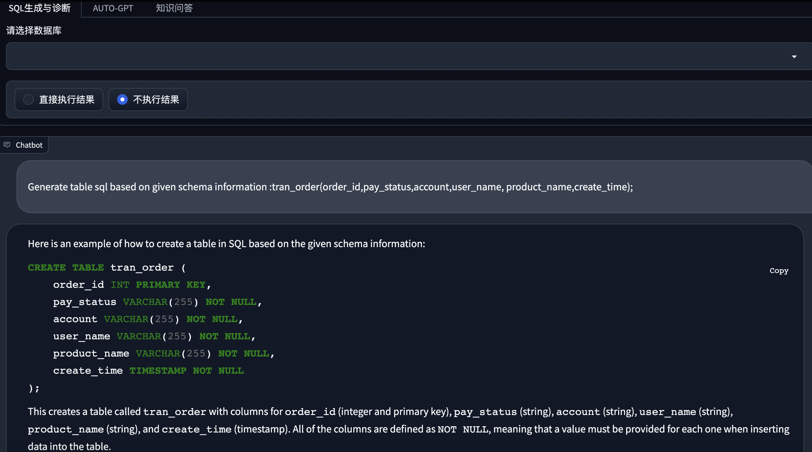
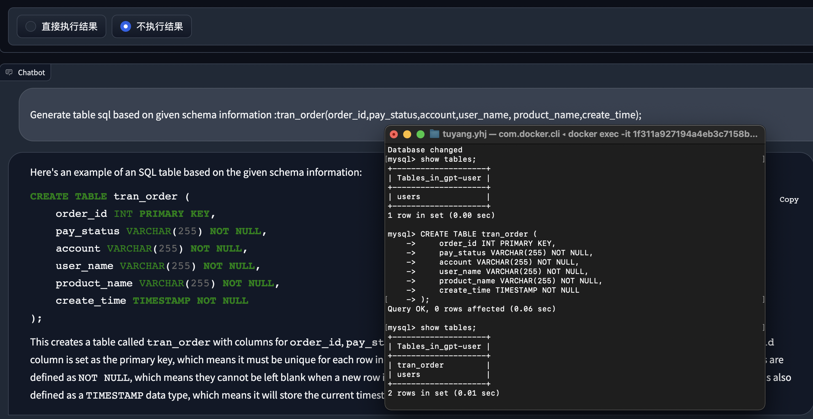
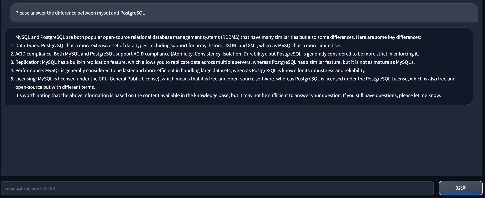
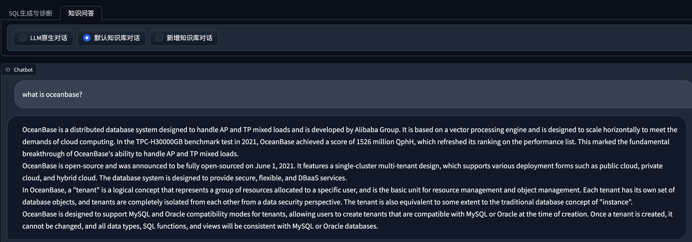
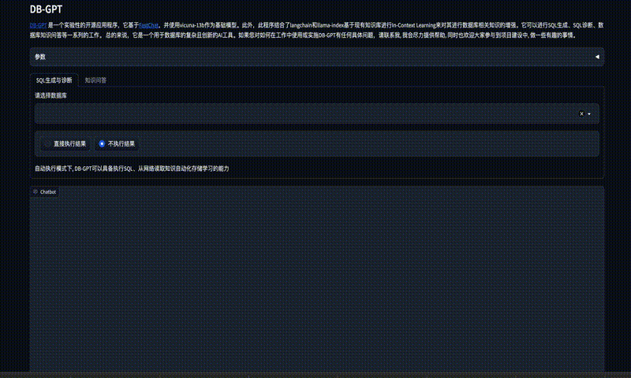

# DB-GPT 

---

[简体中文](README.zh.md)

[](https://star-history.com/#csunny/DB-GPT)

## What is DB-GPT?

As large models are released and iterated upon, they are becoming increasingly intelligent. However, in the process of using large models, we face significant challenges in data security and privacy. We need to ensure that our sensitive data and environments remain completely controlled and avoid any data privacy leaks or security risks. Based on this, we have launched the DB-GPT project to build a complete private large model solution for all database-based scenarios. This solution supports local deployment, allowing it to be applied not only in independent private environments but also to be independently deployed and isolated according to business modules, ensuring that the ability of large models is absolutely private, secure, and controllable.

DB-GPT is an experimental open-source project that uses localized GPT large models to interact with your data and environment. With this solution, you can be assured that there is no risk of data leakage, and your data is 100% private and secure.

## Features

Currently, we have released multiple key features, which are listed below to demonstrate our current capabilities:

- SQL language capabilities
  - SQL generation
  - SQL diagnosis
-  Private domain Q&A and data processing
  -  Database knowledge Q&A
  - Data processing
- Plugins
  -  Support custom plugin execution tasks and natively support the Auto-GPT plugin, such as:
    - Automatic execution of SQL and retrieval of query results
    - Automatic crawling and learning of knowledge
- Unified vector storage/indexing of knowledge base
  - Support for unstructured data such as PDF, Markdown, CSV, and WebURL

- Milti LLMs Support
  - Supports multiple large language models, currently supporting Vicuna (7b, 13b), ChatGLM-6b (int4, int8)
  - TODO: codegen2, codet5p


## Demo

Run on an RTX 4090 GPU. [YouTube](https://www.youtube.com/watch?v=1PWI6F89LPo)

### Run

<p align="center">
  
</p>

### Run Plugin
<p align="center">
  
</p>

### SQL Generation

1. Generate Create Table SQL

<p align="center">
   
</p>

2. Generating executable SQL:To generate executable SQL, first select the corresponding database and then the model can generate SQL based on the corresponding database schema information. The successful result of running it would be demonstrated as follows:
<p align="center">
  
</p>

### Q&A

<p align="center">
  
</p>

1. Based on the default built-in knowledge base, question and answer. 

<p align="center">
  
</p>

2. Add your own knowledge base.

<p align="center">
  
</p>

3. Learning from crawling data from the Internet

  - TODO


## Introduction 
DB-GPT creates a vast model operating system using [FastChat](https://github.com/lm-sys/FastChat) and offers a large language model powered by [Vicuna](https://huggingface.co/Tribbiani/vicuna-7b). In addition, we provide private domain knowledge base question-answering capability through LangChain. Furthermore, we also provide support for additional plugins, and our design natively supports the Auto-GPT plugin.

Is the architecture of the entire DB-GPT shown in the following figure:

<p align="center">
  
</p>

The core capabilities mainly consist of the following parts:
1. Knowledge base capability: Supports private domain knowledge base question-answering capability.
2. Large-scale model management capability: Provides a large model operating environment based on FastChat.
3. Unified data vector storage and indexing: Provides a uniform way to store and index various data types.
4. Connection module: Used to connect different modules and data sources to achieve data flow and interaction.
5. Agent and plugins: Provides Agent and plugin mechanisms, allowing users to customize and enhance the system's behavior.
6. Prompt generation and optimization: Automatically generates high-quality prompts and optimizes them to improve system response efficiency.
7. Multi-platform product interface: Supports various client products, such as web, mobile applications, and desktop applications.

Below is a brief introduction to each module:

### Knowledge base capability

As the knowledge base is currently the most significant user demand scenario, we natively support the construction and processing of knowledge bases. At the same time, we also provide multiple knowledge base management strategies in this project, such as:
1. Default built-in knowledge base
2. Custom addition of knowledge bases
3. Various usage scenarios such as constructing knowledge bases through plugin capabilities and web crawling. Users only need to organize the knowledge documents, and they can use our existing capabilities to build the knowledge base required for the large model.


### LLMs Management

In the underlying large model integration, we have designed an open interface that supports integration with various large models. At the same time, we have a very strict control and evaluation mechanism for the effectiveness of the integrated models. In terms of accuracy, the integrated models need to align with the capability of ChatGPT at a level of 85% or higher. We use higher standards to select models, hoping to save users the cumbersome testing and evaluation process in the process of use.

### Vector storage and indexing

In order to facilitate the management of knowledge after vectorization, we have built-in multiple vector storage engines, from memory-based Chroma to distributed Milvus. Users can choose different storage engines according to their own scenario needs. The storage of knowledge vectors is the cornerstone of AI capability enhancement. As the intermediate language for interaction between humans and large language models, vectors play a very important role in this project.

### Connections

In order to interact more conveniently with users' private environments, the project has designed a connection module, which can support connection to databases, Excel, knowledge bases, and other environments to achieve information and data exchange.

### Agent and Plugin

The ability of Agent and Plugin is the core of whether large models can be automated. In this project, we natively support the plugin mode, and large models can automatically achieve their goals. At the same time, in order to give full play to the advantages of the community, the plugins used in this project natively support the Auto-GPT plugin ecology, that is, Auto-GPT plugins can directly run in our project.

### Prompt Automatic Generation and Optimization

Prompt is a very important part of the interaction between the large model and the user, and to a certain extent, it determines the quality and accuracy of the answer generated by the large model. In this project, we will automatically optimize the corresponding prompt according to user input and usage scenarios, making it easier and more efficient for users to use large language models.

### Multi-Platform Product Interface

TODO: In terms of terminal display, we will provide a multi-platform product interface, including PC, mobile phone, command line, Slack and other platforms.

## Deployment 

### 1. Hardware Requirements
As our project has the ability to achieve ChatGPT performance of over 85%, there are certain hardware requirements. However, overall, the project can be deployed and used on consumer-grade graphics cards. The specific hardware requirements for deployment are as follows:

| GPU  | VRAM Size | Performance                                 |
| --------- | --------- | ------------------------------------------- |
| RTX 4090  | 24 GB     | Smooth conversation inference        |
| RTX 3090  | 24 GB     | Smooth conversation inference, better than V100 |
| V100      | 16 GB     | Conversation inference possible, noticeable stutter |

### 2. Install

This project relies on a local MySQL database service, which you need to install locally. We recommend using Docker for installation.

```bash
$ docker run --name=mysql -p 3306:3306 -e MYSQL_ROOT_PASSWORD=aa12345678 -dit mysql:latest
```
We use [Chroma embedding database](https://github.com/chroma-core/chroma) as the default for our vector database, so there is no need for special installation. If you choose to connect to other databases, you can follow our tutorial for installation and configuration. 
For the entire installation process of DB-GPT, we use the miniconda3 virtual environment. Create a virtual environment and install the Python dependencies.
```
python>=3.10
conda create -n dbgpt_env python=3.10
conda activate dbgpt_env
pip install -r requirements.txt
```

### 3. Run
You can refer to this document to obtain the Vicuna weights: [Vicuna](https://github.com/lm-sys/FastChat/blob/main/README.md#model-weights) .

If you have difficulty with this step, you can also directly use the model from [this link](https://huggingface.co/Tribbiani/vicuna-7b) as a replacement.

1. Run server
```bash
$ python pilot/server/llmserver.py
```

Run gradio webui

```bash
$ python pilot/server/webserver.py
```
Notice:  the webserver need to connect llmserver,  so you need change the .env file. change the MODEL_SERVER = "http://127.0.0.1:8000" to your address.  It's very important.

## Usage Instructions

We provide a user interface for Gradio, which allows you to use DB-GPT through our user interface. Additionally, we have prepared several reference articles (written in Chinese) that introduce the code and principles related to our project.
- [LLM Practical In Action Series (1) — Combined Langchain-Vicuna Application Practical](https://medium.com/@cfqcsunny/llm-practical-in-action-series-1-combined-langchain-vicuna-application-practical-701cd0413c9f)

### Multi LLMs Usage

To use multiple models, modify the LLM_MODEL parameter in the .env configuration file to switch between the models.

### Create your own knowledge repository:

1.Place personal knowledge files or folders in the pilot/datasets directory.

2.set .env configuration set your vector store type, eg:VECTOR_STORE_TYPE=Chroma, now we support Chroma and Milvus(version > 2.1)

3.Run the knowledge repository script in the tools directory.

```bash
& python tools/knowledge_init.py

--vector_name : your vector store name  default_value:default
--append: append mode, True:append, False: not append default_value:False

```

4.Add the knowledge repository in the interface by entering the name of your knowledge repository (if not specified, enter "default") so you can use it for Q&A based on your knowledge base. 

Note that the default vector model used is text2vec-large-chinese (which is a large model, so if your personal computer configuration is not enough, it is recommended to use text2vec-base-chinese). Therefore, ensure that you download the model and place it in the models directory.

If nltk-related errors occur during the use of the knowledge base, you need to install the nltk toolkit. For more details, please refer to: [nltk documents](https://www.nltk.org/data.html)
Run the Python interpreter and type the commands:

```bash
>>> import nltk
>>> nltk.download()
```

## Acknowledgement

This project is standing on the shoulders of giants and is not going to work without the open-source communities. Special thanks to the following projects for their excellent contribution to the AI industry:
- [FastChat](https://github.com/lm-sys/FastChat) for providing chat services
- [vicuna-13b](https://lmsys.org/blog/2023-03-30-vicuna/) as the base model
- [langchain](https://langchain.readthedocs.io/) tool chain
- [Auto-GPT](https://github.com/Significant-Gravitas/Auto-GPT) universal plugin template
- [Hugging Face](https://huggingface.co/) for big model management
- [Chroma](https://github.com/chroma-core/chroma) for vector storage
- [Milvus](https://milvus.io/) for distributed vector storage
- [ChatGLM](https://github.com/THUDM/ChatGLM-6B) as the base model
- [llama_index](https://github.com/jerryjliu/llama_index) for enhancing database-related knowledge using [in-context learning](https://arxiv.org/abs/2301.00234) based on existing knowledge bases.

## Contribution

- Please run `black .` before submitting the code.

<!-- GITCONTRIBUTOR_START -->

## Contributors

|[<br/><sub><b>csunny</b></sub>](https://github.com/csunny)<br/>|[<br/><sub><b>xudafeng</b></sub>](https://github.com/xudafeng)<br/>|[<br/><sub><b>明天</b></sub>](https://github.com/yhjun1026)<br/> | [<br/><sub><b>Aries-ckt</b></sub>](https://github.com/Aries-ckt)<br/>|[<br/><sub><b>thebigbone</b></sub>](https://github.com/thebigbone)<br/>|
| :---: | :---: | :---: | :---: |:---: |


This project follows the git-contributor [spec](https://github.com/xudafeng/git-contributor), auto updated at `Fri May 19 2023 00:24:18 GMT+0800`.

<!-- GITCONTRIBUTOR_END -->

## Licence

The MIT License (MIT)

## Contact Information
We are working on building a community, if you have any ideas about building the community, feel free to contact us. [Discord](https://discord.gg/kMFf77FH)
