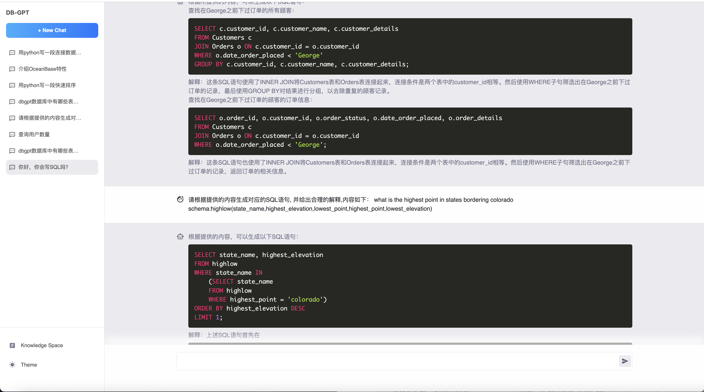
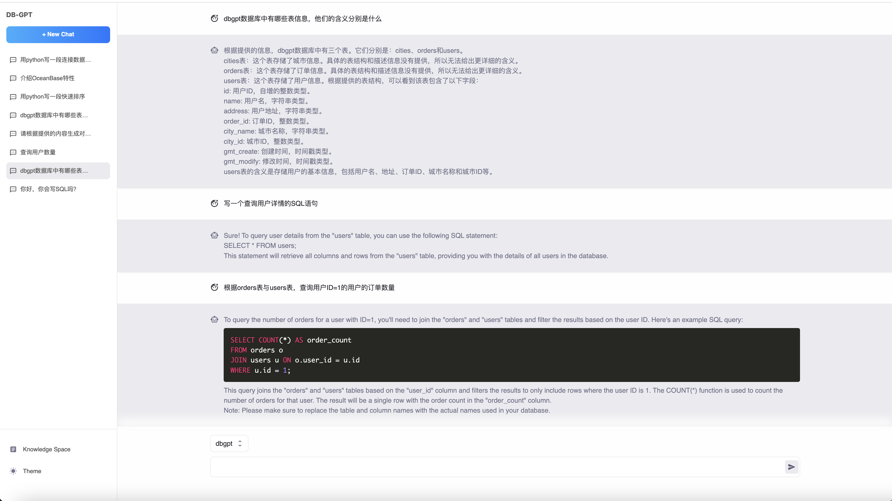
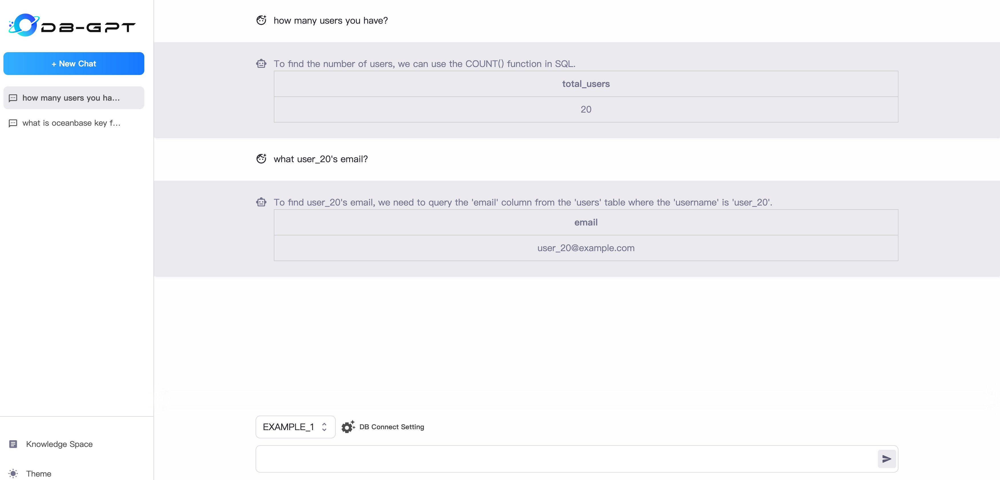
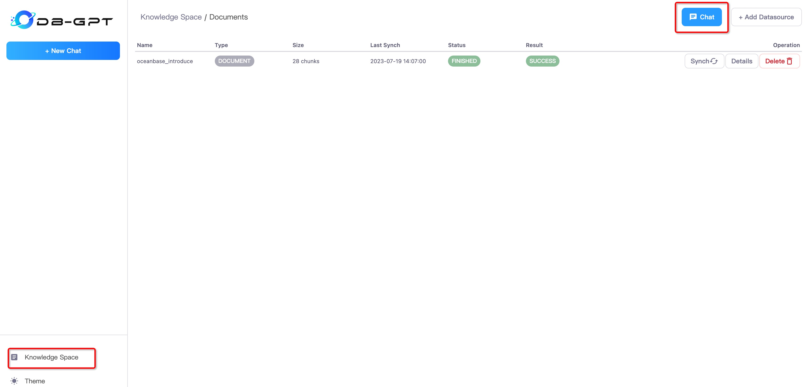
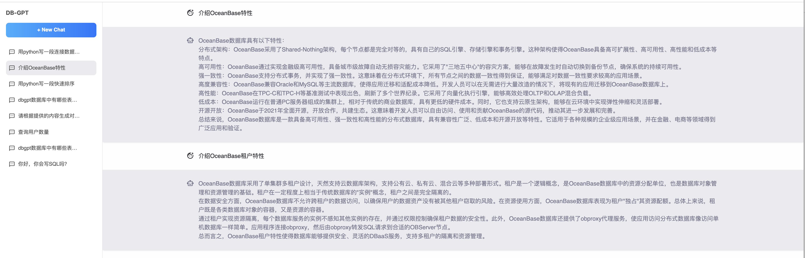

# DB-GPT: Revolutionizing Database Interactions with Private LLM Technology
 
<div align="center">
  <p>
    <a href="https://github.com/csunny/DB-GPT">
        
    </a>
    <a href="https://github.com/csunny/DB-GPT">
        
    </a>
    <a href="https://opensource.org/licenses/MIT">
      
    </a>
     <a href="https://github.com/csunny/DB-GPT/releases">
      
    </a>
    <a href="https://github.com/csunny/DB-GPT/issues">
      
    </a>
    <a href="https://discord.gg/jDD5FwHh">
      
    </a>
    <a href="https://codespaces.new/csunny/DB-GPT">
      
    </a>
  </p>


[**简体中文**](README.zh.md) |[**Discord**](https://discord.gg/jDD5FwHh) |[**Documents**](https://db-gpt.readthedocs.io/en/latest/)|[**Wechat**](https://github.com/csunny/DB-GPT/blob/main/README.zh.md#%E8%81%94%E7%B3%BB%E6%88%91%E4%BB%AC) 

</div>

## What is DB-GPT?

DB-GPT is an experimental open-source project that uses localized GPT large models to interact with your data and environment. With this solution, you can be assured that there is no risk of data leakage, and your data is 100% private and secure.


## Contents
- [install](#install)
- [demo](#demo)
- [introduction](#introduction)
- [features](#features)
- [contribution](#contribution)
- [acknowledgement](#acknowledgement)
- [roadmap](#roadmap)
- [contract](#contact-information)

## Demo

Run on an RTX 4090 GPU.

https://github.com/csunny/DB-GPT/assets/13723926/55f31781-1d49-4757-b96e-7ef6d3dbcf80

<!-- <video id="video" controls="" preload="auto" poster="assets/exector_sql.png">
      <source id="mp4" src="https://github.com/csunny/DB-GPT/assets/17919400/654b5a49-5ea4-4c02-b5b2-72d089dcc1f0" type="video/mp4">
</videos> -->


#### Chat with data, and figure charts.

<p align="left">
  
</p>

#### Text2SQL, generate SQL from chat
<p align="left">
  
</p>

#### Chat with database meta information.
<p align="left">
  
</p>

#### Chat with data, and execute results.
<p align="left">
  
</p>

#### Knownledge space to manage docs.
<p align="left">
  
</p>

#### Chat with knowledge, such as txt、pdf、csv、words. etc
<p align="left">
  
</p>


## Features

Currently, we have released multiple key features, which are listed below to demonstrate our current capabilities:

- SQL language capabilities
  - SQL generation
  - SQL diagnosis
- Private domain Q&A and data processing
  -   Knowledge Management(We currently support many document formats: txt, pdf, md, html, doc, ppt, and url.)
  -  Database knowledge Q&A
  - knowledge Embedding
- Plugins
  -  Support custom plugin execution tasks and natively support the Auto-GPT plugin, such as:
    - Automatic execution of SQL and retrieval of query results
    - Automatic crawling and learning of knowledge
- Unified vector storage/indexing of knowledge base
  - Support for unstructured data such as PDF, TXT, Markdown, CSV, DOC, PPT, and WebURL

- Multi LLMs Support
  - Supports multiple large language models, currently supporting Vicuna (7b, 13b), ChatGLM-6b (int4, int8), guanaco(7b,13b,33b), Gorilla(7b,13b), 🔥 llama-2(7b, 13b, 70b) 
  - TODO: baichuan(7b, 13b)


[](https://star-history.com/#csunny/DB-GPT)


## Introduction 
DB-GPT creates a vast model operating system using [FastChat](https://github.com/lm-sys/FastChat) and offers a large language model powered by [Vicuna](https://huggingface.co/Tribbiani/vicuna-7b). In addition, we provide private domain knowledge base question-answering capability. Furthermore, we also provide support for additional plugins, and our design natively supports the Auto-GPT plugin.Our vision is to make it easier and more convenient to build  applications around databases and llm.


Is the architecture of the entire DB-GPT shown in the following figure:

<p align="center">
  
</p>

The core capabilities mainly consist of the following parts:
1. Knowledge base capability: Supports private domain knowledge base question-answering capability.
2. Large-scale model management capability: Provides a large model operating environment based on FastChat.
3. Unified data vector storage and indexing: Provides a uniform way to store and index various data types.
4. Connection module: Used to connect different modules and data sources to achieve data flow and interaction.
5. Agent and plugins: Provides Agent and plugin mechanisms, allowing users to customize and enhance the system's behavior.
6. Prompt generation and optimization: Automatically generates high-quality prompts and optimizes them to improve system response efficiency.
7. Multi-platform product interface: Supports various client products, such as web, mobile applications, and desktop applications.

### SubModule
- [DB-GPT-Hub](https://github.com/csunny/DB-GPT-Hub) Text-to-SQL parsing with LLMs
- [DB-GPT-Plugins](https://github.com/csunny/DB-GPT-Plugins) DB-GPT Plugins, Can run autogpt plugin directly
- [DB-GPT-Web](https://github.com/csunny/DB-GPT-Web)  ChatUI for DB-GPT  

## Image
🌐 [AutoDL Image](https://www.codewithgpu.com/i/csunny/DB-GPT/dbgpt-0.3.1-v2)
## Install 
[Quickstart](https://db-gpt.readthedocs.io/en/latest/getting_started/getting_started.html)

### Language Switching
    In the .env configuration file, modify the LANGUAGE parameter to switch to different languages. The default is English (Chinese: zh, English: en, other languages to be added later).
### Platform Deployment
- autodl
    [autodl image](https://www.codewithgpu.com/i/csunny/DB-GPT/csunny-db-gpt). You can refer to the image instructions to build from scratch, or use `docker pull` to obtain the shared image, follow the instructions in the document to operate. If you have any questions, please leave a comment.

## Usage Instructions

- [Multi LLMs Usage](https://db-gpt.readthedocs.io/en/latest/modules/llms.html)
- [Create your own knowledge repository](https://db-gpt.readthedocs.io/en/latest/modules/knowledge.html)

If nltk-related errors occur during the use of the knowledge base, you need to install the nltk toolkit. For more details, please refer to: [nltk documents](https://www.nltk.org/data.html)
Run the Python interpreter and type the commands:

```bash
>>> import nltk
>>> nltk.download()
```

## Acknowledgement

This project is standing on the shoulders of giants and is not going to work without the open-source communities. Special thanks to the following projects for their excellent contribution to the AI industry:
- [FastChat](https://github.com/lm-sys/FastChat) for providing chat services
- [vicuna-13b](https://lmsys.org/blog/2023-03-30-vicuna/) as the base model
- [langchain](https://langchain.readthedocs.io/) tool chain
- [Auto-GPT](https://github.com/Significant-Gravitas/Auto-GPT) universal plugin template
- [Hugging Face](https://huggingface.co/) for big model management
- [Chroma](https://github.com/chroma-core/chroma) for vector storage
- [Milvus](https://milvus.io/) for distributed vector storage
- [ChatGLM](https://github.com/THUDM/ChatGLM-6B) as the base model
- [llama_index](https://github.com/jerryjliu/llama_index) for enhancing database-related knowledge using [in-context learning](https://arxiv.org/abs/2301.00234) based on existing knowledge bases.

## Contribution

- Please run `black .` before submitting the code. contributing guidelines, [how to contribution](https://github.com/csunny/DB-GPT/blob/main/CONTRIBUTING.md)

## RoadMap

<p align="left">
  
</p>

## Licence

The MIT License (MIT)

## Contact Information
We are working on building a community, if you have any ideas about building the community, feel free to contact us. 
[](https://discord.gg/jDD5FwHh)

<p align="center">
  
</p>