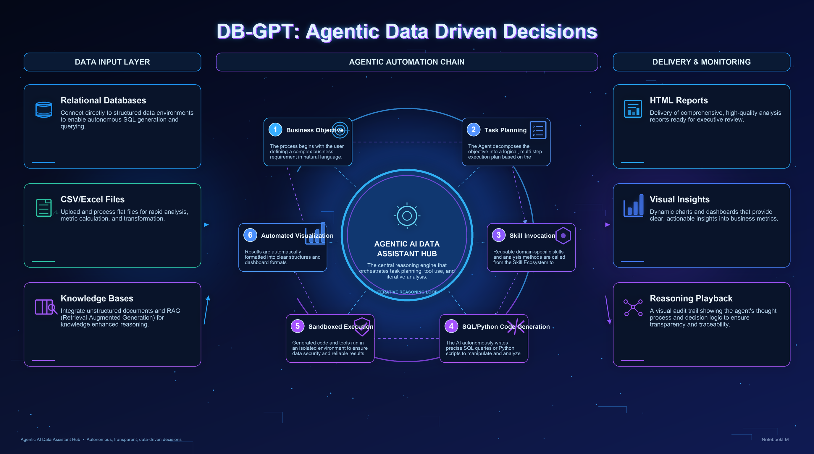
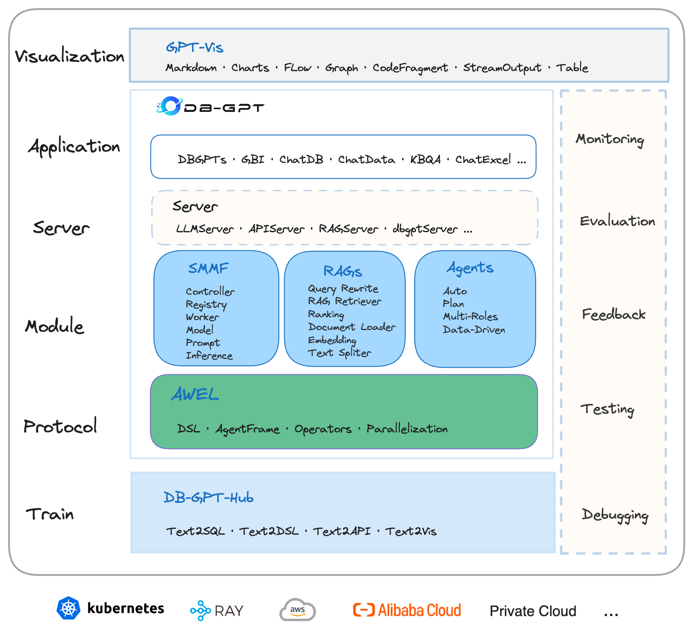

#  DB-GPT: AWEL மற்றும் முகவர்களுடன் AI நேட்டிவ் டேட்டா ஆப் டெவலப்மென்ட் கட்டமைப்பு

<p align="left">


</p>

<div align="center">
<p>

<a href="https://github.com/eosphoros-ai/DB-GPT">

</a>
<a href="https://github.com/eosphoros-ai/DB-GPT">

</a>
<a href="http://dbgpt.cn/">

</a>
<a href="https://opensource.org/licenses/MIT">

</a>
<a href="https://github.com/eosphoros-ai/DB-GPT/releases">

</a>
<a href="https://github.com/eosphoros-ai/DB-GPT/issues">

</a>
<a href="https://x.com/DBGPT_AI">

</a>

<a href="https://medium.com/@dbgpt0506">

</a>
<a href="https://space.bilibili.com/3537113070963392">

</a>
<a href="https://join.slack.com/t/slack-inu2564/shared_invite/zt-29rcnyw2b-N~ubOD9kFc7b7MDOAM1otA">

</a>
<a href="https://codespaces.new/eosphoros-ai/DB-GPT">

</a>
</p>
[](README.md)
[](README.zh.md)
[](README.ja.md) 

[**ஆவணங்கள்**](http://docs.dbgpt.cn/docs/overview/) | [**எங்களைத் தொடர்பு கொள்ளவும்**](https://github.com/eosphoros-ai/DB-GPT/blob/main/README.zh.md#%E8%81%94%E7%B3%BB%E6%88%91%E4%BB%AC) | [**சமூகம்**](https://github.com/eosphoros-ai/community) | [**Paper**](https://arxiv.org/pdf/2312.17449.pdf)

</div>
## DB-GPT என்றால் என்ன?

🤖 **DB-GPT என்பது AWEL (Agentic Workflow Expression Language) மற்றும் முகவர்கள்** ஆகியவற்றைக் கொண்ட ஒரு திறந்த மூல AI நேட்டிவ் டேட்டா ஆப் டெவலப்மென்ட் கட்டமைப்பாகும். 

மல்டி-மாடல் மேனேஜ்மென்ட் (SMMF), Text2SQL எஃபெக்ட் ஆப்டிமைசேஷன், RAG ஃப்ரேம்வொர்க் மற்றும் ஆப்டிமைசேஷன், மல்டி-ஏஜென்ட்ஸ் ஃப்ரேம்வொர்க் ஒத்துழைப்பு, AWEL (ஏஜென்ட் வொர்க்ஃப்ளோ ஆர்கெஸ்ட்ரேஷன்) போன்ற பல தொழில்நுட்ப திறன்களை மேம்படுத்துவதன் மூலம், பெரிய மாடல்களின் துறையில் உள்கட்டமைப்பை உருவாக்குவதே இதன் நோக்கமாகும். இது டேட்டாவுடன் கூடிய பெரிய மாடல் பயன்பாடுகளை எளிமையாகவும் வசதியாகவும் ஆக்குகிறது.

🚀 **டேட்டா 3.0 சகாப்தத்தில், மாதிரிகள் மற்றும் தரவுத்தளங்களின் அடிப்படையில், நிறுவனங்கள் மற்றும் டெவலப்பர்கள் குறைந்த குறியீட்டைக் கொண்டு தங்கள் சொந்த தனிப்பயனாக்கப்பட்ட பயன்பாடுகளை உருவாக்க முடியும்.**
### அறிமுகம் 

DB-GPT இன் கட்டமைப்பு பின்வரும் படத்தில் காட்டப்பட்டுள்ளது:

<p align="center">

</p>

முக்கிய திறன்களில் பின்வரும் பகுதிகள் அடங்கும்:

- **RAG (மீட்டெடுப்பு ஆக்மென்டட் ஜெனரேஷன்)**: RAG தற்போது மிகவும் நடைமுறையில் செயல்படுத்தப்பட்ட மற்றும் அவசரமாகத் தேவைப்படும் டொமைன் ஆகும். DB-GPT ஏற்கனவே RAG அடிப்படையிலான ஒரு கட்டமைப்பை செயல்படுத்தியுள்ளது, இது பயனர்கள் DB-GPT இன் RAG திறன்களைப் பயன்படுத்தி அறிவு சார்ந்த பயன்பாடுகளை உருவாக்க அனுமதிக்கிறது.

- **GBI (ஜெனரேட்டிவ் பிசினஸ் இன்டலிஜென்ஸ்)**: ஜெனரேட்டிவ் BI என்பது DB-GPT திட்டத்தின் முக்கிய திறன்களில் ஒன்றாகும், இது நிறுவன அறிக்கை பகுப்பாய்வு மற்றும் வணிக நுண்ணறிவுகளை உருவாக்குவதற்கான அடிப்படை தரவு நுண்ணறிவு தொழில்நுட்பத்தை வழங்குகிறது.

- **ஃபைன்-ட்யூனிங் ஃப்ரேம்வொர்க்**: மாடல் ஃபைன்-ட்யூனிங் என்பது எந்தவொரு நிறுவனமும் செங்குத்து மற்றும் முக்கிய டொமைன்களில் செயல்படுத்த ஒரு தவிர்க்க முடியாத திறனாகும். DB-GPT, DB-GPT திட்டத்துடன் தடையின்றி ஒருங்கிணைக்கும் ஒரு முழுமையான ஃபைன்-ட்யூனிங் கட்டமைப்பை வழங்குகிறது. சமீபத்திய ஃபைன்-ட்யூனிங் முயற்சிகளில், ஸ்பைடர் தரவுத்தொகுப்பை அடிப்படையாகக் கொண்ட துல்லிய விகிதம் 82.5% ஆக அடையப்பட்டுள்ளது.

- **டேட்டா-டிரைவன் மல்டி-ஏஜென்ட்ஸ் ஃப்ரேம்வொர்க்**: DB-GPT தரவு-இயக்கப்படும் சுய-வளர்ச்சியடைந்த மல்டி-ஏஜென்ட்ஸ் ஃப்ரேம்வொர்க்கை வழங்குகிறது, இது தொடர்ந்து முடிவுகளை எடுத்து தரவுகளின் அடிப்படையில் செயல்படுத்துவதை நோக்கமாகக் கொண்டுள்ளது.

- **தரவு தொழிற்சாலை**: பெரிய மாதிரிகளின் சகாப்தத்தில் நம்பகமான அறிவு மற்றும் தரவை சுத்தம் செய்தல் மற்றும் செயலாக்குவது பற்றியது தரவு தொழிற்சாலை.

- **தரவு மூலங்கள்**: உற்பத்தி வணிகத் தரவை DB-GPT இன் முக்கிய திறன்களுடன் தடையின்றி இணைக்க பல்வேறு தரவு மூலங்களை ஒருங்கிணைத்தல்.

#### துணை தொகுதி
- [DB-GPT-Hub](https://github.com/eosphoros-ai/DB-GPT-Hub) பெரிய மொழி மாதிரிகளில் (LLMs) மேற்பார்வையிடப்பட்ட ஃபைன்-ட்யூனிங் (SFT) ஐப் பயன்படுத்துவதன் மூலம் உயர் செயல்திறனுடன் உரையிலிருந்து SQL பணிப்பாய்வு.

- [dbgpts](https://github.com/eosphoros-ai/dbgpts) dbgpts என்பது DB-GPT-ஐ அடிப்படையாகக் கொண்ட சில தரவு பயன்பாடுகள், AWEL ஆபரேட்டர்கள், AWEL பணிப்பாய்வு டெம்ப்ளேட்கள் மற்றும் முகவர்களைக் கொண்ட அதிகாரப்பூர்வ களஞ்சியமாகும்.

#### DeepWiki
- [DB-GPT](https://deepwiki.com/eosphoros-ai/DB-GPT)
- [DB-GPT-HUB](https://deepwiki.com/eosphoros-ai/DB-GPT-Hub)
- [dbgpts](https://deepwiki.com/eosphoros-ai/dbgpts)

#### Text2SQL Finetune

  |     LLM     |  Supported  | 
  |:-----------:|:-----------:|
  |    LLaMA    |      ✅     |
  |   LLaMA-2   |      ✅     | 
  |    BLOOM    |      ✅     | 
  |   BLOOMZ    |      ✅     | 
  |   Falcon    |      ✅     | 
  |  Baichuan   |      ✅     | 
  |  Baichuan2  |      ✅     | 
  |  InternLM   |      ✅     |
  |    Qwen     |      ✅     | 
  |   XVERSE    |      ✅     | 
  |  ChatGLM2   |      ✅     |

  [Text2SQL finetune பற்றிய கூடுதல் தகவல்கள்](https://github.com/eosphoros-ai/DB-GPT-Hub)

- [DB-GPT-Plugins](https://github.com/eosphoros-ai/DB-GPT-Plugins) தானியங்கு-GPT செருகுநிரலை நேரடியாக இயக்கக்கூடிய DB-GPT செருகுநிரல்கள்
- [GPT-Vis](https://github.com/eosphoros-ai/GPT-Vis) காட்சிப்படுத்தல் நெறிமுறை

### AI-நேட்டிவ் டேட்டா ஆப் 
---

- 🔥🔥🔥 [Released V0.7.0 | A set of significant upgrades](http://docs.dbgpt.cn/blog/db-gpt-v070-release)
  - [Support MCP Protocol](https://github.com/eosphoros-ai/DB-GPT/pull/2497)
  - [Support DeepSeek R1](https://github.com/deepseek-ai/DeepSeek-R1)
  - [Support QwQ-32B](https://huggingface.co/Qwen/QwQ-32B)
  - [Refactor the basic modules]()
    - [dbgpt-app](./packages/dbgpt-app)
    - [dbgpt-core](./packages/dbgpt-core)
    - [dbgpt-serve](./packages/dbgpt-serve)
    - [dbgpt-client](./packages/dbgpt-client)
    - [dbgpt-accelerator](./packages/dbgpt-accelerator)
    - [dbgpt-ext](./packages/dbgpt-ext)
---


---

## ஏன் DB-GPT?

### 1. முகவர் அடிப்படையான தரவு பகுப்பாய்வு
பணிகளைத் திட்டமிடுங்கள், வேலையைப் படிகளாகப் பிரிங்கள், கருவிகளை அழைக்கவும், முழுமையான பகுப்பாய்வு பணிப்பாய்வுகளை முடிக்கவும்.


### 2. தானியங்கி SQL + குறியீடு செயல்படுத்தல்
தரவைக் கேட்க, தரவுத் தொகுப்புகளை சுத்தம் செய்ய, மெட்ரிக்கைக் கணக்கிட்டு, வெளியீடுகளை உருவாக்க SQL மற்றும் குறியீட்டை உருவாக்குங்கள்.


### 3. பல-மூல தரவு அணுகல்
கட்டமைக்கப்பட்ட மற்றும் கட்டமைக்கப்படாத மூலங்கள் உட்பட, தரவுத்தளங்கள், spreadsheetகள், ஆவணங்கள் மற்றும் அறிவு தளங்கள் முழுவதும் வேலை செய்யுங்கள்.

### 4. திறன்கள்-இயக்கப்படும் நீட்சி
துறை அறிவு, பகுப்பாய்வு முறைகள் மற்றும் செயல்படுத்தும் பணிப்பாய்வுகளை மீண்டும் பயன்படுத்தக்கூடிய திறன்களாகத் தொகுக்கவும்.


### 5. சாண்ட்பாக்ஸ் செயல்படுத்தல்
பாதுகாப்பான, மிகவும் நம்பகமான பகுப்பாய்வுக்காகத் தனிமைப்படுத்தப்பட்ட சூழலில் குறியீடு மற்றும் கருவிகளை இயக்குங்கள்.


## Installation / Quick Start 


[**Usage Tutorial**](http://docs.dbgpt.cn/docs/overview)
- [**Install**](http://docs.dbgpt.cn/docs/installation)
  - [Docker](http://docs.dbgpt.cn/docs/installation/docker)
  - [Source Code](http://docs.dbgpt.cn/docs/getting-started/deploy/source-code)
- [**Quickstart**](http://docs.dbgpt.cn/docs/overview)
- [**Application**](http://docs.dbgpt.cn/docs/use_cases)
  - [Development Guide](http://docs.dbgpt.cn/docs/cookbook/app/data_analysis_app_develop) 
  - [AWEL Flow Usage](http://docs.dbgpt.cn/docs/application/awel_flow_usage)
- [**Debugging**](http://docs.dbgpt.cn/docs/operation_manual/advanced_tutorial/debugging)
- [**Advanced Usage**](http://docs.dbgpt.cn/docs/application/advanced_tutorial/cli)
  - [SMMF](http://docs.dbgpt.cn/docs/application/advanced_tutorial/smmf)
  - [Finetune](http://docs.dbgpt.cn/docs/application/fine_tuning_manual/dbgpt_hub)
  - [AWEL](http://docs.dbgpt.cn/docs/awel/tutorial)

  ## அம்சங்கள்

தற்போது, ​​எங்கள் தற்போதைய திறன்களை வெளிப்படுத்த பல முக்கிய அம்சங்களை அறிமுகப்படுத்தியுள்ளோம்:
- **தனியார் டொமைன் கேள்வி பதில் & தரவு செயலாக்கம்**

DB-GPT திட்டம் அறிவுத் தளக் கட்டமைப்பை மேம்படுத்தவும், கட்டமைக்கப்பட்ட மற்றும் கட்டமைக்கப்படாத தரவு இரண்டையும் திறம்படச் சேமித்து மீட்டெடுக்கவும் வடிவமைக்கப்பட்ட பல்வேறு செயல்பாடுகளை வழங்குகிறது. இந்த செயல்பாடுகளில் பல கோப்பு வடிவங்களைப் பதிவேற்றுவதற்கான உள்ளமைக்கப்பட்ட ஆதரவு, தனிப்பயன் தரவு பிரித்தெடுக்கும் செருகுநிரல்களை ஒருங்கிணைக்கும் திறன் மற்றும் பெரிய அளவிலான தகவல்களை திறம்பட நிர்வகிப்பதற்கான ஒருங்கிணைந்த திசையன் சேமிப்பு மற்றும் மீட்டெடுப்பு திறன்கள் ஆகியவை அடங்கும்.

- **மல்டி-டேட்டா சோர்ஸ் & ஜிபிஐ (ஜெனரேட்டிவ் பிசினஸ் இன்டலிஜென்ஸ்)**

டிபி-ஜிபிடி திட்டம் எக்செல், தரவுத்தளங்கள் மற்றும் தரவுக் கிடங்குகள் உள்ளிட்ட பல்வேறு தரவு மூலங்களுடன் தடையற்ற இயற்கை மொழி தொடர்புகளை எளிதாக்குகிறது. இந்த மூலங்களிலிருந்து தகவல்களை வினவுதல் மற்றும் மீட்டெடுப்பது போன்ற செயல்முறையை இது எளிதாக்குகிறது, பயனர்கள் உள்ளுணர்வு உரையாடல்களில் ஈடுபடவும் நுண்ணறிவுகளைப் பெறவும் அதிகாரம் அளிக்கிறது. மேலும், டிபி-ஜிபிடி பகுப்பாய்வு அறிக்கைகளை உருவாக்குவதை ஆதரிக்கிறது, பயனர்களுக்கு மதிப்புமிக்க தரவு சுருக்கங்கள் மற்றும் விளக்கங்களை வழங்குகிறது.

- **மல்டி-ஏஜெண்ட்ஸ் & செருகுநிரல்கள்**

இது பல்வேறு பணிகளைச் செய்ய தனிப்பயன் செருகுநிரல்களுக்கான ஆதரவை வழங்குகிறது மற்றும் தானியங்கி-GPT செருகுநிரல் மாதிரியை இயல்பாக ஒருங்கிணைக்கிறது. முகவர்கள் நெறிமுறை முகவர் நெறிமுறை தரநிலைக்கு இணங்குகிறது.

- **தானியங்கி ஃபைன்-ட்யூனிங் text2SQL**

பெரிய மொழி மாதிரிகள் (LLMகள்), Text2SQL தரவுத்தொகுப்புகள், LoRA/QLoRA/Pturning மற்றும் பிற ஃபைன்-ட்யூனிங் முறைகளை மையமாகக் கொண்ட தானியங்கி ஃபைன்-ட்யூனிங் இலகுரக கட்டமைப்பையும் நாங்கள் உருவாக்கியுள்ளோம். இந்த கட்டமைப்பு உரையிலிருந்து SQL ஃபைன்-ட்யூனிங்கை எளிதாக்குகிறது, இது ஒரு அசெம்பிளி லைன் செயல்முறையைப் போலவே நேரடியானதாக ஆக்குகிறது. [DB-GPT-Hub](https://github.com/eosphoros-ai/DB-GPT-Hub)

- **SMMF(சேவை சார்ந்த பல-மாதிரி மேலாண்மை கட்டமைப்பு)**

LLaMA/LLaMA2, Baichuan, ChatGLM, Wenxin, Tongyi, Zhipu மற்றும் பல போன்ற திறந்த மூல மற்றும் API முகவர்களிடமிருந்து டஜன் கணக்கான பெரிய மொழி மாதிரிகள் (LLMகள்) உட்பட விரிவான மாதிரி ஆதரவை நாங்கள் வழங்குகிறோம். 

- செய்திகள்

<table>
      <thead>
        <tr>
          <th>Provider</th>
          <th>Supported</th>
          <th>Models</th>
        </tr>
      </thead>
      <tbody>
        <tr>
          <td align="center" valign="middle">DeepSeek</td>
          <td align="center" valign="middle">✅</td>
          <td>
            🔥🔥🔥  <a href="https://huggingface.co/deepseek-ai/DeepSeek-R1-0528">DeepSeek-R1-0528</a><br/>
            🔥🔥🔥  <a href="https://huggingface.co/deepseek-ai/DeepSeek-V3-0324">DeepSeek-V3-0324</a><br/>
            🔥🔥🔥  <a href="https://huggingface.co/deepseek-ai/DeepSeek-R1">DeepSeek-R1</a><br/>
            🔥🔥🔥  <a href="https://huggingface.co/deepseek-ai/DeepSeek-V3">DeepSeek-V3</a><br/>
            🔥🔥🔥  <a href="https://huggingface.co/deepseek-ai/DeepSeek-R1-Distill-Llama-70B">DeepSeek-R1-Distill-Llama-70B</a><br/>
            🔥🔥🔥  <a href="https://huggingface.co/deepseek-ai/DeepSeek-R1-Distill-Qwen-32B">DeepSeek-R1-Distill-Qwen-32B</a><br/>
            🔥🔥🔥  <a href="https://huggingface.co/deepseek-ai/DeepSeek-Coder-V2-Instruct">DeepSeek-Coder-V2-Instruct</a><br/>
          </td>
        </tr>
        <tr>
          <td align="center" valign="middle">Qwen</td>
          <td align="center" valign="middle">✅</td>
          <td>
            🔥🔥🔥  <a href="https://huggingface.co/Qwen/Qwen3-235B-A22B">Qwen3-235B-A22B</a><br/>
            🔥🔥🔥  <a href="https://huggingface.co/Qwen/Qwen3-30B-A3B">Qwen3-30B-A3B</a><br/>
            🔥🔥🔥  <a href="https://huggingface.co/Qwen/Qwen3-32B">Qwen3-32B</a><br/>
            🔥🔥🔥  <a href="https://huggingface.co/Qwen/QwQ-32B">QwQ-32B</a><br/>
            🔥🔥🔥  <a href="https://huggingface.co/Qwen/Qwen2.5-Coder-32B-Instruct">Qwen2.5-Coder-32B-Instruct</a><br/>
            🔥🔥🔥  <a href="https://huggingface.co/Qwen/Qwen2.5-Coder-14B-Instruct">Qwen2.5-Coder-14B-Instruct</a><br/>
            🔥🔥🔥  <a href="https://huggingface.co/Qwen/Qwen2.5-72B-Instruct">Qwen2.5-72B-Instruct</a><br/>
            🔥🔥🔥  <a href="https://huggingface.co/Qwen/Qwen2.5-32B-Instruct">Qwen2.5-32B-Instruct</a><br/>
          </td>
        </tr>
        <tr>
          <td align="center" valign="middle">GLM</td>
          <td align="center" valign="middle">✅</td>
          <td>
            🔥🔥🔥  <a href="https://huggingface.co/THUDM/GLM-Z1-32B-0414">GLM-Z1-32B-0414</a><br/>
            🔥🔥🔥  <a href="https://huggingface.co/THUDM/GLM-4-32B-0414">GLM-4-32B-0414</a><br/>
            🔥🔥🔥  <a href="https://huggingface.co/THUDM/glm-4-9b-chat">Glm-4-9b-chat</a>
          </td>
        </tr>
        <tr>
          <td align="center" valign="middle">Llama</td>
          <td align="center" valign="middle">✅</td>
          <td>
            🔥🔥🔥  <a href="https://huggingface.co/meta-llama/Meta-Llama-3.1-405B-Instruct">Meta-Llama-3.1-405B-Instruct</a><br/>
            🔥🔥🔥  <a href="https://huggingface.co/meta-llama/Meta-Llama-3.1-70B-Instruct">Meta-Llama-3.1-70B-Instruct</a><br/>
            🔥🔥🔥  <a href="https://huggingface.co/meta-llama/Meta-Llama-3.1-8B-Instruct">Meta-Llama-3.1-8B-Instruct</a><br/>
            🔥🔥🔥  <a href="https://huggingface.co/meta-llama/Meta-Llama-3-70B-Instruct">Meta-Llama-3-70B-Instruct</a><br/>
            🔥🔥🔥  <a href="https://huggingface.co/meta-llama/Meta-Llama-3-8B-Instruct">Meta-Llama-3-8B-Instruct</a>
          </td>
        </tr>
        <tr>
          <td align="center" valign="middle">Gemma</td>
          <td align="center" valign="middle">✅</td>
          <td>
            🔥🔥🔥  <a href="https://huggingface.co/google/gemma-2-27b-it">gemma-2-27b-it</a><br>
            🔥🔥🔥  <a href="https://huggingface.co/google/gemma-2-9b-it">gemma-2-9b-it</a><br>
            🔥🔥🔥  <a href="https://huggingface.co/google/gemma-7b-it">gemma-7b-it</a><br>
            🔥🔥🔥  <a href="https://huggingface.co/google/gemma-2b-it">gemma-2b-it</a>
          </td>
        </tr>
        <tr>
          <td align="center" valign="middle">Yi</td>
          <td align="center" valign="middle">✅</td>
          <td>
            🔥🔥🔥  <a href="https://huggingface.co/01-ai/Yi-1.5-34B-Chat">Yi-1.5-34B-Chat</a><br/>
            🔥🔥🔥  <a href="https://huggingface.co/01-ai/Yi-1.5-9B-Chat">Yi-1.5-9B-Chat</a><br/>
            🔥🔥🔥  <a href="https://huggingface.co/01-ai/Yi-1.5-6B-Chat">Yi-1.5-6B-Chat</a><br/>
            🔥🔥🔥  <a href="https://huggingface.co/01-ai/Yi-34B-Chat">Yi-34B-Chat</a>
          </td>
        </tr>
        <tr>
          <td align="center" valign="middle">Starling</td>
          <td align="center" valign="middle">✅</td>
          <td>
            🔥🔥🔥  <a href="https://huggingface.co/Nexusflow/Starling-LM-7B-beta">Starling-LM-7B-beta</a>
          </td>
        </tr>
        <tr>
          <td align="center" valign="middle">SOLAR</td>
          <td align="center" valign="middle">✅</td>
          <td>
            🔥🔥🔥  <a href="https://huggingface.co/upstage/SOLAR-10.7B-Instruct-v1.0">SOLAR-10.7B</a>
          </td>
        </tr>
        <tr>
          <td align="center" valign="middle">Mixtral</td>
          <td align="center" valign="middle">✅</td>
          <td>
            🔥🔥🔥  <a href="https://huggingface.co/mistralai/Mixtral-8x7B-Instruct-v0.1">Mixtral-8x7B</a>
          </td>
        </tr>
        <tr>
          <td align="center" valign="middle">Phi</td>
          <td align="center" valign="middle">✅</td>
          <td>
            🔥🔥🔥  <a href="https://huggingface.co/collections/microsoft/phi-3-6626e15e9585a200d2d761e3">Phi-3</a>
          </td>
        </tr>
      </tbody>
    </table>

- [மேலும் ஆதரிக்கப்படும் LLMகள்](http://docs.dbgpt.cn/docs/modules/smmf)

- **தனியுரிமை மற்றும் பாதுகாப்பு**

தனியார்மயமாக்கப்பட்ட பெரிய மாதிரிகள் மற்றும் ப்ராக்ஸி உணர்திறன் நீக்கம் உள்ளிட்ட பல்வேறு தொழில்நுட்பங்களை செயல்படுத்துவதன் மூலம் தரவின் தனியுரிமை மற்றும் பாதுகாப்பை நாங்கள் உறுதி செய்கிறோம்.

- ஆதரவு தரவுமூலங்கள்
- [தரவுமூலங்கள்](http://docs.dbgpt.cn/docs/modules/connections)


## பங்களிப்பு

- புதிய பங்களிப்புகளுக்கான விரிவான வழிகாட்டுதல்களைச் சரிபார்க்க, [பங்களிப்பது எப்படி] (https://github.com/eosphoros-ai/DB-GPT/blob/main/CONTRIBUTING.md) ஐப் பார்க்கவும்.

### பங்களிப்பாளர்கள் சுவர்
<a href="https://github.com/eosphoros-ai/DB-GPT/graphs/contributors">

</a>

## உரிமம்
MIT உரிமம் (MIT)

## DISCKAIMER
- [disckaimer](./DISCKAIMER.md)

## மேற்கோள்
DB-GPT இன் ஒட்டுமொத்த கட்டமைப்பைப் புரிந்து கொள்ள விரும்பினால், <a href="https://arxiv.org/abs/2312.17449" target="_blank">காகிதம்</a> மற்றும் <a href="https://arxiv.org/abs/2404.10209" target="_blank">காகிதம்</a> ஆகியவற்றை மேற்கோள் காட்டுங்கள்.

முகவர் மேம்பாட்டிற்கு DB-GPT ஐப் பயன்படுத்துவது பற்றி அறிய விரும்பினால், தயவுசெய்து <a href="https://arxiv.org/abs/2412.13520" target="_blank">Paper</a>
```bibtex
@article{xue2023dbgpt,
      title={DB-GPT: Empowering Database Interactions with Private Large Language Models}, 
      author={Siqiao Xue and Caigao Jiang and Wenhui Shi and Fangyin Cheng and Keting Chen and Hongjun Yang and Zhiping Zhang and Jianshan He and Hongyang Zhang and Ganglin Wei and Wang Zhao and Fan Zhou and Danrui Qi and Hong Yi and Shaodong Liu and Faqiang Chen},
      year={2023},
      journal={arXiv preprint arXiv:2312.17449},
      url={https://arxiv.org/abs/2312.17449}
}
@misc{huang2024romasrolebasedmultiagentdatabase,
      title={ROMAS: A Role-Based Multi-Agent System for Database monitoring and Planning}, 
      author={Yi Huang and Fangyin Cheng and Fan Zhou and Jiahui Li and Jian Gong and Hongjun Yang and Zhidong Fan and Caigao Jiang and Siqiao Xue and Faqiang Chen},
      year={2024},
      eprint={2412.13520},
      archivePrefix={arXiv},
      primaryClass={cs.AI},
      url={https://arxiv.org/abs/2412.13520}, 
}
@inproceedings{xue2024demonstration,
      title={Demonstration of DB-GPT: Next Generation Data Interaction System Empowered by Large Language Models}, 
      author={Siqiao Xue and Danrui Qi and Caigao Jiang and Wenhui Shi and Fangyin Cheng and Keting Chen and Hongjun Yang and Zhiping Zhang and Jianshan He and Hongyang Zhang and Ganglin Wei and Wang Zhao and Fan Zhou and Hong Yi and Shaodong Liu and Hongjun Yang and Faqiang Chen},
      year={2024},
      booktitle = "Proceedings of the VLDB Endowment",
      url={https://arxiv.org/abs/2404.10209}
}
```


## தொடர்புத் தகவல்
DB-GPT-க்கு பங்களித்த அனைவருக்கும் நன்றி! உங்கள் யோசனைகள், குறியீடு, கருத்துகள் மற்றும் நிகழ்வுகளிலும் சமூக தளங்களிலும் அவற்றைப் பகிர்வது கூட DB-GPT-ஐ மேம்படுத்தும்.
நாங்கள் ஒரு சமூகத்தை உருவாக்குவதில் பணியாற்றி வருகிறோம், சமூகத்தை உருவாக்குவதற்கான ஏதேனும் யோசனைகள் உங்களிடம் இருந்தால், எங்களைத் தொடர்பு கொள்ள தயங்க வேண்டாம்.

- [Github சிக்கல்கள்](https://github.com/eosphoros-ai/DB-GPT/issues) ⭐️: GB-DPT ஐப் பயன்படுத்துவது பற்றிய கேள்விகளுக்கு, பங்களிப்பைப் பார்க்கவும். 
- [Github விவாதங்கள்](https://github.com/orgs/eosphoros-ai/discussions) ⭐️: உங்கள் அனுபவத்தை அல்லது தனித்துவமான பயன்பாடுகளைப் பகிரவும். 
- [Twitter](https://x.com/DBGPT_AI) ⭐️: தயவுசெய்து எங்களுடன் பேச தயங்க வேண்டாம். 

[](https://star-history.com/#csunny/DB-GPT)
