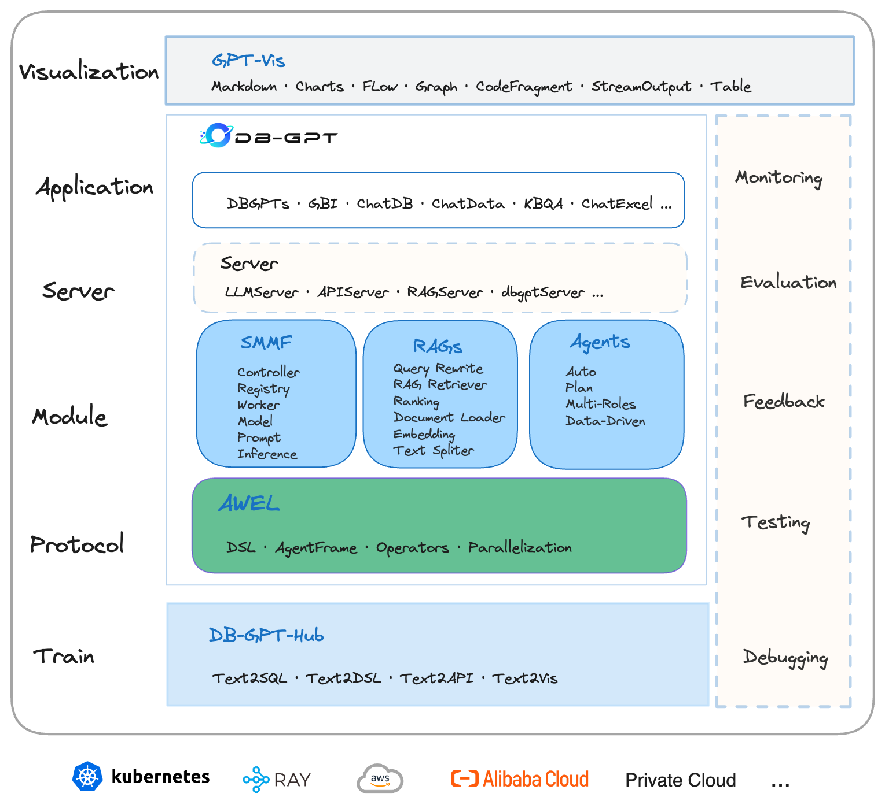
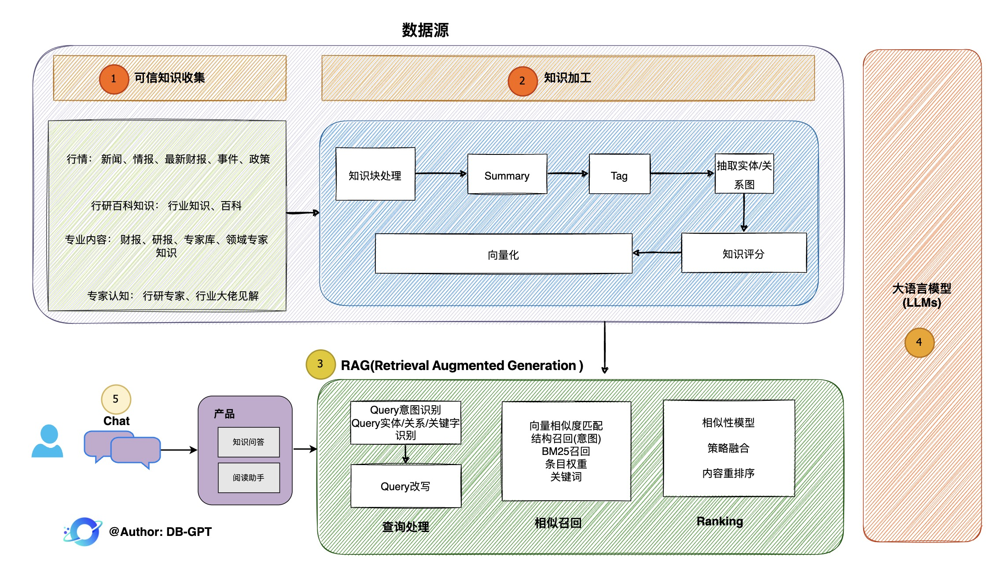

# DB-GPT: AI原生数据应用开发框架

<p align="left">
  
</p>


<div align="center">
  <p>
    <a href="https://github.com/eosphoros-ai/DB-GPT">
        
    </a>
    <a href="https://github.com/eosphoros-ai/DB-GPT">
        
    </a>
    <a href="https://opensource.org/licenses/MIT">
      
    </a>
     <a href="https://github.com/eosphoros-ai/DB-GPT/releases">
      
    </a>
    <a href="https://github.com/eosphoros-ai/DB-GPT/issues">
      
    </a>
    <a href="https://discord.gg/7uQnPuveTY">
      
    </a>
    <a href="https://join.slack.com/t/slack-inu2564/shared_invite/zt-29rcnyw2b-N~ubOD9kFc7b7MDOAM1otA">
      
    </a>
    <a href="https://codespaces.new/eosphoros-ai/DB-GPT">
      
    </a>
  </p>

[**English**](README.md) | [**Discord**](https://discord.gg/7uQnPuveTY) | [**文档**](https://www.yuque.com/eosphoros/dbgpt-docs/bex30nsv60ru0fmx) | [**微信**](https://github.com/eosphoros-ai/DB-GPT/blob/main/README.zh.md#%E8%81%94%E7%B3%BB%E6%88%91%E4%BB%AC) | [**社区**](https://github.com/eosphoros-ai/community) | [**Paper**](https://arxiv.org/pdf/2312.17449.pdf)
</div>

## DB-GPT 是什么？

🤖️ **DB-GPT是一个开源的AI原生数据应用开发框架(AI Native Data App Development framework with AWEL(Agentic Workflow Expression Language) and Agents)。**

目的是构建大模型领域的基础设施，通过开发多模型管理(SMMF)、Text2SQL效果优化、RAG框架以及优化、Multi-Agents框架协作、AWEL(智能体工作流编排)等多种技术能力，让围绕数据库构建大模型应用更简单，更方便。 

🚀 **数据3.0 时代，基于模型、数据库，企业/开发者可以用更少的代码搭建自己的专属应用。**

## 效果演示

### AI原生数据智能应用
---
- [V0.6.0发布——一系列重大功能更新](https://www.yuque.com/eosphoros/dbgpt-docs/fho86kk4e9y4rkpd)
  - AWEL协议升级2.0，支持更复杂的编排，同时优化了前端可视化与交互能力。
  - 支持数据应用的创建与生命周期管理，提供多种应用构建模式。1. 多智能体自动规划模式、2. 任务流编排模式、3. 单一智能体模式、4. 原生应用模式
  - GraphRAG支持图社区摘要与混合检索，性能与检索效果有显著优势，同时支持丰富的前端可视化。
  - 支持意图识别、槽位填充与Prompt管理。
  - GPT-Vis前端可视化升级，支持更丰富的可视化图表。 
  - 支持Text2NLU与Text2GQL微调, 即新增意图分类与从自然语言到图语言的微调。 


### Data Agents 


## 目录
- [架构方案](#架构方案)
- [安装](#安装)
- [特性简介](#特性一览)
- [贡献](#贡献)
- [路线图](#路线图)
- [联系我们](#联系我们)

## 架构方案

<p align="center">
  
</p>

核心能力主要有以下几个部分:
- **RAG(Retrieval Augmented Generation)**，RAG是当下落地实践最多，也是最迫切的领域，DB-GPT目前已经实现了一套基于RAG的框架，用户可以基于DB-GPT的RAG能力构建知识类应用。 

- **GBI**：生成式BI是DB-GPT项目的核心能力之一，为构建企业报表分析、业务洞察提供基础的数智化技术保障。 

- **微调框架**:  模型微调是任何一个企业在垂直、细分领域落地不可或缺的能力，DB-GPT提供了完整的微调框架，实现与DB-GPT项目的无缝打通，在最近的微调中，基于spider的准确率已经做到了82.5%

- **数据驱动的Multi-Agents框架**:  DB-GPT提供了数据驱动的自进化Multi-Agents框架，目标是可以持续基于数据做决策与执行。 

- **数据工厂**: 数据工厂主要是在大模型时代，做可信知识、数据的清洗加工。 

- **数据源**: 对接各类数据源，实现生产业务数据无缝对接到DB-GPT核心能力。 

### RAG生产落地实践架构
<p align="center">
  
</p>

### 子模块
- [DB-GPT-Hub](https://github.com/eosphoros-ai/DB-GPT-Hub) 通过微调来持续提升Text2SQL效果 
- [DB-GPT-Plugins](https://github.com/eosphoros-ai/DB-GPT-Plugins) DB-GPT 插件仓库, 兼容Auto-GPT
- [GPT-Vis](https://github.com/eosphoros-ai/DB-GPT-Web) 可视化协议 

- [dbgpts](https://github.com/eosphoros-ai/dbgpts)  dbgpts 是官方提供的数据应用仓库, 包含数据智能应用, 智能体编排流程模版, 通用算子等构建在DB-GPT之上的资源。 

## 安装


[**教程**](https://www.yuque.com/eosphoros/dbgpt-docs/bex30nsv60ru0fmx)
- [**快速开始**](https://www.yuque.com/eosphoros/dbgpt-docs/ew0kf1plm0bru2ga)
  - [源码安装](https://www.yuque.com/eosphoros/dbgpt-docs/urh3fcx8tu0s9xmb)
  - [Docker安装](https://www.yuque.com/eosphoros/dbgpt-docs/glf87qg4xxcyrp89)
  - [Docker Compose安装](https://www.yuque.com/eosphoros/dbgpt-docs/wwdu11e0v5nkfzin)
- [**使用手册**](https://www.yuque.com/eosphoros/dbgpt-docs/tkspdd0tcy2vlnu4)
  - [知识库](https://www.yuque.com/eosphoros/dbgpt-docs/ycyz3d9b62fccqxh)
  - [数据对话](https://www.yuque.com/eosphoros/dbgpt-docs/gd9hbhi1dextqgbz)
  - [Excel对话](https://www.yuque.com/eosphoros/dbgpt-docs/prugoype0xd2g4bb)
  - [数据库对话](https://www.yuque.com/eosphoros/dbgpt-docs/wswpv3zcm2c9snmg)
  - [报表分析](https://www.yuque.com/eosphoros/dbgpt-docs/vsv49p33eg4p5xc1)
  - [Agents](https://www.yuque.com/eosphoros/dbgpt-docs/pom41m7oqtdd57hm)
- [**进阶教程**](https://www.yuque.com/eosphoros/dbgpt-docs/dxalqb8wsv2xkm5f)
  - [数智应用开发](https://www.yuque.com/eosphoros/dbgpt-docs/ancwnrsk9agc6e4w)
  - [智能体工作流使用](https://www.yuque.com/eosphoros/dbgpt-docs/hcomfb3yrleg7gmq)
  - [智能应用使用](https://www.yuque.com/eosphoros/dbgpt-docs/aiagvxeb86iarq6r)
  - [多模型管理](https://www.yuque.com/eosphoros/dbgpt-docs/huzgcf2abzvqy8uv)
  - [命令行使用](https://www.yuque.com/eosphoros/dbgpt-docs/gd4kgumgd004aly8)
- [**模型服务部署**](https://www.yuque.com/eosphoros/dbgpt-docs/vubxiv9cqed5mc6o)
  - [单机部署](https://www.yuque.com/eosphoros/dbgpt-docs/kwg1ed88lu5fgawb)
  - [集群部署](https://www.yuque.com/eosphoros/dbgpt-docs/gmbp9619ytyn2v1s)
  - [vLLM](https://www.yuque.com/eosphoros/dbgpt-docs/bhy9igdvanx1uluf)
- [**如何Debug**](https://www.yuque.com/eosphoros/dbgpt-docs/eyg0ocbc2ce3q95r)
- [**AWEL**](https://www.yuque.com/eosphoros/dbgpt-docs/zozbzslbfk0m0op5)
- [**FAQ**](https://www.yuque.com/eosphoros/dbgpt-docs/gomtc46qonmyt44l)

## 特性一览
- **私域问答&数据处理&RAG**

  支持内置、多文件格式上传、插件自抓取等方式自定义构建知识库，对海量结构化，非结构化数据做统一向量存储与检索

- **多数据源&GBI**

  支持自然语言与Excel、数据库、数仓等多种数据源交互，并支持分析报告。

- **自动化微调**

  围绕大语言模型、Text2SQL数据集、LoRA/QLoRA/Pturning等微调方法构建的自动化微调轻量框架, 让TextSQL微调像流水线一样方便。详见: [DB-GPT-Hub](https://github.com/eosphoros-ai/DB-GPT-Hub)

- **数据驱动的Agents插件**

  支持自定义插件执行任务，原生支持Auto-GPT插件模型，Agents协议采用Agent Protocol标准

- **多模型支持与管理**

  海量模型支持，包括开源、API代理等几十种大语言模型。如LLaMA/LLaMA2、Baichuan、ChatGLM、文心、通义、智谱等。当前已支持如下模型: 

  - 新增支持模型
    - 🔥🔥🔥  [Qwen2.5-72B-Instruct](https://huggingface.co/Qwen/Qwen2.5-72B-Instruct)
    - 🔥🔥🔥  [Qwen2.5-32B-Instruct](https://huggingface.co/Qwen/Qwen2.5-32B-Instruct)
    - 🔥🔥🔥  [Qwen2.5-14B-Instruct](https://huggingface.co/Qwen/Qwen2.5-14B-Instruct)
    - 🔥🔥🔥  [Qwen2.5-7B-Instruct](https://huggingface.co/Qwen/Qwen2.5-7B-Instruct)
    - 🔥🔥🔥  [Qwen2.5-3B-Instruct](https://huggingface.co/Qwen/Qwen2.5-3B-Instruct)
    - 🔥🔥🔥  [Qwen2.5-1.5B-Instruct](https://huggingface.co/Qwen/Qwen2.5-1.5B-Instruct)
    - 🔥🔥🔥  [Qwen2.5-0.5B-Instruct](https://huggingface.co/Qwen/Qwen2.5-0.5B-Instruct)
    - 🔥🔥🔥  [Qwen2.5-Coder-7B-Instruct](https://huggingface.co/Qwen/Qwen2.5-Coder-7B-Instruct)
    - 🔥🔥🔥  [Qwen2.5-Coder-1.5B-Instruct](https://huggingface.co/Qwen/Qwen2.5-Coder-1.5B-Instruct)
    - 🔥🔥🔥  [Meta-Llama-3.1-405B-Instruct](https://huggingface.co/meta-llama/Meta-Llama-3.1-405B-Instruct)
    - 🔥🔥🔥  [Meta-Llama-3.1-70B-Instruct](https://huggingface.co/meta-llama/Meta-Llama-3.1-70B-Instruct)
    - 🔥🔥🔥  [Meta-Llama-3.1-8B-Instruct](https://huggingface.co/meta-llama/Meta-Llama-3.1-8B-Instruct)
    - 🔥🔥🔥  [gemma-2-27b-it](https://huggingface.co/google/gemma-2-27b-it)
    - 🔥🔥🔥  [gemma-2-9b-it](https://huggingface.co/google/gemma-2-9b-it)
    - 🔥🔥🔥  [DeepSeek-Coder-V2-Instruct](https://huggingface.co/deepseek-ai/DeepSeek-Coder-V2-Instruct)
    - 🔥🔥🔥  [DeepSeek-Coder-V2-Lite-Instruct](https://huggingface.co/deepseek-ai/DeepSeek-Coder-V2-Lite-Instruct)
    - 🔥🔥🔥  [Qwen2-57B-A14B-Instruct](https://huggingface.co/Qwen/Qwen2-57B-A14B-Instruct)
    - 🔥🔥🔥  [Qwen2-57B-A14B-Instruct](https://huggingface.co/Qwen/Qwen2-57B-A14B-Instruct)
    - 🔥🔥🔥  [Qwen2-72B-Instruct](https://huggingface.co/Qwen/Qwen2-72B-Instruct)
    - 🔥🔥🔥  [Qwen2-7B-Instruct](https://huggingface.co/Qwen/Qwen2-7B-Instruct)
    - 🔥🔥🔥  [Qwen2-1.5B-Instruct](https://huggingface.co/Qwen/Qwen2-1.5B-Instruct)
    - 🔥🔥🔥  [Qwen2-0.5B-Instruct](https://huggingface.co/Qwen/Qwen2-0.5B-Instruct)
    - 🔥🔥🔥  [glm-4-9b-chat](https://huggingface.co/THUDM/glm-4-9b-chat)
    - 🔥🔥🔥  [Phi-3](https://huggingface.co/collections/microsoft/phi-3-6626e15e9585a200d2d761e3)
    - 🔥🔥🔥  [Yi-1.5-34B-Chat](https://huggingface.co/01-ai/Yi-1.5-34B-Chat)
    - 🔥🔥🔥  [Yi-1.5-9B-Chat](https://huggingface.co/01-ai/Yi-1.5-9B-Chat)
    - 🔥🔥🔥  [Yi-1.5-6B-Chat](https://huggingface.co/01-ai/Yi-1.5-6B-Chat)
    - 🔥🔥🔥  [Qwen1.5-110B-Chat](https://huggingface.co/Qwen/Qwen1.5-110B-Chat)
    - 🔥🔥🔥  [Qwen1.5-MoE-A2.7B-Chat](https://huggingface.co/Qwen/Qwen1.5-MoE-A2.7B-Chat)
    - 🔥🔥🔥  [Meta-Llama-3-70B-Instruct](https://huggingface.co/meta-llama/Meta-Llama-3-70B-Instruct)
    - 🔥🔥🔥  [Meta-Llama-3-8B-Instruct](https://huggingface.co/meta-llama/Meta-Llama-3-8B-Instruct)
    - 🔥🔥🔥  [CodeQwen1.5-7B-Chat](https://huggingface.co/Qwen/CodeQwen1.5-7B-Chat)
    - 🔥🔥🔥  [Qwen1.5-32B-Chat](https://huggingface.co/Qwen/Qwen1.5-32B-Chat)
    - 🔥🔥🔥  [Starling-LM-7B-beta](https://huggingface.co/Nexusflow/Starling-LM-7B-beta)
    - 🔥🔥🔥  [gemma-7b-it](https://huggingface.co/google/gemma-7b-it)
    - 🔥🔥🔥  [gemma-2b-it](https://huggingface.co/google/gemma-2b-it)
    - 🔥🔥🔥  [SOLAR-10.7B](https://huggingface.co/upstage/SOLAR-10.7B-Instruct-v1.0)
    - 🔥🔥🔥  [Mixtral-8x7B](https://huggingface.co/mistralai/Mixtral-8x7B-Instruct-v0.1)
    - 🔥🔥🔥  [Qwen-72B-Chat](https://huggingface.co/Qwen/Qwen-72B-Chat)
    - 🔥🔥🔥  [Yi-34B-Chat](https://huggingface.co/01-ai/Yi-34B-Chat)
  - [更多开源模型](https://www.yuque.com/eosphoros/dbgpt-docs/iqaaqwriwhp6zslc#qQktR)

  - 支持在线代理模型
    - [x] [DeepSeek.deepseek-chat](https://platform.deepseek.com/api-docs/)
    - [x] [Ollama.API](https://github.com/ollama/ollama/blob/main/docs/api.md)
    - [x] [月之暗面.Moonshot](https://platform.moonshot.cn/docs/)
    - [x] [零一万物.Yi](https://platform.lingyiwanwu.com/docs)
    - [x] [OpenAI·ChatGPT](https://api.openai.com/)
    - [x] [百川·Baichuan](https://platform.baichuan-ai.com/)
    - [x] [阿里·通义](https://www.aliyun.com/product/dashscope)
    - [x] [百度·文心](https://cloud.baidu.com/product/wenxinworkshop?track=dingbutonglan)
    - [x] [智谱·ChatGLM](http://open.bigmodel.cn/)
    - [x] [讯飞·星火](https://xinghuo.xfyun.cn/)
    - [x] [Google·Bard](https://bard.google.com/)
    - [x] [Google·Gemini](https://makersuite.google.com/app/apikey)

- **隐私安全**

  通过私有化大模型、代理脱敏等多种技术保障数据的隐私安全。

- [支持数据源](https://www.yuque.com/eosphoros/dbgpt-docs/rc4r27ybmdwg9472)


## Image

🌐 [AutoDL镜像](https://www.codewithgpu.com/i/eosphoros-ai/DB-GPT/dbgpt)

🌐 [小程序云部署](https://www.yuque.com/eosphoros/dbgpt-docs/ek12ly8k661tbyn8)

### 多语言切换

在.env 配置文件当中，修改LANGUAGE参数来切换使用不同的语言，默认是英文(中文zh, 英文en, 其他语言待补充)

## 使用说明

### 多模型使用

- [使用指南](https://www.yuque.com/eosphoros/dbgpt-docs/huzgcf2abzvqy8uv)

### 数据Agents使用

- [数据Agents](https://www.yuque.com/eosphoros/dbgpt-docs/gwz4rayfuwz78fbq)

## 贡献

更加详细的贡献指南请参考[如何贡献](https://github.com/eosphoros-ai/DB-GPT/blob/main/CONTRIBUTING.md)。

这是一个用于数据库的复杂且创新的工具, 我们的项目也在紧急的开发当中, 会陆续发布一些新的feature。如在使用当中有任何具体问题, 优先在项目下提issue, 如有需要, 请联系如下微信，我会尽力提供帮助，同时也非常欢迎大家参与到项目建设中。

### 贡献者榜单 
<a href="https://github.com/eosphoros-ai/DB-GPT/graphs/contributors">
  
</a>


## Licence

The MIT License (MIT)

## 引用
如果您发现`DB-GPT`对您的研究或开发有用，请引用以下<a href="https://arxiv.org/abs/2312.17449" target="_blank">论文</a>：

```bibtex
@article{xue2023dbgpt,
      title={DB-GPT: Empowering Database Interactions with Private Large Language Models}, 
      author={Siqiao Xue and Caigao Jiang and Wenhui Shi and Fangyin Cheng and Keting Chen and Hongjun Yang and Zhiping Zhang and Jianshan He and Hongyang Zhang and Ganglin Wei and Wang Zhao and Fan Zhou and Danrui Qi and Hong Yi and Shaodong Liu and Faqiang Chen},
      year={2023},
      journal={arXiv preprint arXiv:2312.17449},
      url={https://arxiv.org/abs/2312.17449}
}
```

## 联系我们

  **说明: 由于微信群人数上限的限制, 我们的答疑与问题支持优先会在钉钉大群进行。**
<div style="display: flex; justify-content: space-around;">
    <figure style="display: flex; flex-direction: column;">
        
        <p style="text-align: center;">
          钉钉
        </p>
    </figure>
    <figure style="display: flex; flex-direction: column;">
        
        <p style="text-align: center;">
          微信
        </p> 
    </figure>
</div>

<!-- <p align="center">
  
</p> -->

[](https://star-history.com/#csunny/DB-GPT)
