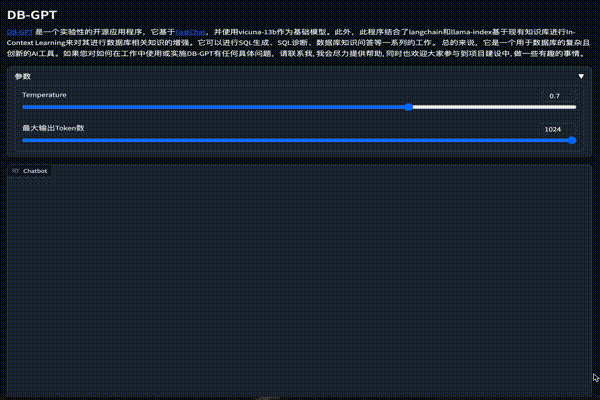
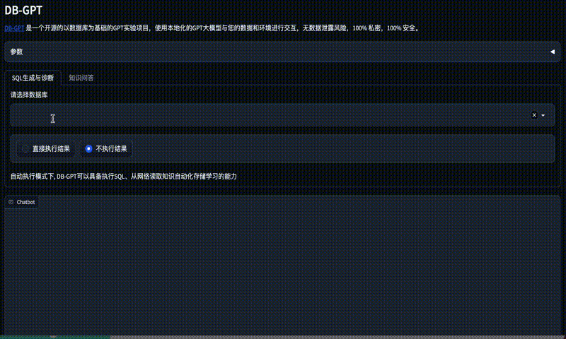
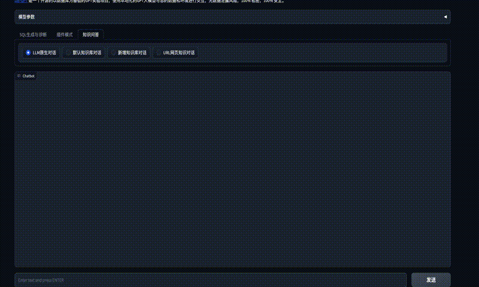

# DB-GPT: 用私有化LLM技术定义数据库下一代交互方式
<div align="center">
  <p>
    <a href="https://github.com/csunny/DB-GPT">
        
    </a>
    <a href="https://github.com/csunny/DB-GPT">
        
    </a>
  </p>

[**English**](README.md)|[**Discord**](https://discord.gg/ea6BnZkY) 
</div>

## DB-GPT 是什么？

随着大模型的发布迭代，大模型变得越来越智能，在使用大模型的过程当中，遇到极大的数据安全与隐私挑战。在利用大模型能力的过程中我们的私密数据跟环境需要掌握自己的手里，完全可控，避免任何的数据隐私泄露以及安全风险。基于此，我们发起了DB-GPT项目，为所有以数据库为基础的场景，构建一套完整的私有大模型解决方案。 此方案因为支持本地部署，所以不仅仅可以应用于独立私有环境，而且还可以根据业务模块独立部署隔离，让大模型的能力绝对私有、安全、可控。

DB-GPT 是一个开源的以数据库为基础的GPT实验项目，使用本地化的GPT大模型与您的数据和环境进行交互，无数据泄露风险，100% 私密，100% 安全。

## 最新发布

- [2023/06/01]🔥 在Vicuna-13B基础模型的基础上，通过插件实现任务链调用。例如单句创建数据库的实现.[演示](./assets/dbgpt_bytebase_plugin.gif)
- [2023/06/01]🔥 QLoRA guanaco(原驼)支持, 支持4090运行33B
- [2023/05/28]🔥根据URL进行对话 [演示](./assets/chat_url_zh.gif)
- [2023/05/21] SQL生成与自动执行. [演示](./assets/auto_sql.gif)
- [2023/05/15] 知识库对话 [演示](./assets/new_knownledge.gif)
- [2023/05/06] SQL生成与诊断 [演示](./assets/演示.gif)

## 特性一览

目前我们已经发布了多种关键的特性，这里一一列举展示一下当前发布的能力。
- SQL 语言能力
  - SQL生成
  - SQL诊断
- 私域问答与数据处理
  - 数据库知识问答
  - 数据处理
- 插件模型
  - 支持自定义插件执行任务，原生支持Auto-GPT插件。如:
    - SQL自动执行，获取查询结果
    - 自动爬取学习知识
- 知识库统一向量存储/索引
  - 非结构化数据支持包括PDF、MarkDown、CSV、WebURL

- 多模型支持
  - 支持多种大语言模型, 当前已支持Vicuna(7b,13b), ChatGLM-6b(int4, int8)
  - TODO: codet5p, codegen2

## 效果演示

示例通过 RTX 4090 GPU 演示
<p align="center">
  
</p>

<p align="center">
  
</p>

<p align="center">
  
</p>

<p align="center">
  
</p>

## 架构方案
DB-GPT基于 [FastChat](https://github.com/lm-sys/FastChat) 构建大模型运行环境，并提供 vicuna 作为基础的大语言模型。此外，我们通过LangChain提供私域知识库问答能力。同时我们支持插件模式, 在设计上原生支持Auto-GPT插件。 

整个DB-GPT的架构，如下图所示

<p align="center">
  
</p>

核心能力主要有以下几个部分。 
1. 知识库能力：支持私域知识库问答能力   
2. 大模型管理能力：基于FastChat提供一个大模型的运营环境。
3. 统一的数据向量化存储与索引：提供一种统一的方式来存储和索引各种数据类型。   
4. 连接模块：用于连接不同的模块和数据源，实现数据的流转和交互。 
5. Agent与插件：提供Agent和插件机制，使得用户可以自定义并增强系统的行为。  
6. Prompt自动生成与优化：自动化生成高质量的Prompt，并进行优化，提高系统的响应效率。  
7. 多端产品界面：支持多种不同的客户端产品，例如Web、移动应用和桌面应用等。

下面对每个模块也做一些简要的介绍:

### 知识库能力
知识库作为当前用户需求最大的场景，我们原生支持知识库的构建与处理。同时在本项目当中，也提供了多种知识库的管理策略。 如:
1. 默认内置知识库  
2. 自定义新增知识库 
3. 通过插件能力自抓取构建知识库等多种使用场景。
   
用户只需要整理好知识文档，即可用我们现有的能力构建大模型所需要的知识库能力。


### 大模型管理能力
在底层大模型接入中，设计了开放的接口，支持对接多种大模型。同时对于接入模型的效果，我们有非常严格的把控与评审机制。对大模型能力上与ChatGPT对比，在准确率上需要满足85%以上的能力对齐。我们用更高的标准筛选模型，是期望在用户使用过程中，可以省去前面繁琐的测试评估环节。

### 统一的数据向量化存储与索引
为了方便对知识向量化之后的管理，我们内置了多种向量存储引擎，从基于内存的Chroma到分布式的Milvus, 可以根据自己的场景需求，选择不同的存储引擎，整个知识向量存储是AI能力增强的基石，向量作为人与大语言模型交互的中间语言，在本项目中的作用非常重要。

### 连接模块
为了能够更方便的与用户的私有环境进行交互，项目设计了连接模块，连接模块可以支持连接到数据库、Excel、知识库等等多种环境当中，实现信息与数据交互。 

### Agent与插件  
Agent与插件能力是大模型能否自动化的核心，在本的项目中，原生支持插件模式，大模型可以自动化完成目标。 同时为了充分发挥社区的优势，本项目中所用的插件原生支持Auto-GPT插件生态，即Auto-GPT的插件可以直接在我们的项目中运行。

### Prompt自动生成与优化 
Prompt是与大模型交互过程中非常重要的部分，一定程度上Prompt决定了大模型生成答案的质量与准确性，在本的项目中，我们会根据用户输入与使用场景，自动优化对应的Prompt，让用户使用大语言模型变得更简单、更高效。 

### 多端产品界面
TODO: 在终端展示上，我们将提供多端产品界面。包括PC、手机、命令行、Slack等多种模式。 


## 安装教程
### 1.硬件说明
因为我们的项目在效果上具备ChatGPT 85%以上的能力，因此对硬件有一定的要求。 但总体来说，我们在消费级的显卡上即可完成项目的部署使用，具体部署的硬件说明如下:
| GPU型号 | 显存大小 | 性能                                       |
| ------- | -------- | ------------------------------------------ |
| RTX4090 | 24G      | 可以流畅的进行对话推理，无卡顿             |
| RTX3090 | 24G      | 可以流畅进行对话推理，有卡顿感，但好于V100 |
| V100    | 16G      | 可以进行对话推理，有明显卡顿               |
### 2.DB-GPT安装

本项目依赖一个本地的 MySQL 数据库服务，你需要本地安装，推荐直接使用 Docker 安装。
```
docker run --name=mysql -p 3306:3306 -e MYSQL_ROOT_PASSWORD=aa123456 -dit mysql:latest
```
向量数据库我们默认使用的是Chroma内存数据库，所以无需特殊安装，如果有需要连接其他的同学，可以按照我们的教程进行安装配置。整个DB-GPT的安装过程，我们使用的是miniconda3的虚拟环境。创建虚拟环境，并安装python依赖包

```
python>=3.10
conda create -n dbgpt_env python=3.10
conda activate dbgpt_env
pip install -r requirements.txt

```

### 3. 运行大模型

关于基础模型, 可以根据[Vicuna](https://github.com/lm-sys/FastChat/blob/main/README.md#model-weights)合成教程进行合成。 
如果此步有困难的同学，也可以直接使用[此链接](https://huggingface.co/Tribbiani/vicuna-7b)上的模型进行替代。

  运行模型服务 
```
cd pilot/server
python llmserver.py
```

运行 gradio webui

```bash
$ python webserver.py 
```
注意: 在启动Webserver之前, 需要修改.env 文件中的MODEL_SERVER = "http://127.0.0.1:8000", 将地址设置为你的服务器地址。

## 使用说明

我们提供了Gradio的用户界面，可以通过我们的用户界面使用DB-GPT， 同时关于我们项目相关的一些代码跟原理介绍，我们也准备了以下几篇参考文章。
1.  [大模型实战系列(1) —— 强强联合Langchain-Vicuna应用实战](https://zhuanlan.zhihu.com/p/628750042)
2.  [大模型实战系列(2) —— DB-GPT 阿里云部署指南](https://zhuanlan.zhihu.com/p/629467580)
3.  [大模型实战系列(3) —— DB-GPT插件模型原理与使用](https://zhuanlan.zhihu.com/p/629623125)


### 多模型使用
在.env 配置文件当中, 修改LLM_MODEL参数来切换使用的模型。

### 多语言用户界面模式
在.env 配置文件当中，修改LANGUAGE参数来切换使用不同的语言，默认是英文(中文zh, 英文en, 其他语言待补充)

### 打造属于你的知识库：

1.将个人知识文件或者文件夹放入pilot/datasets目录中

2.在.env文件指定你的向量数据库类型,VECTOR_STORE_TYPE(默认Chroma),目前支持Chroma,Milvus(需要设置MILVUS_URL和MILVUS_PORT)

注意Milvus版本需要>2.1

3.在tools目录执行知识入库脚本（）

如果是选择默认知识库，不需要指定 --vector_name, 默认default

```
python tools/knowledge_init.py

```

如果选择新增知识库，在界面上新增知识库输入你的知识库名,

```
python tools/knowledge_init.py --vector_name = yourname

--vector_name: vector_name  default_value:default

```
就可以根据你的知识库进行问答

注意，这里默认向量模型是text2vec-large-chinese(模型比较大，如果个人电脑配置不够建议采用text2vec-base-chinese),因此确保需要将模型download下来放到models目录中。

如果在使用知识库时遇到与nltk相关的错误，您需要安装nltk工具包。更多详情，请参见：[nltk文档](https://www.nltk.org/data.html)
Run the Python interpreter and type the commands:
```bash
>>> import nltk
>>> nltk.download()
```

## 感谢

项目取得的成果，需要感谢技术社区，尤其以下项目。

- [FastChat](https://github.com/lm-sys/FastChat) 提供 chat 服务
- [vicuna-13b](https://huggingface.co/Tribbiani/vicuna-13b) 作为基础模型
- [langchain](https://github.com/hwchase17/langchain) 工具链
- [Auto-GPT](https://github.com/Significant-Gravitas/Auto-GPT) 通用的插件模版
- [Hugging Face](https://huggingface.co/) 大模型管理
- [Chroma](https://github.com/chroma-core/chroma) 向量存储
- [Milvus](https://milvus.io/) 分布式向量存储
- [ChatGLM](https://github.com/THUDM/ChatGLM-6B) 基础模型
- [llama-index](https://github.com/jerryjliu/llama_index) 基于现有知识库进行[In-Context Learning](https://arxiv.org/abs/2301.00234)来对其进行数据库相关知识的增强。

# 贡献

- 提交代码前请先执行 `black .`

这是一个用于数据库的复杂且创新的工具, 我们的项目也在紧急的开发当中, 会陆续发布一些新的feature。如在使用当中有任何具体问题, 优先在项目下提issue, 如有需要, 请联系如下微信，我会尽力提供帮助，同时也非常欢迎大家参与到项目建设中。

<p align="center">
  
</p>

## Licence

The MIT License (MIT)

[](https://star-history.com/#csunny/DB-GPT)

