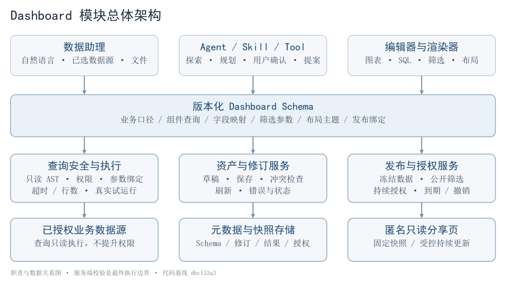
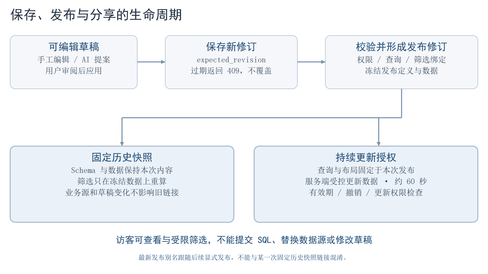

# Dashboard 模块设计

模块把看板保存为版本化的工程对象。Schema 表达业务口径、查询、筛选、布局和展示；Snapshot 表达一次执行结果。模型负责提出计划和变更，服务端负责验证、授权、执行与持久化，前端负责审阅和交互。

## 总体架构

| 模块 | 职责 | 后端或前端入口 |
|---|---|---|
| Agent / Skill | 数据探索、无 SQL 规划、确认、受限修改提案 | tools/dashboard.py、planner.py、confirmation.py |
| Schema | 结构与跨字段校验、兼容版本、筛选和查询绑定 | schemas.py、schema/dashboard.schema.json、web/types/dashboard.ts |
| 查询执行 | AST 只读检查、表字段允许列表、参数、资源限制、血缘 | sql_security.py、query_executor.py、lineage.py |
| 资产 | 草稿、修订、保存冲突、刷新、发布与导出 | service.py、models.py、api.py |
| 访问 | 身份、数据源授权、对象角色、公开访问与令牌保管 | identity.py、access.py、publication.py、live_share.py、share_vault.py |
| 编辑与渲染 | 组件配置、AI 提案、布局、筛选、发布 | DashboardEditor.tsx、DashboardRenderer.tsx、DashboardPublishDialog.tsx |

后端入口相对 [dashboard 目录](../../packages/dbgpt-app/src/dbgpt_app/openapi/api_v1/dashboard/)，工具位于相邻的 tools 目录；前端组件相对 [dashboard 组件目录](../../web/new-components/dashboard/)。

## 数据合同

后端 Pydantic 是结构和跨字段校验的实现依据；JSON Schema 用于交换与验证，TypeScript 用于前端类型约束。浏览器校验不能替代服务端校验。

| 字段 | 内容 |
|---|---|
| schema_version | 兼容 1.0—1.4，包含联邦、指标口径、发布展示及主题增量。 |
| dashboard | ID、标题、说明、数据来源、状态、主题和刷新策略。 |
| metric_context | 粒度、时间、新鲜度、来源与指标口径。 |
| filters | 类型、字段、选项、默认值与查询参数绑定。 |
| widgets | 组件、查询、输出字段、图表编码及公开筛选聚合。 |
| layouts | 网格位置、尺寸及移动端展示策略。 |
| metadata | 会话、生成来源、模板和兼容信息。 |

五类基础组件为 kpi、line、bar、pie、table。扩展展示形式通过可视化配置表达。筛选合同包含日期、单选、多选、文本和数字范围，具体能力由查询参数及发布绑定共同决定。字段细节以 [schemas.py](../../packages/dbgpt-app/src/dbgpt_app/openapi/api_v1/dashboard/schemas.py) 为准。

## 从需求到草稿

1. 用户选择数据源或关联文件，Agent 探索表、字段、样本和时间列。
2. 规划器产生无 SQL 的指标、维度、筛选和组件计划，等待用户确认。
3. 确认后的生成关联计划与组件标识，逐组件检查 SQL、权限与真实执行结果。
4. 事件分别表示规划、试运行、错误和草稿保存，不能把候选查询成功当作资产已经保存。
5. 编辑器接受手工调整或 AI 提案；保存携带 expected_revision，过期保存返回冲突。

AI 续改先读取当前对象，再产生受限提案。用户审阅后才应用；只读解释和异常分析不能静默改变草稿。跨对象修改按依赖顺序验证，新增筛选器必须与组件引用、参数和公开聚合一致。

## 查询和筛选

SQL 经 AST 解析后只接受允许的只读查询，再检查表字段和调用者的数据源权限。用户值使用参数绑定；多选参数由执行层展开。查询受超时、行数和总等待限制约束。

筛选需要同时满足界面选项、SQL 参数及公开数据聚合三处绑定。公开 KPI 可能需要在物化数据中保留筛选维度。单组件刷新失败保留其他成功结果；生成过程的候选持久化是另一条路径，不能用刷新测试代替其验收。

## 草稿与发布

| 对象 | 变化方式 | 边界 |
|---|---|---|
| 草稿 | 用户显式保存 | 修订冲突不能静默覆盖。 |
| 固定历史发布 | Schema 与数据冻结 | 筛选在冻结数据中计算，不随源数据或草稿变化。 |
| 最新发布别名 | 跟随后续显式发布 | 与指定修订的固定历史链接区分。 |
| 持续分享 | 按已发布定义重新物化数据 | 有效期、撤销与权限控制；页面刷新节奏不构成实时性保证。 |

发布前检查权限、Schema、查询与发布绑定。公开访客不能提交任意 SQL 或修改草稿。令牌查找使用散列；授权发布者恢复链接所需的密文保存在独立表，部署需管理加密密钥。详见 [安全说明](SECURITY.md)。

## 模板、资源与维护

数据模板通过字段、粒度和关系映射创建 Schema；风格模板提供布局和表达指导。手动映射必须保持业务含义。模板收藏使用浏览器持久化，目前不提供账户跨设备同步。

编辑器保存位置和尺寸，并检查碰撞；紧凑排列由用户主动触发。模板主题变更用于新资产，历史定义仍需可读。工程 ZIP 提供 Schema、Plan 与 SQL 复核材料，不是独立离线应用。

架构图整理自 2026-09-26 设计材料。[开发指南](DEVELOPER_GUIDE.md)说明修改合同及迁移的要求，[验证说明](VALIDATION.md)区分历史结果与拆分候选验证。
