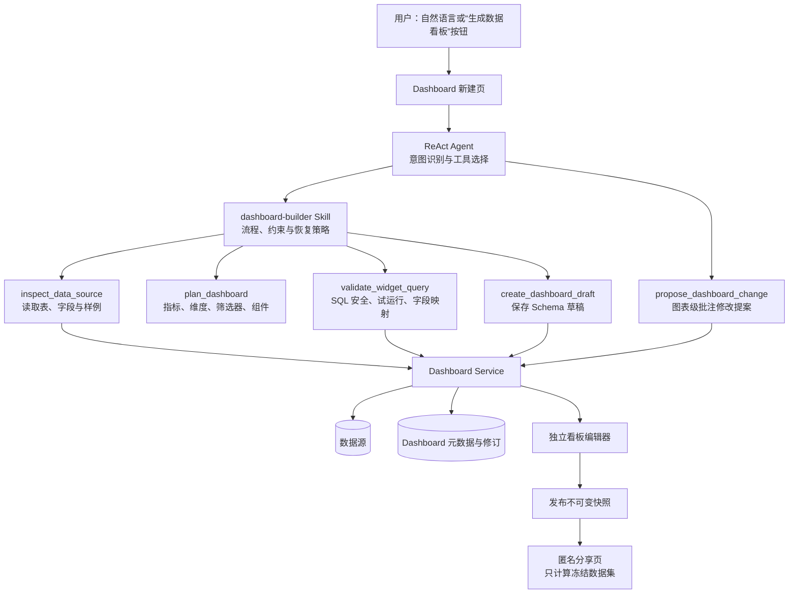
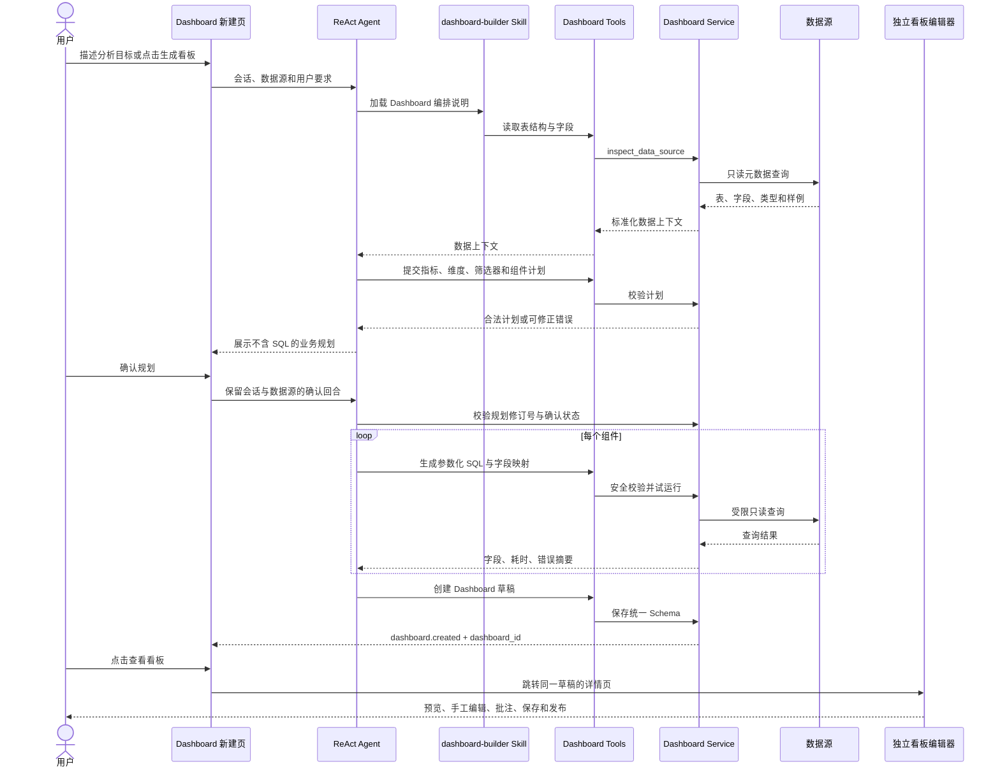

# Dashboard 自然语言触发架构：Tool 与 Skill 的职责划分

## 1. 结论

Dashboard 生成采用 **Skill 负责编排、Tool 负责确定性操作** 的组合方案，而不是把整套逻辑直接写入主页 ReAct Agent。

- `dashboard-builder` Skill：告诉 Agent 何时应该生成看板，以及“理解需求 → 规划 → 生成查询 → 校验 → 创建草稿”的执行顺序。
- Dashboard Tools：暴露小而稳定的动作，例如读取数据结构、校验计划、试运行组件查询、创建草稿和提出局部修改。
- Dashboard Service：负责 Schema、SQL 安全、持久化、修订控制、发布快照和分享筛选；它不依赖具体模型。
- ReAct Agent：只负责识别意图、加载 Skill、选择 Tool 和向用户解释结果，保持轻量、可替换。

简单、确定性的创建动作适合 Tool；跨多步、有恢复策略的生成流程适合 Skill。因此二者不是二选一。

## 2. 系统分层



## 3. 一次生成请求的数据流



## 4. 为什么不把代码直接塞进主页 Agent

1. 主页 Agent 不应该知道数据库表、修订表和发布令牌的实现细节。
2. SQL 安全和 Schema 校验必须在服务端确定性执行，不能依赖提示词自觉。
3. 同一套 Dashboard Service 可同时被自然语言、手工编辑器、测试和后续其他 Agent 调用。
4. Skill 可以独立升级流程，不必频繁改动 ReAct 核心循环。
5. Tool 返回结构化错误后，Agent 可以只修复失败组件，不丢弃整个看板。

## 5. 两种触发入口

### 自动识别

用户明确说“生成看板、仪表盘、Dashboard、持续监控”时，Agent 加载 `dashboard-builder` Skill。普通的一次性问数或单图请求不会被强制转换为看板。

### 新建入口

“数据看板”列表的“新建看板”打开 `/dashboards/new/`。用户选择数据源或上传文件、提交需求，页面沿用同一 Skill 与 Tool 链路，并在业务规划确认后进入 SQL 生成。

## 6. 图表批注修改链路

```text
选中稳定组件 ID 或数据点
→ 保存批注上下文
→ propose_dashboard_change Tool 生成受限 Patch
→ 服务端在内存中应用
→ 校验 Schema、SQL 和受影响组件
→ 用户查看前后差异
→ 确认后写入新修订；放弃则草稿不变
```

模型只返回基于稳定 ID 的允许操作，不能直接修改所有者、数据源、权限、令牌或执行元数据。修订已变化时，旧提案失效并要求重新生成。

## 7. 实现边界与维护

统一 Schema、规划确认、独立编辑器、组件 SQL、修订、两种发布模式及批注提案均有实现。部署时仍需接入真实身份和数据源授权，并独立评估模型生成的业务口径。持续维护重点是模型语义、外部数据库兼容性和共享接口回归，实际验证范围见 [验证说明](VALIDATION.md)。
