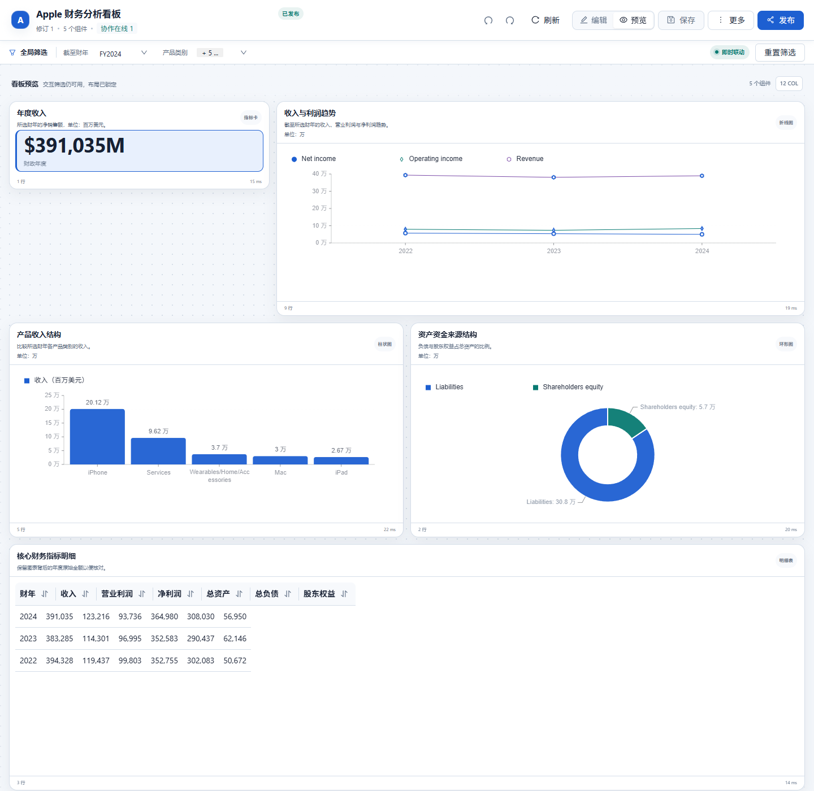
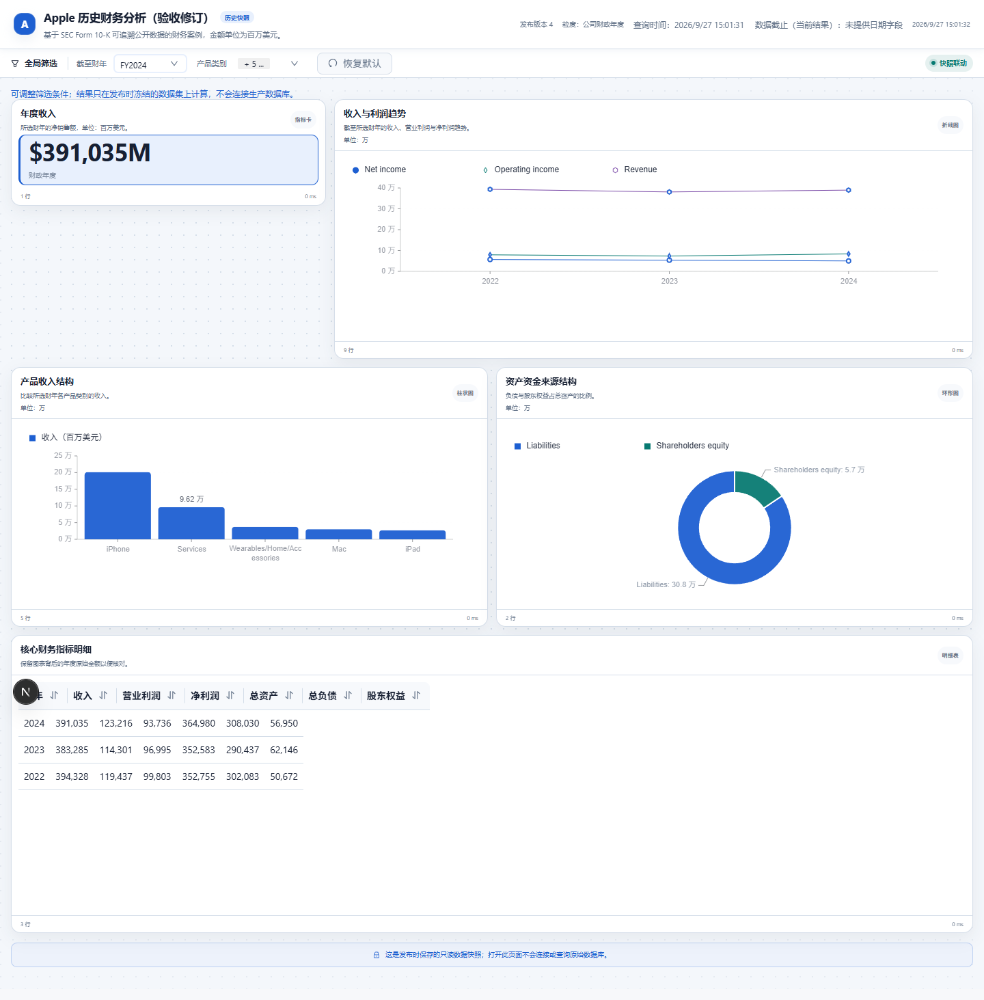
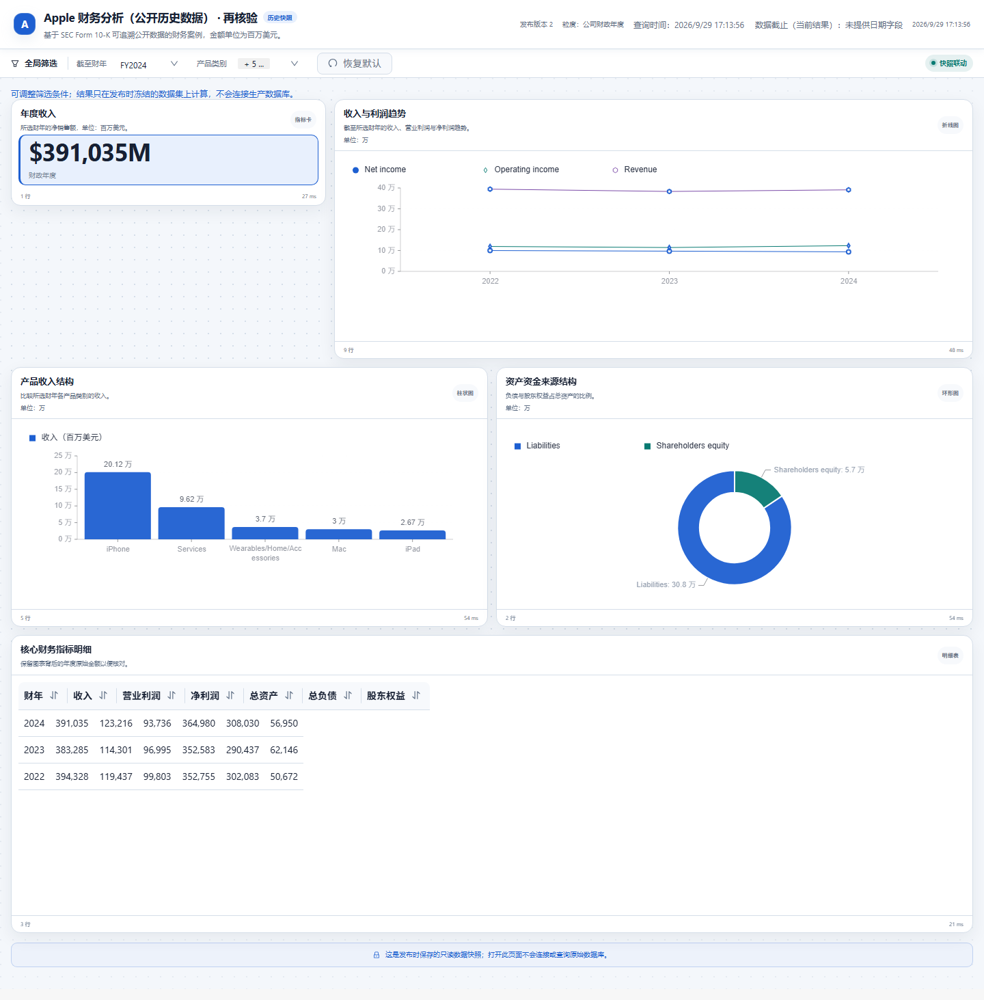

# Apple 历史财务看板

使用 Apple FY2022—FY2024 公开财报精简摘录，展示年度总览、跨年趋势、产品结构和资产资金来源。财年与产品筛选共用 Dashboard 的查询、编辑和发布能力。

## 数据准备

在仓库根目录生成独立演示数据库：

```sh
python examples/dashboard/build_demo_databases.py --output output/dashboard-demo
```

生成器重建目标目录中的同名示例库。通过数据源页面注册 `output/dashboard-demo/apple_financial_demo.db`。固定定义见 [apple-financial.schema.json](../../../examples/dashboard/schemas/apple-financial.schema.json)，来源与提取信息见 [apple-sec-sources.json](../../../examples/dashboard/sources/apple-sec-sources.json)。配置中的数据源标识须与实际注册结果一致。

| 表 | 粒度 | 行数 |
|---|---|---:|
| annual_financials | 财年，收入、利润、资产、负债及权益 | 3 |
| product_revenue | 财年 × 产品 | 15 |
| source_metadata | 财年，来源及单位 | 3 |

金额统一为**百万美元**，FY 表示 Apple 财年。来源为 [Apple 2024 Form 10-K](https://www.sec.gov/Archives/edgar/data/320193/000032019324000123/aapl-20240928.htm) 与 [Apple 2023 Form 10-K](https://www.sec.gov/Archives/edgar/data/320193/000032019323000106/aapl-20230930.htm)。这是固定历史数据示例。

| 财年 | 收入 | 营业利润 | 净利润 |
|---|---:|---:|---:|
| FY2022 | 394,328 | 119,437 | 99,803 |
| FY2023 | 383,285 | 114,301 | 96,995 |
| FY2024 | 391,035 | 123,216 | 93,736 |

每年产品收入合计应等于总收入，资产应等于负债加权益。先检查这些恒等式，再核对可视化。

## 制作和筛选口径

```text
基于 apple_financial_demo 规划 FY2022—FY2024 财务看板，包含年度收入、
收入与利润趋势、产品收入结构、负债与权益结构及核心财务明细。
提供截至财年与产品多选，金额为百万美元，保留 SEC 来源说明。
先展示规划，等我确认后再生成。
```

| 组件 | 筛选规则 |
|---|---|
| 年度收入 KPI | 取所选财年，不受产品多选影响。 |
| 收入与利润趋势 | 显示截至所选财年的三个系列，不堆叠为一个总值。 |
| 产品收入结构 | 同时受财年和产品多选影响。 |
| 资产资金来源 | 取所选财年，负债与权益合计等于资产。 |
| 财务明细 | 显示截至所选财年的原始数值。 |



截图来自 2026-09-26 保留的开发实例，是既有固定 Schema 资产；不计为新的模型生成结果或拆分候选的浏览器验收。KPI 的 M 表示百万美元，图表轴缩放不能改变原始金额单位。

## 编辑与发布演示

1. 复制演示资产，默认 FY2024 的收入 KPI 应为 391,035，明细包含三个财年。
2. 改为 FY2022，KPI 应为 394,328，趋势与明细只保留截至 FY2022 的数据。
3. 恢复 FY2024，只选 iPhone。产品图缩小范围，年度收入 KPI 仍为 391,035。
4. 打开组件 SQL 和参数设置，修改标题或布局，试运行、保存并重开。
5. 发布固定快照，在无登录窗口重复财年与产品筛选，核对影响范围和数值。
6. 检查来源说明。工程导出用于复核 Schema、SQL 与来源，不是独立离线应用。

固定 Schema 可用于确定性回归；通过模型生成的副本需单独记录模型配置、提示、人工修正和实际结果。历史中存在人工修正财务图的记录，不能据此宣称模型一次成功。

## 验收方法

对默认、FY2022、FY2023、仅 iPhone 四组筛选逐一核对五组件的实时查询和冻结筛选结果。历史 2026-09-26 记录为 20/20 组比较一致及既有页面读取；不据此认定拆分候选重新完成全部编辑和发布步骤。当前检查及限制见 [验证说明](../VALIDATION.md)。


## 2026-09-27 补充验收

真实模型流程已完成生成、编辑保存、返回来源对话和匿名发布；首次内容复核发现四个 KPI 错映射为财年，系列也有语义错误。按本文已核验的五组件定义人工修订后重新发布。页面 FY2024 → FY2022 的收入为 391,035 → 394,328；实际匿名 API 仅选 iPhone 为 201,183，总收入仍为 391,035。独立 20 组查询/冻结筛选复算通过。金额为百万美元。此记录包含人工修订，不是模型一次成功。



截图来自 2026-09-27 的隔离实例；当前候选验证见 [验证说明](../VALIDATION.md)。

## 拆分候选的确定性验收（2026-09-29）

随库五组件 Schema 经真实后端接口完成保存、重开、刷新、固定发布及匿名桌面/手机访问。FY2024 收入的独立查询与页面值均为 391,035 百万美元；页面运行错误为空，截图连续三张指纹一致后保存。该验收未调用外部模型，不能替代上文筛选矩阵或模型语义评估。


