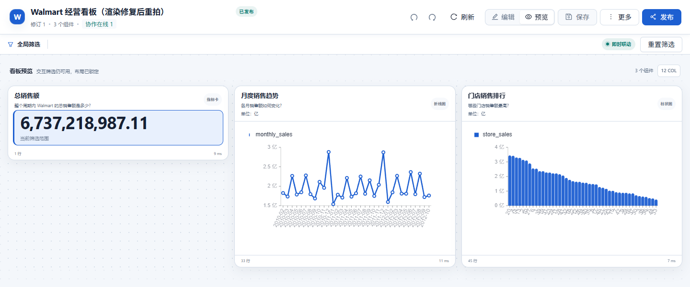
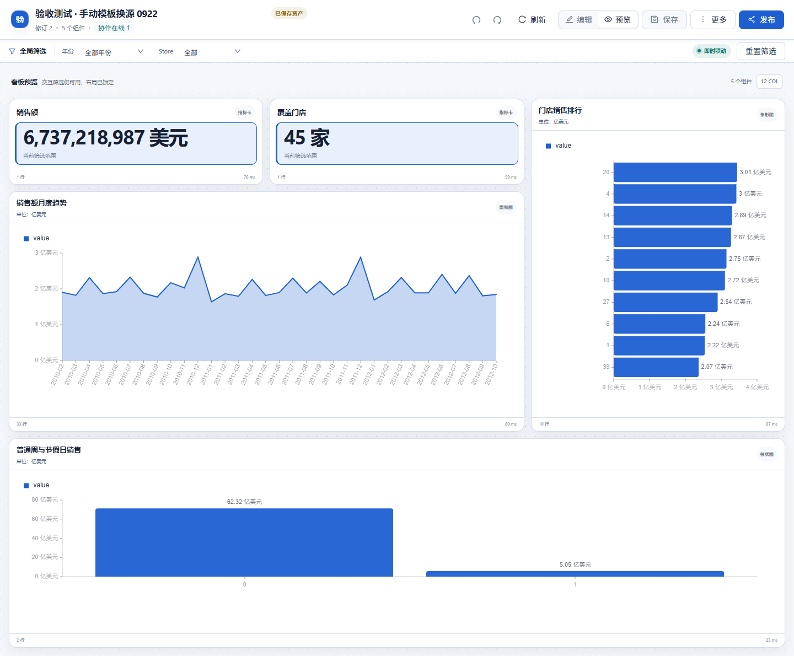
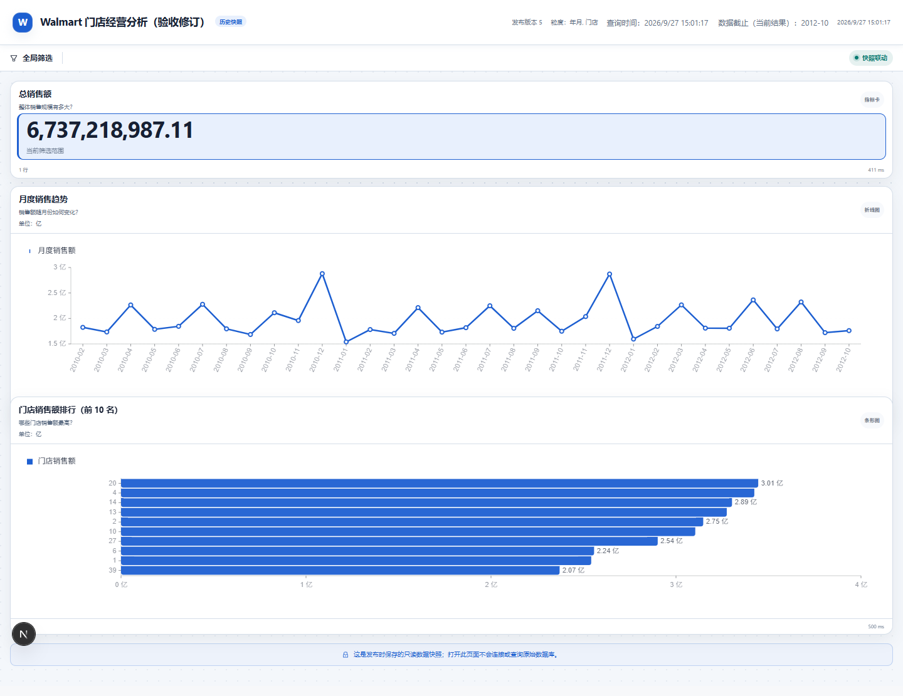
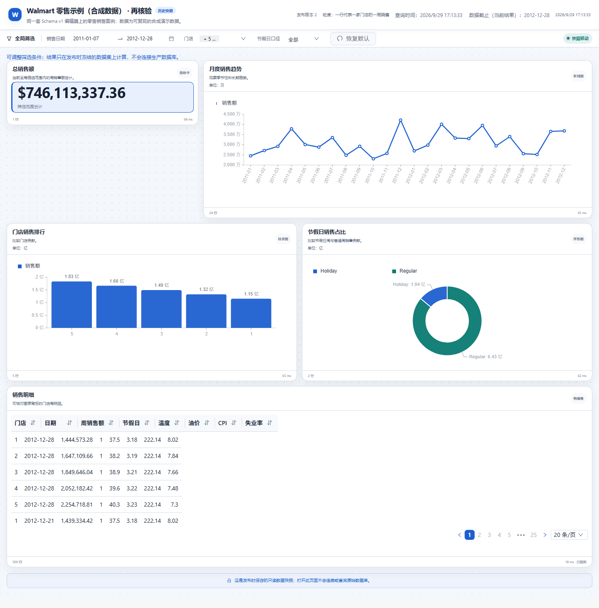

# Walmart 零售经营看板

本案例按“整体规模 → 时间变化 → 门店贡献”组织经营复盘，分别使用总销售额 KPI、月度趋势和门店排行。查看查询、编辑布局、保存和发布都使用公共 Dashboard 模块。

## 数据来源与复现边界

有两种零售输入，使用前应明确选择：

| 输入 | 获取与用途 | 数值边界 |
|---|---|---|
| 合成零售示例 | 运行仓库生成器，得到 walmart_sales_demo.db | 用于独立安装的功能演示；数值不等于下列真实历史案例。 |
| 历史 Walmart 验收源 | 官方基线已经包含的 CSV 与 SQLite 示例，表 walmart_sales | 与公开 Kaggle 副本逐字节/逐行核验，详见下文；并非新增自造数据。 |

在仓库根目录生成独立演示数据：

```sh
python examples/dashboard/build_demo_databases.py --output output/dashboard-demo
```

该命令会重建目标目录中同名的示例数据库，使用独立目录，不要指向业务数据库。通过 DB-GPT 数据源页面注册生成的 SQLite 文件后，按其实际表结构生成看板。固定示例见 [schemas](../../../examples/dashboard/schemas/)；生成器的表与字段是独立示例合同，不能直接套用下方历史源 SQL。

历史案例可以直接复现。官方基线已包含 [Walmart_Sales.csv](../../../docker/examples/excel/Walmart_Sales.csv) 和 [Walmart_Sales.db](../../../docker/examples/dashboard/Walmart_Sales.db)，注册数据库时使用名称 `Walmart_Sales`。公共匹配副本为 [Kaggle Walmart Sales](https://www.kaggle.com/datasets/mikhail1681/walmart-sales)。2026-09-27 下载的 CSV 与仓库 CSV 的 SHA-256 均为 `0846b6941217dd938ceba6ae04650ccbbd01f4877a5f88bfa4dbecda54806c8f`。这证明数据内容一致，不证明最初开发者的下载来源或新增授权；该历史源沿用官方已有文件。

无需联网的复核命令如下，对照 CSV 和数据库全部 6,435 行、每行八个字段，并检查业务键、日期与销售总额。数据库以只读方式打开：

```sh
python examples/dashboard/verify_walmart_source.py
```

历史源的口径如下：

| 项目 | 定义或历史核对值 |
|---|---|
| 粒度 | 一家门店的一个销售周，业务键 Store + Date。 |
| 记录与门店 | 6,435 条、45 家。 |
| 时间 | 2010-02-05 至 2012-10-26，共 143 个周日期、33 个年月。 |
| 关键字段 | Store、Date、Weekly_Sales、Holiday_Flag；Date 为 DD-MM-YYYY 文本。 |
| 总额 | Weekly_Sales 合计 6,737,218,987.11；无汇率换算。 |
| 前五门店 | 20、4、14、13、2，按累计销售额降序。 |

历史源文件 SHA-256：`14c4c65ebfcd34606ea061fd4e7cf5486a22b3fe1736cbd73a8dcd04b958d5a5`。2010、2012 年覆盖不完整，年度总额不能直接当作可比全年业绩；累计排行也不等于单店效率。

## 制作和核对

选择历史数据源后，可输入：

```text
生成精简 Walmart 经营看板，只包含总销售额、月度趋势和门店排行三个组件，
不要创建筛选器。先生成规划，等待我确认后再生成 SQL。
```

检查规划的粒度和组件，再确认生成。核验 KPI 总额、33 个完整年月和 45 家门店的金额与顺序。月度查询需要保留年份：

```sql
SELECT substr(Date, 7, 4) || '-' || substr(Date, 4, 2) AS month,
       SUM(Weekly_Sales) AS sales
FROM walmart_sales
GROUP BY substr(Date, 7, 4) || '-' || substr(Date, 4, 2)
ORDER BY month;
```



截图来自 2026-09-26 保留的开发实例，展示既有资产；不代表拆分候选中重新执行了生成流程。图表刻度经过缩放，核对时使用查询原值。

复制资产后打开组件设置，查看 SQL、输出字段和图表映射。修改标题或布局，试运行并保存，重开检查结果。拖动与缩放受布局碰撞约束。

## 模板路径和发布

模板页的“零售经营总览”可通过日期、门店、销售额和节假日字段匹配创建五组件副本，包含销售额、门店数、趋势、前十门店及节假日汇总，并带筛选。它与无筛选的三组件自然语言案例是不同资产。



该图为 2026-09-26 读取既有模板副本，KPI 的整数展示不改变查询精度。模板字段匹配成功不计为新增模型生成成功样本。

发布时选择“固定发布时的数据”，在无登录窗口核对公开页面。三组件案例没有筛选器；有筛选的模板副本需要另行检查每个绑定。选择“跟随数据源更新”时，数据按已发布定义更新；演示源变化应使用独立测试库。

## 验收方法

记录数据指纹、组件键、金额、顺序、编辑后修订号及匿名发布结果。历史 2026-09-26 记录包括 487 组聚合对比和既有页面读取；这些结果对应当时的集成版本，也不等同于最终版本的完整生成、编辑和发布验收。当前检查见 [验证说明](../VALIDATION.md)。


## 2026-09-27 补充验收

真实模型生成三组件后完成编辑、保存、返回对话与固定发布；人工整理重叠布局并把门店图设为前 10 名，原查询仍保留 45 店结果。匿名页总额为 6,737,218,987.11。2026-09-27 完成 487 组聚合复算和 CSV/数据库逐行核验。原需求不设置筛选器。



截图来自 2026-09-27 的隔离实例；当前候选验证见 [验证说明](../VALIDATION.md)。

## 拆分候选的确定性验收（2026-09-29）

合成零售示例采用随库五组件 Schema，经真实后端接口完成保存、重开、刷新、固定发布及匿名桌面/手机访问。独立查询总销售额为 746,113,337.36，页面金额一致；这与前述真实历史 Walmart 总额是两个数据源。页面运行错误为空，截图连续三张指纹一致后保存。该验收未调用外部模型。


