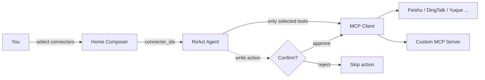

# MCP Connectors

**MCP Connectors** let your DB-GPT agents reach beyond the database — sending messages, reading and writing documents, managing issues, and searching the web — by connecting to external services through the **Model Context Protocol (MCP)**.

Activate a built-in template or plug in any custom MCP server, then pick the connectors you want in the composer. The agent only sees the tools you select, and any write action pauses for your confirmation first.

:::info What is MCP?
The [Model Context Protocol](https://modelcontextprotocol.io) is an open standard that gives AI applications a uniform way to talk to external tools and services. Each connector in DB-GPT is backed by an MCP server, so adding a new capability is as simple as pointing to its endpoint.
:::

## Highlights

- **Built-in templates** — One-click activation for Feishu, DingTalk, Yuque, GitHub, Notion, Linear, Tavily, and DeepWiki.
- **Custom MCP servers** — Connect any SSE or Streamable HTTP MCP endpoint with your own auth.
- **Per-conversation selection** — Choose which connectors to attach in the composer; the agent's prompt stays focused and token-efficient.
- **Human-in-the-loop confirmation** — Write actions (create / update / delete) pop a confirmation dialog before they run.
- **Tool transparency** — Inspect the full tool list of any connector, with parameters and descriptions.
- **Secure credentials** — Tokens are encrypted at rest and survive process restarts.

## How it works

A connector lives in one of three states:

| State | Meaning |
| --- | --- |
| **Available** | A template in the catalog, or the generic "custom MCP" entry — not yet configured. |
| **Active** | Configured with credentials and connected; its tools are ready to use. |
| **Attached** | Selected in the current conversation — the agent actually injects its tools. |

## Built-in connectors

| Connector | Category | Default transport | Typical tools |
| --- | --- | --- | --- |
| Feishu | Communication | SSE | Send messages, read / write docs, calendar |
| DingTalk | Communication | SSE | Group messages, bot notifications |
| Yuque | Document | SSE | Read / write knowledge base docs |
| GitHub | Project | Streamable HTTP | Issues, PRs, repository management |
| Notion | Document | Streamable HTTP | Pages and databases read / write |
| Linear | Project | Streamable HTTP | Issues / projects collaboration |
| Tavily | Search | Streamable HTTP | LLM-optimized web search, returns Markdown |
| DeepWiki | Dev Tools | Streamable HTTP | AI reading & Q&A over any GitHub repo |

## Managing connectors

Open the **Connectors** page to see every template and custom server as a card. Each card shows the icon, name, a `Template` / `Custom` badge, its category, the `MCP / SSE` (or Streamable HTTP) transport, and a short description. Use the search box and the **All / Active / Inactive / Needs attention** tabs to filter.

  

- **Template cards** show an `Activate` button — click it to fill in credentials and connect.
- **Active cards** show an `● Active` badge and quick actions to test the connection, edit, or delete.

### Add a connector

Click **Add Connector** to open the dialog:

  

| Field | Description |
| --- | --- |
| **Connector name** | A display name for this connector. |
| **Connector type** | Pick a built-in template or **Custom MCP Server**. |
| **Transport protocol** | **Streamable HTTP** (default) or **SSE**. |
| **Auth type** | `none`, `bearer`, or `token` — show the token / header fields as needed. |
| **Connector description** | Optional. Shown in the agent's tool description. |

For a custom server, just provide the endpoint URL, transport, and authentication. Credentials are encrypted before they are stored.

### Inspect the tools

Open a connector's detail to browse every tool it exposes. The panel lists each tool name with its description and an **Input parameters** table (name, type, required, description) — useful for understanding exactly what the agent can call.

  

## Using connectors in a conversation

1. On the home page, open the connector picker in the composer toolbar (**Select MCP**).
2. Tick one or more connectors. The composer shows the selected count, and the agent will only be given those connectors' tools.
3. Ask your question. When the agent needs a tool, it calls it automatically.
4. If the agent triggers a **write action** (for example, creating a doc or sending a message), a confirmation dialog appears. Approve to run it, or reject to skip — the agent continues either way.

:::tip Why selection matters
Attaching only the connectors you need keeps the agent's prompt focused, reduces token usage, and prevents the model from picking the wrong tool.
:::

## Notes & limitations

- Built-in templates ship with sensible `confirm` actions (write operations require confirmation); custom MCP tools run without confirmation in this release.
- Credentials are scoped per user and restored automatically after a restart.
- If a server is offline at startup, its connector is marked so you can re-test it from the card.
