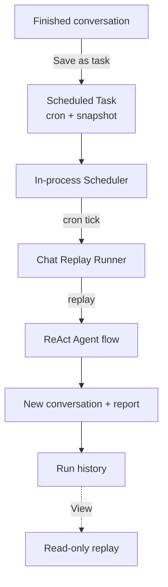

# Scheduled Tasks

**Scheduled Tasks** turn a one-off conversation into a recurring job. Run a data analysis once, save it as a task, and DB-GPT replays the whole ReAct Agent flow on a cron schedule — generating a fresh report every time.

Every run produces a brand-new conversation you can replay later, so you always have a full history of what was generated and when.

:::info Built-in, zero config
The scheduler runs inside the webserver process and starts automatically. No extra service to deploy.
:::

## Highlights

- **Save any conversation** — Freeze a finished conversation (question + model + selected skill / connectors) into a repeatable task.
- **Flexible scheduling** — Pick a preset (Hourly / Daily / Weekly / Monthly) or write a custom cron expression, with a live "next run" preview.
- **Automatic replay** — At each cron tick the agent re-runs the full flow and writes the result to history.
- **Execution history** — Every run records its status, duration, and a result summary.
- **Replay without re-running** — Open any past run to view its conversation snapshot — pure read, zero LLM calls.
- **Restart self-healing** — Enabled tasks are reloaded into the scheduler when the process restarts.

## How it works

## Saving a conversation as a task

After a conversation has produced a report, open **Save as Scheduled Task** from the home page.

  

| Field | Description |
| --- | --- |
| **Task name** | Required. A name for the task. |
| **Description** | Optional. A note about what the task does. |
| **Frequency** | `Hourly` / `Daily` / `Weekly` / `Monthly`, or `Custom` for a raw cron expression. |
| **Cron expression** | Shown live as you adjust the frequency (e.g. `0 9 * * *`). |

The **"Will reuse this conversation environment (read-only)"** section shows the frozen context — the model and the original question — that each run will replay. Click **Save & enable** to create the task and schedule it.

## Managing tasks

The **Scheduled Tasks** page lists every task with its status, cron expression, next run time, and creator. Use the search box and the **All / Enabled / Paused** tabs to filter, and the **Enable** toggle to pause or resume a task.

  

| Column | Description |
| --- | --- |
| **Task name** | Name and description. |
| **Status** | `Enabled` or `Paused`. |
| **Cron expression** | The active schedule. |
| **Next run** | When the task will fire next. |
| **Creator** | Who created the task. |
| **Enable** | Toggle to pause / resume. |
| **Actions** | Edit or delete. |

## Task detail & execution history

Open a task to see its full configuration and run history.

  

- **Basic info** — status, cron expression, next run, creator, created time.
- **Task environment (read-only)** — the original question, model, and database that every run replays.
- **Execution history** — the most recent runs, each with status (`Success` / `Failed` / `Timeout` / `Running`), start time, duration, and a result summary.

Click **View** on any run to jump to the home page and **replay that run's conversation** — the full step stream and report are restored from history with no LLM calls. A banner at the top reminds you the conversation was generated by a scheduled task, with a link back to the task detail.

## How it runs

1. The in-process scheduler holds one job per enabled task, keyed by its cron expression.
2. When a job fires, the runner starts a **new conversation** and replays the saved request against the agent.
3. The run is recorded with its status, a summary, and the new conversation id used for replay.
4. Runs are independent — a failure is logged against that run and the task simply waits for the next tick.

:::tip Replay is read-only
"View" loads a past run's stored conversation from the database. It never re-executes the agent, so it's instant and free.
:::

## Notes & limitations

- Tasks do not retry on failure — a failed or timed-out run is recorded and the task waits for the next scheduled time.
- Each run has a hard execution timeout to guard against runaway agents.
- In this release tasks are shared across users (the creator is shown for auditing); per-user isolation and notifications are planned for later.
