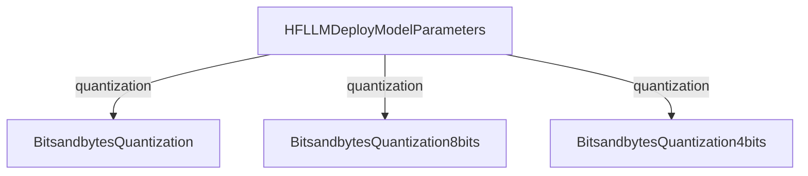
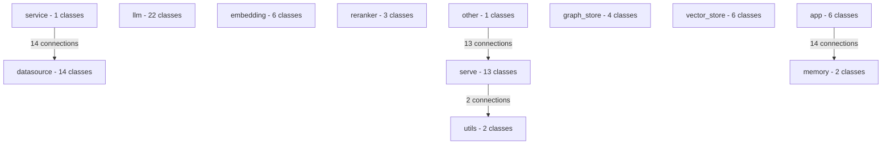

# Configuration Overview

This document provides an overview of all configuration classes organized by type.

## Configuration Types

- [app](#type-app) (6 classes)
- [datasource](#type-datasource) (14 classes)
- [embedding](#type-embedding) (6 classes)
- [graph_store](#type-graph_store) (4 classes)
- [llm](#type-llm) (22 classes)
- [memory](#type-memory) (2 classes)
- [other](#type-other) (1 classes)
- [reranker](#type-reranker) (3 classes)
- [serve](#type-serve) (13 classes)
- [service](#type-service) (1 classes)
- [utils](#type-utils) (2 classes)
- [vector_store](#type-vector_store) (6 classes)

## Type Details

### app {#type-app}

This type contains 6 configuration classes.

#### Configuration Classes

| Class | Description |
|-------|-------------|
| [ChatDashboardConfig](/docs/config-reference/app/config_chatdashboardconfig_2480d0) |  |
| [ChatExcelConfig](/docs/config-reference/app/config_chatexcelconfig_8dcf86) |  |
| [ChatKnowledgeConfig](/docs/config-reference/app/config_chatknowledgeconfig_d51d9e) |  |
| [ChatNormalConfig](/docs/config-reference/app/config_chatnormalconfig_83c865) |  |
| [ChatWithDBExecuteConfig](/docs/config-reference/app/config_chatwithdbexecuteconfig_64fe0f) |  |
| [ChatWithDBQAConfig](/docs/config-reference/app/config_chatwithdbqaconfig_62cbe4) |  |

---

### datasource {#type-datasource}

This type contains 14 configuration classes.

#### Configuration Classes

| Class | Description |
|-------|-------------|
| [ClickhouseParameters](/docs/config-reference/datasource/conn_clickhouse_clickhouseparameters_4a1237) |  |
| [DorisParameters](/docs/config-reference/datasource/conn_doris_dorisparameters_e33c53) |  |
| [DuckDbConnectorParameters](/docs/config-reference/datasource/conn_duckdb_duckdbconnectorparameters_c672c7) |  |
| [HiveParameters](/docs/config-reference/datasource/conn_hive_hiveparameters_ec3601) |  |
| [MSSQLParameters](/docs/config-reference/datasource/conn_mssql_mssqlparameters_d79d1c) |  |
| [MySQLParameters](/docs/config-reference/datasource/conn_mysql_mysqlparameters_4393c4) |  |
| [OceanBaseParameters](/docs/config-reference/datasource/conn_oceanbase_oceanbaseparameters_260d2d) |  |
| [PostgreSQLParameters](/docs/config-reference/datasource/conn_postgresql_postgresqlparameters_22efa5) |  |
| [RDBMSDatasourceParameters](/docs/config-reference/datasource/base_rdbmsdatasourceparameters_4f774f) |  |
| [SQLiteConnectorParameters](/docs/config-reference/datasource/conn_sqlite_sqliteconnectorparameters_82c8b5) |  |
| [SparkParameters](/docs/config-reference/datasource/conn_spark_sparkparameters_174bbc) |  |
| [StarRocksParameters](/docs/config-reference/datasource/conn_starrocks_starrocksparameters_e511f7) |  |
| [TuGraphParameters](/docs/config-reference/datasource/conn_tugraph_tugraphparameters_0c844e) |  |
| [VerticaParameters](/docs/config-reference/datasource/conn_vertica_verticaparameters_c712b8) |  |

---

### embedding {#type-embedding}

This type contains 6 configuration classes.

#### Configuration Classes

| Class | Description |
|-------|-------------|
| [HFEmbeddingDeployModelParameters](/docs/config-reference/embedding/embeddings_hfembeddingdeploymodelparameters_f588e1) |  |
| [JinaEmbeddingsDeployModelParameters](/docs/config-reference/embedding/jina_jinaembeddingsdeploymodelparameters_40b0f2) |  |
| [OllamaEmbeddingDeployModelParameters](/docs/config-reference/embedding/ollama_ollamaembeddingdeploymodelparameters_b511e0) |  |
| [OpenAPIEmbeddingDeployModelParameters](/docs/config-reference/embedding/embeddings_openapiembeddingdeploymodelparameters_f9ba47) |  |
| [QianfanEmbeddingDeployModelParameters](/docs/config-reference/embedding/qianfan_qianfanembeddingdeploymodelparameters_257d2a) |  |
| [TongyiEmbeddingDeployModelParameters](/docs/config-reference/embedding/tongyi_tongyiembeddingdeploymodelparameters_a7cbb4) |  |

---

### graph_store {#type-graph_store}

This type contains 4 configuration classes.

#### Configuration Classes

| Class | Description |
|-------|-------------|
| [BuiltinKnowledgeGraphConfig](/docs/config-reference/graph_store/knowledge_graph_builtinknowledgegraphconfig_f26e05) |  |
| [Neo4jStoreConfig](/docs/config-reference/graph_store/neo4j_store_neo4jstoreconfig_a4db5d) |  |
| [OpenSPGConfig](/docs/config-reference/graph_store/open_spg_openspgconfig_a744fd) |  |
| [TuGraphStoreConfig](/docs/config-reference/graph_store/tugraph_store_tugraphstoreconfig_7ca8a8) |  |

---

### llm {#type-llm}

This type contains 22 configuration classes.

#### Relationships

#### Configuration Classes

| Class | Description |
|-------|-------------|
| [BaichuanDeployModelParameters](/docs/config-reference/llm/baichuan_baichuandeploymodelparameters_0bf9cc) |  |
| [BitsandbytesQuantization](/docs/config-reference/llm/parameter_bitsandbytesquantization_d40e3b) |  |
| [BitsandbytesQuantization4bits](/docs/config-reference/llm/parameter_bitsandbytesquantization4bits_52b778) |  |
| [BitsandbytesQuantization8bits](/docs/config-reference/llm/parameter_bitsandbytesquantization8bits_909aed) |  |
| [ClaudeDeployModelParameters](/docs/config-reference/llm/claude_claudedeploymodelparameters_1f0c45) |  |
| [DeepSeekDeployModelParameters](/docs/config-reference/llm/deepseek_deepseekdeploymodelparameters_194cbd) |  |
| [GeminiDeployModelParameters](/docs/config-reference/llm/gemini_geminideploymodelparameters_5113b9) |  |
| [GiteeDeployModelParameters](/docs/config-reference/llm/gitee_giteedeploymodelparameters_d1bdb3) |  |
| [HFLLMDeployModelParameters](/docs/config-reference/llm/hf_adapter_hfllmdeploymodelparameters_103e81) |  |
| [LlamaCppModelParameters](/docs/config-reference/llm/llama_cpp_py_adapter_llamacppmodelparameters_e88874) |  |
| [LlamaServerParameters](/docs/config-reference/llm/llama_cpp_adapter_llamaserverparameters_421f40) |  |
| [MoonshotDeployModelParameters](/docs/config-reference/llm/moonshot_moonshotdeploymodelparameters_aa2f6b) |  |
| [OllamaDeployModelParameters](/docs/config-reference/llm/ollama_ollamadeploymodelparameters_d55be6) |  |
| [OpenAICompatibleDeployModelParameters](/docs/config-reference/llm/chatgpt_openaicompatibledeploymodelparameters_c3d426) |  |
| [SiliconFlowDeployModelParameters](/docs/config-reference/llm/siliconflow_siliconflowdeploymodelparameters_abe22f) |  |
| [SparkDeployModelParameters](/docs/config-reference/llm/spark_sparkdeploymodelparameters_afba3c) |  |
| [TongyiDeployModelParameters](/docs/config-reference/llm/tongyi_tongyideploymodelparameters_02a91b) |  |
| [VLLMDeployModelParameters](/docs/config-reference/llm/vllm_adapter_vllmdeploymodelparameters_1d4a24) |  |
| [VolcengineDeployModelParameters](/docs/config-reference/llm/volcengine_volcenginedeploymodelparameters_938015) |  |
| [WenxinDeployModelParameters](/docs/config-reference/llm/wenxin_wenxindeploymodelparameters_63c66b) |  |
| [YiDeployModelParameters](/docs/config-reference/llm/yi_yideploymodelparameters_92dbaa) |  |
| [ZhipuDeployModelParameters](/docs/config-reference/llm/zhipu_zhipudeploymodelparameters_c51e31) |  |

---

### memory {#type-memory}

This type contains 2 configuration classes.

#### Configuration Classes

| Class | Description |
|-------|-------------|
| [BufferWindowGPTsAppMemoryConfig](/docs/config-reference/memory/config_bufferwindowgptsappmemoryconfig_c31071) |  |
| [TokenBufferGPTsAppMemoryConfig](/docs/config-reference/memory/config_tokenbuffergptsappmemoryconfig_6a2000) |  |

---

### other {#type-other}

This type contains 1 configuration classes.

#### Configuration Classes

| Class | Description |
|-------|-------------|
| [ApplicationConfig](/docs/config-reference/config_applicationconfig_72fd1c) |  |

---

### reranker {#type-reranker}

This type contains 3 configuration classes.

#### Configuration Classes

| Class | Description |
|-------|-------------|
| [CrossEncoderRerankEmbeddingsParameters](/docs/config-reference/reranker/rerank_crossencoderrerankembeddingsparameters_63ec13) |  |
| [OpenAPIRerankerDeployModelParameters](/docs/config-reference/reranker/rerank_openapirerankerdeploymodelparameters_778108) |  |
| [SiliconFlowRerankEmbeddingsParameters](/docs/config-reference/reranker/rerank_siliconflowrerankembeddingsparameters_af0257) |  |

---

### serve {#type-serve}

This type contains 13 configuration classes.

#### Configuration Classes

| Class | Description |
|-------|-------------|
| [ServeConfig](/docs/config-reference/serve/config_serveconfig_63f1e9) |  |
| [ServeConfig](/docs/config-reference/serve/config_serveconfig_adbd6f) |  |
| [ServeConfig](/docs/config-reference/serve/config_serveconfig_313252) |  |
| [ServeConfig](/docs/config-reference/serve/config_serveconfig_ec2d70) |  |
| [ServeConfig](/docs/config-reference/serve/config_serveconfig_1a9284) |  |
| [ServeConfig](/docs/config-reference/serve/config_serveconfig_8839e0) |  |
| [ServeConfig](/docs/config-reference/serve/config_serveconfig_fa1f35) |  |
| [ServeConfig](/docs/config-reference/serve/config_serveconfig_cb64c6) |  |
| [ServeConfig](/docs/config-reference/serve/config_serveconfig_c0b589) |  |
| [ServeConfig](/docs/config-reference/serve/config_serveconfig_b1c2b9) |  |
| [ServeConfig](/docs/config-reference/serve/config_serveconfig_7a0577) |  |
| [ServeConfig](/docs/config-reference/serve/config_serveconfig_854dad) |  |
| [ServeConfig](/docs/config-reference/serve/config_serveconfig_7889f9) |  |

---

### service {#type-service}

This type contains 1 configuration classes.

#### Configuration Classes

| Class | Description |
|-------|-------------|
| [DBModelRegistryParameters](/docs/config-reference/service/parameter_dbmodelregistryparameters_87d036) |  |

---

### utils {#type-utils}

This type contains 2 configuration classes.

#### Configuration Classes

| Class | Description |
|-------|-------------|
| [OSSStorageConfig](/docs/config-reference/utils/config_ossstorageconfig_1ad505) |  |
| [S3StorageConfig](/docs/config-reference/utils/config_s3storageconfig_f0cdc9) |  |

---

### vector_store {#type-vector_store}

This type contains 6 configuration classes.

#### Configuration Classes

| Class | Description |
|-------|-------------|
| [ChromaVectorConfig](/docs/config-reference/vector_store/chroma_store_chromavectorconfig_16224f) |  |
| [ElasticsearchStoreConfig](/docs/config-reference/vector_store/elastic_store_elasticsearchstoreconfig_15bdb6) |  |
| [MilvusVectorConfig](/docs/config-reference/vector_store/milvus_store_milvusvectorconfig_20af52) |  |
| [OceanBaseConfig](/docs/config-reference/vector_store/oceanbase_store_oceanbaseconfig_220e36) |  |
| [PGVectorConfig](/docs/config-reference/vector_store/pgvector_store_pgvectorconfig_3ef448) |  |
| [WeaviateVectorConfig](/docs/config-reference/vector_store/weaviate_store_weaviatevectorconfig_093ce3) |  |

---

## Cross-Type Relationships

The following diagram shows relationships between different configuration types:

## Looking for a specific configuration?

1. Use the search function in the documentation site
2. Browse the configuration types above
3. Check the specific class documentation for detailed parameter information
