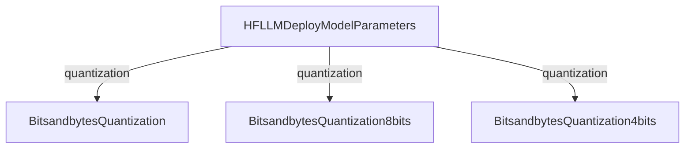
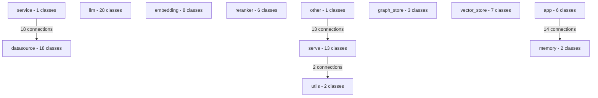

# Configuration Overview

This document provides an overview of all configuration classes organized by type.

## Configuration Types

- [app](#type-app) (6 classes)
- [datasource](#type-datasource) (18 classes)
- [embedding](#type-embedding) (8 classes)
- [graph_store](#type-graph_store) (3 classes)
- [llm](#type-llm) (28 classes)
- [memory](#type-memory) (2 classes)
- [other](#type-other) (1 classes)
- [reranker](#type-reranker) (6 classes)
- [serve](#type-serve) (13 classes)
- [service](#type-service) (1 classes)
- [utils](#type-utils) (2 classes)
- [vector_store](#type-vector_store) (7 classes)

## Type Details

### app {#type-app}

This type contains 6 configuration classes.

#### Configuration Classes

| Class | Description |
|-------|-------------|
| [ChatDashboardConfig](app/config_chatdashboardconfig_2480d0) |  |
| [ChatExcelConfig](app/config_chatexcelconfig_8dcf86) |  |
| [ChatKnowledgeConfig](app/config_chatknowledgeconfig_d51d9e) |  |
| [ChatNormalConfig](app/config_chatnormalconfig_83c865) |  |
| [ChatWithDBExecuteConfig](app/config_chatwithdbexecuteconfig_64fe0f) |  |
| [ChatWithDBQAConfig](app/config_chatwithdbqaconfig_62cbe4) |  |

---

### datasource {#type-datasource}

This type contains 18 configuration classes.

#### Configuration Classes

| Class | Description |
|-------|-------------|
| [ClickhouseParameters](datasource/conn_clickhouse_clickhouseparameters_4a1237) |  |
| [DorisParameters](datasource/conn_doris_dorisparameters_e33c53) |  |
| [DuckDbConnectorParameters](datasource/conn_duckdb_duckdbconnectorparameters_c672c7) |  |
| [GaussDBParameters](datasource/conn_gaussdb_gaussdbparameters_9c9811) |  |
| [HiveParameters](datasource/conn_hive_hiveparameters_ec3601) |  |
| [MSSQLParameters](datasource/conn_mssql_mssqlparameters_d79d1c) |  |
| [MySQLParameters](datasource/conn_mysql_mysqlparameters_4393c4) |  |
| [Neo4jParameters](datasource/conn_neo4j_neo4jparameters_041b12) |  |
| [OceanBaseParameters](datasource/conn_oceanbase_oceanbaseparameters_260d2d) |  |
| [OracleParameters](datasource/conn_oracle_oracleparameters_c011ed) |  |
| [PostgreSQLParameters](datasource/conn_postgresql_postgresqlparameters_22efa5) |  |
| [RDBMSDatasourceParameters](datasource/base_rdbmsdatasourceparameters_4f774f) |  |
| [SQLiteConnectorParameters](datasource/conn_sqlite_sqliteconnectorparameters_82c8b5) |  |
| [SparkParameters](datasource/conn_spark_sparkparameters_174bbc) |  |
| [StarRocksParameters](datasource/conn_starrocks_starrocksparameters_e511f7) |  |
| [TuGraphParameters](datasource/conn_tugraph_tugraphparameters_0c844e) |  |
| [VerticaParameters](datasource/conn_vertica_verticaparameters_c712b8) |  |
| [openGaussParameters](datasource/conn_opengauss_opengaussparameters_85409c) |  |

---

### embedding {#type-embedding}

This type contains 8 configuration classes.

#### Configuration Classes

| Class | Description |
|-------|-------------|
| [AimlapiEmbeddingDeployModelParameters](embedding/aimlapi_aimlapiembeddingdeploymodelparameters_97d1c4) |  |
| [HFEmbeddingDeployModelParameters](embedding/embeddings_hfembeddingdeploymodelparameters_f588e1) |  |
| [JinaEmbeddingsDeployModelParameters](embedding/jina_jinaembeddingsdeploymodelparameters_40b0f2) |  |
| [OllamaEmbeddingDeployModelParameters](embedding/ollama_ollamaembeddingdeploymodelparameters_b511e0) |  |
| [OpenAPIEmbeddingDeployModelParameters](embedding/embeddings_openapiembeddingdeploymodelparameters_f9ba47) |  |
| [QianfanEmbeddingDeployModelParameters](embedding/qianfan_qianfanembeddingdeploymodelparameters_257d2a) |  |
| [SiliconFlowEmbeddingDeployModelParameters](embedding/siliconflow_siliconflowembeddingdeploymodelparameters_113c43) |  |
| [TongyiEmbeddingDeployModelParameters](embedding/tongyi_tongyiembeddingdeploymodelparameters_a7cbb4) |  |

---

### graph_store {#type-graph_store}

This type contains 3 configuration classes.

#### Configuration Classes

| Class | Description |
|-------|-------------|
| [Neo4jStoreConfig](graph_store/neo4j_store_neo4jstoreconfig_a4db5d) |  |
| [OpenSPGConfig](graph_store/open_spg_openspgconfig_a744fd) |  |
| [TuGraphStoreConfig](graph_store/tugraph_store_tugraphstoreconfig_7ca8a8) |  |

---

### llm {#type-llm}

This type contains 28 configuration classes.

#### Relationships

```mermaid
graph TD
    HFLLMDeployModelParameters -->|quantization| BitsandbytesQuantization
    HFLLMDeployModelParameters -->|quantization| BitsandbytesQuantization8bits
    HFLLMDeployModelParameters -->|quantization| BitsandbytesQuantization4bits
```

#### Configuration Classes

| Class | Description |
|-------|-------------|
| [AimlapiDeployModelParameters](llm/aimlapi_aimlapideploymodelparameters_7c1b54) |  |
| [BaichuanDeployModelParameters](llm/baichuan_baichuandeploymodelparameters_0bf9cc) |  |
| [BitsandbytesQuantization](llm/parameter_bitsandbytesquantization_d40e3b) |  |
| [BitsandbytesQuantization4bits](llm/parameter_bitsandbytesquantization4bits_52b778) |  |
| [BitsandbytesQuantization8bits](llm/parameter_bitsandbytesquantization8bits_909aed) |  |
| [BurnCloudDeployModelParameters](llm/burncloud_burnclouddeploymodelparameters_e59cbb) |  |
| [ClaudeDeployModelParameters](llm/claude_claudedeploymodelparameters_1f0c45) |  |
| [DeepSeekDeployModelParameters](llm/deepseek_deepseekdeploymodelparameters_194cbd) |  |
| [GeminiDeployModelParameters](llm/gemini_geminideploymodelparameters_5113b9) |  |
| [GiteeDeployModelParameters](llm/gitee_giteedeploymodelparameters_d1bdb3) |  |
| [HFLLMDeployModelParameters](llm/hf_adapter_hfllmdeploymodelparameters_103e81) |  |
| [InfiniAIDeployModelParameters](llm/infiniai_infiniaideploymodelparameters_682301) |  |
| [LiteLLMDeployModelParameters](llm/litellm_litellmdeploymodelparameters_d053f9) |  |
| [LlamaCppModelParameters](llm/llama_cpp_py_adapter_llamacppmodelparameters_e88874) |  |
| [LlamaServerParameters](llm/llama_cpp_adapter_llamaserverparameters_421f40) |  |
| [MLXDeployModelParameters](llm/mlx_adapter_mlxdeploymodelparameters_f26f45) |  |
| [MiniMaxDeployModelParameters](llm/minimax_minimaxdeploymodelparameters_97ce61) |  |
| [MoonshotDeployModelParameters](llm/moonshot_moonshotdeploymodelparameters_aa2f6b) |  |
| [OllamaDeployModelParameters](llm/ollama_ollamadeploymodelparameters_d55be6) |  |
| [OpenAICompatibleDeployModelParameters](llm/chatgpt_openaicompatibledeploymodelparameters_c3d426) |  |
| [SiliconFlowDeployModelParameters](llm/siliconflow_siliconflowdeploymodelparameters_abe22f) |  |
| [SparkDeployModelParameters](llm/spark_sparkdeploymodelparameters_afba3c) |  |
| [TongyiDeployModelParameters](llm/tongyi_tongyideploymodelparameters_02a91b) |  |
| [VLLMDeployModelParameters](llm/vllm_adapter_vllmdeploymodelparameters_1d4a24) |  |
| [VolcengineDeployModelParameters](llm/volcengine_volcenginedeploymodelparameters_938015) |  |
| [WenxinDeployModelParameters](llm/wenxin_wenxindeploymodelparameters_63c66b) |  |
| [YiDeployModelParameters](llm/yi_yideploymodelparameters_92dbaa) |  |
| [ZhipuDeployModelParameters](llm/zhipu_zhipudeploymodelparameters_c51e31) |  |

---

### memory {#type-memory}

This type contains 2 configuration classes.

#### Configuration Classes

| Class | Description |
|-------|-------------|
| [BufferWindowGPTsAppMemoryConfig](memory/config_bufferwindowgptsappmemoryconfig_c31071) |  |
| [TokenBufferGPTsAppMemoryConfig](memory/config_tokenbuffergptsappmemoryconfig_6a2000) |  |

---

### other {#type-other}

This type contains 1 configuration classes.

#### Configuration Classes

| Class | Description |
|-------|-------------|
| [ApplicationConfig](config_applicationconfig_72fd1c) |  |

---

### reranker {#type-reranker}

This type contains 6 configuration classes.

#### Configuration Classes

| Class | Description |
|-------|-------------|
| [CrossEncoderRerankEmbeddingsParameters](reranker/rerank_crossencoderrerankembeddingsparameters_63ec13) |  |
| [InfiniAIRerankEmbeddingsParameters](reranker/rerank_infiniairerankembeddingsparameters_879440) |  |
| [OpenAPIRerankerDeployModelParameters](reranker/rerank_openapirerankerdeploymodelparameters_778108) |  |
| [QwenRerankEmbeddingsParameters](reranker/rerank_qwenrerankembeddingsparameters_18e7d2) |  |
| [SiliconFlowRerankEmbeddingsParameters](reranker/rerank_siliconflowrerankembeddingsparameters_af0257) |  |
| [TeiEmbeddingsParameters](reranker/rerank_teiembeddingsparameters_e38e28) |  |

---

### serve {#type-serve}

This type contains 13 configuration classes.

#### Configuration Classes

| Class | Description |
|-------|-------------|
| [ServeConfig](serve/config_serveconfig_63f1e9) |  |
| [ServeConfig](serve/config_serveconfig_adbd6f) |  |
| [ServeConfig](serve/config_serveconfig_313252) |  |
| [ServeConfig](serve/config_serveconfig_ec2d70) |  |
| [ServeConfig](serve/config_serveconfig_1a9284) |  |
| [ServeConfig](serve/config_serveconfig_8839e0) |  |
| [ServeConfig](serve/config_serveconfig_fa1f35) |  |
| [ServeConfig](serve/config_serveconfig_cb64c6) |  |
| [ServeConfig](serve/config_serveconfig_c0b589) |  |
| [ServeConfig](serve/config_serveconfig_b1c2b9) |  |
| [ServeConfig](serve/config_serveconfig_7a0577) |  |
| [ServeConfig](serve/config_serveconfig_854dad) |  |
| [ServeConfig](serve/config_serveconfig_7889f9) |  |

---

### service {#type-service}

This type contains 1 configuration classes.

#### Configuration Classes

| Class | Description |
|-------|-------------|
| [DBModelRegistryParameters](service/parameter_dbmodelregistryparameters_87d036) |  |

---

### utils {#type-utils}

This type contains 2 configuration classes.

#### Configuration Classes

| Class | Description |
|-------|-------------|
| [OSSStorageConfig](utils/config_ossstorageconfig_1ad505) |  |
| [S3StorageConfig](utils/config_s3storageconfig_f0cdc9) |  |

---

### vector_store {#type-vector_store}

This type contains 7 configuration classes.

#### Configuration Classes

| Class | Description |
|-------|-------------|
| [ChromaVectorConfig](vector_store/chroma_store_chromavectorconfig_16224f) |  |
| [ElasticsearchStoreConfig](vector_store/elastic_store_elasticsearchstoreconfig_15bdb6) |  |
| [OceanBaseConfig](vector_store/oceanbase_store_oceanbaseconfig_220e36) |  |
| [PGVectorConfig](vector_store/pgvector_store_pgvectorconfig_3ef448) |  |
| [QdrantVectorConfig](vector_store/qdrant_store_qdrantvectorconfig_3d0339) |  |
| [ValkeyVectorConfig](vector_store/valkey_store_valkeyvectorconfig_a0fffb) |  |
| [WeaviateVectorConfig](vector_store/weaviate_store_weaviatevectorconfig_093ce3) |  |

---

## Cross-Type Relationships

The following diagram shows relationships between different configuration types:

```mermaid
graph TD
    other[other - 1 classes]
    datasource[datasource - 18 classes]
    llm[llm - 28 classes]
    embedding[embedding - 8 classes]
    reranker[reranker - 6 classes]
    service[service - 1 classes]
    graph_store[graph_store - 3 classes]
    vector_store[vector_store - 7 classes]
    serve[serve - 13 classes]
    memory[memory - 2 classes]
    app[app - 6 classes]
    utils[utils - 2 classes]
    service -->|18 connections| datasource
    other -->|13 connections| serve
    serve -->|2 connections| utils
    app -->|14 connections| memory
```

## Looking for a specific configuration?

1. Use the search function in the documentation site
2. Browse the configuration types above
3. Check the specific class documentation for detailed parameter information
