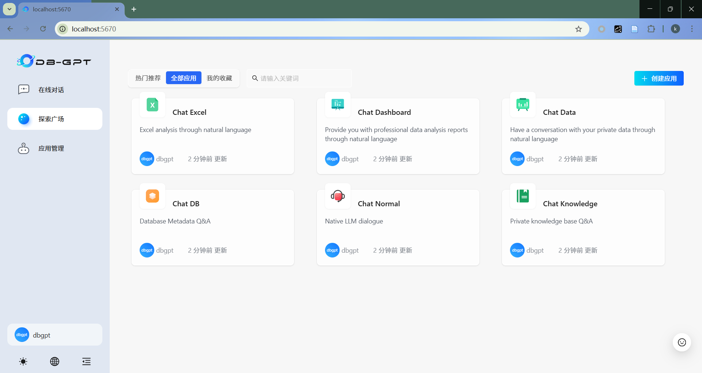
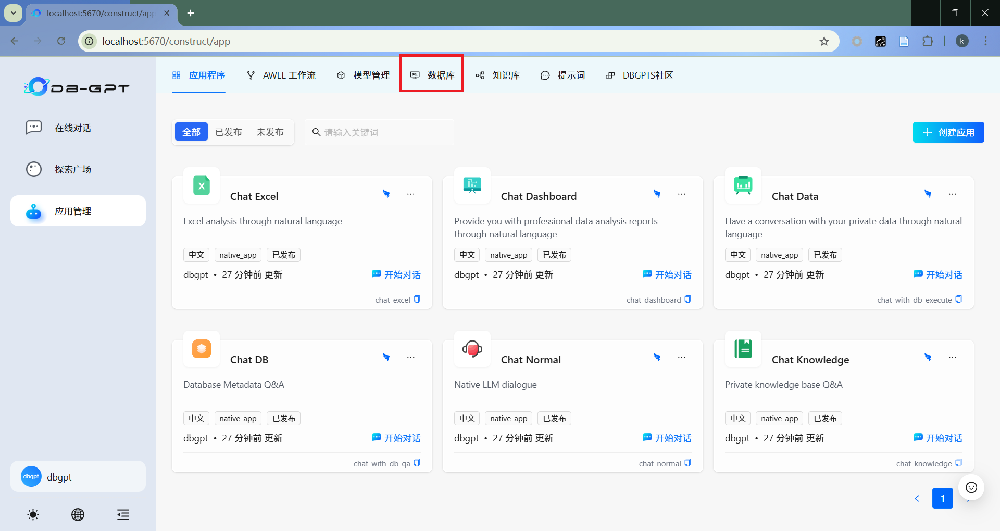

# DB-GPT 数据分析多智能体实践指南（基于Superstore数据集）

本指南旨在帮助入门者使用 DB-GPT 数据分析多智能体应用对 Superstore 数据集进行分析。通过本指南，您将学会如何部署项目、配置环境、准备数据，并成功运行针对 Superstore 销售数据的分析应用。

## 1. 项目部署

### 1.1 克隆代码库

首先，从 GitHub 克隆 DB-GPT 项目代码：

```bash
git clone https://github.com/eosphoros-ai/DB-GPT.git
cd DB-GPT
```

### 1.2 环境准备

DB-GPT 支持多种部署方式，推荐使用 uv 工具进行依赖管理：

```bash
# 安装 uv 工具
curl -LsSf https://astral.sh/uv/install.sh | sh

# 验证安装
uv --version
```

### 1.3 安装依赖

根据您使用的模型类型，选择相应的依赖安装方式：

#### 使用 OpenAI 代理模型（推荐入门使用）

```bash
uv sync --all-packages \
--extra "base" \
--extra "proxy_openai" \
--extra "rag" \
--extra "storage_chromadb" \
--extra "dbgpts"
```

#### 使用本地模型（如 GLM4）

```bash
uv sync --all-packages \
--extra "base" \
--extra "cuda121" \
--extra "hf" \
--extra "rag" \
--extra "storage_chromadb" \
--extra "quant_bnb" \
--extra "dbgpts"
```

### 1.4 配置大语言模型和嵌入模型

#### OpenAI 代理模型配置

创建或编辑配置文件 `configs/dbgpt-proxy-openai.toml`：

```toml
[system]
language = "zh"
encrypt_key = "your_secret_key"

[service.web]
host = "0.0.0.0"
port = 5670

[service.web.database]
type = "sqlite"
path = "pilot/meta_data/dbgpt.db"

[rag.storage]
[rag.storage.vector]
type = "chroma"
persist_path = "pilot/data"

# 模型配置
[models]
[[models.llms]]
name = "gpt-3.5-turbo"
provider = "proxy/openai"
api_key = "your-openai-api-key"

[[models.embeddings]]
name = "text-embedding-ada-002"
provider = "proxy/openai"
api_key = "your-openai-api-key"
```

#### 本地模型配置示例

创建或编辑配置文件 `configs/dbgpt-local-glm.toml`：

```toml
[system]
language = "zh"
encrypt_key = "your_secret_key"

[service.web]
host = "0.0.0.0"
port = 5670

[service.web.database]
type = "sqlite"
path = "pilot/meta_data/dbgpt.db"

[rag.storage]
[rag.storage.vector]
type = "chroma"
persist_path = "pilot/data"

# 模型配置
[models]
[[models.llms]]
name = "THUDM/glm-4-9b-chat-hf"
provider = "hf"
# 如果未提供，模型将从 Hugging Face 模型中心下载
# 取消注释以下行以指定本地文件系统中的模型路径
# path = "the-model-path-in-the-local-file-system"

[[models.embeddings]]
name = "BAAI/bge-large-zh-v1.5"
provider = "hf"
# 如果未提供，模型将从 Hugging Face 模型中心下载
# 取消注释以下行以指定本地文件系统中的模型路径
# path = "the-model-path-in-the-local-file-system"
```

## 2. 知识库准备

数据分析多智能体应用需要业务相关的知识文件来描述 Superstore 数据集的指标信息，包括指标名、计算规则、字段等。

### 2.1 Superstore 指标信息文件格式

创建`指标.txt`文本文件来描述 Superstore 业务指标，不同指标的描述可用"###"分隔，方便后续分片处理。针对当前案例设置两个指标：订单数量和订单占比。

```
###
指标名称：订单数量
字段：quantity
计算规则：无
建议计算维度：地区（region）
阈值：0.01
###
指标名称：订单占比
字段：quantity
计算规则：SUM(quantity) / TOTAL(SUM(quantity)) OVER()
建议计算维度：地区（region）
阈值：0.05
```

## 3. 数据库准备

数据分析多智能体应用需要准备 Superstore 业务数据库。系统支持多种数据库类型，包括 MySQL、PostgreSQL、SQLite 等。本案例使用MySQL进行演示。

### 3.1 Superstore 数据集准备

将 Superstore 数据集存储在 MySQL 数据库中，表名为 `superstore_dataset`。

#### 数据表结构

```sql
CREATE TABLE `superstore_dataset`
(
    "region" VARCHAR(255) COLLATE "UTF8MB4_BIN" COMMENT "Region where the Customer belong.",
    "quantity" INTEGER COMMENT "Quantity of the Product.",
    "category" VARCHAR(255) COLLATE "UTF8MB4_BIN" COMMENT "Category of the product ordered.",
    "ship_mode" VARCHAR(255) COLLATE "UTF8MB4_BIN" COMMENT "Shipping Mode specified by the Customer.",
    "sub_category" VARCHAR(255) COLLATE "UTF8MB4_BIN" COMMENT "Sub-Category of the product ordered."
) COMMENT "None"
```

## 4. 修改planner

为了使用数据分析应用，需要将 `PlannerAgent` 修改为 `DataAnalysisPlannerAgent`。修改 `packages/dbgpt-core/src/dbgpt/agent/core/plan/team_auto_plan.py` 文件中的相关代码，确保系统使用 `DataAnalysisPlannerAgent`：

首先导入相关包：

```python
from ..plan.data_analysis_planner_agent import DataAnalysisPlannerAgent
```

将`planner`改为`DataAnalysisPlannerAgent`：

```python
# 修改前
planner: ConversableAgent = (
    await PlannerAgent()
    .bind(self.memory)
    .bind(self.agent_context)
    .bind(self.llm_config)
    .bind_agents(self.agents)
    .build()
)
# 修改后
planner: ConversableAgent = (
    await DataAnalysisPlannerAgent()
    .bind(self.memory)
    .bind(self.agent_context)
    .bind(self.llm_config)
    .bind_agents(self.agents)
    .build()
)
```

## 5. 数据分析

使用配置文件启动 DB-GPT 服务：

```bash
# 使用 OpenAI 代理模型配置启动
uv run dbgpt start webserver --config configs/dbgpt-proxy-openai.toml

# 或使用本地模型配置启动
uv run dbgpt start webserver --config configs/dbgpt-local-glm.toml
```

打开浏览器并访问：`http://localhost:5671`



### 5.1 知识库接入

1. 点击“应用管理”，选择“知识库”


2. 创建知识库


3. 知识库配置


4. 知识库类型


5. 上传

此处上传提前准备好的`指标.txt`文档。


6. 分片

分片策略选择"separator"，分隔符设置为"###"。


7. 成功创建知识库


### 5.2 创建数据库

1. 选择“数据库”



2. 添加数据源


3. 配置数据源

输入准备好的数据库连接信息。


4. 添加成功


### 5.3 创建数据分析应用

1. 创建应用

点击“创建应用”


2. 基础配置

选择“多智能体自动规划模式”，并输入应用名称和对应描述。


3. 加入`MetricInfoRetriever`

选取`MetricInfoRetriever`，并配置知识库资源。


4. 加入`DataScientist`

选取`DataScientist`，并配置数据库资源。


5. 加入`AnomalyDetector`

选取`AnomalyDetector`。


6. 加入`VolatilityAnalyzer`

选取`VolatilityAnalyzer`，并配置数据库资源。


7. 加入`ReportGenerator`

选取`ReportGenerator`。


8. 保存

点击“保存”。


### 5.4 使用

1. 开始对话

点击“开始对话”。


2. 提问

在输入框中输入问题，如“请帮我分析订单数量2012年 年环比增长情况”，点击发送。


3. 回答


4. 报告生成

最终生成分析报告。


