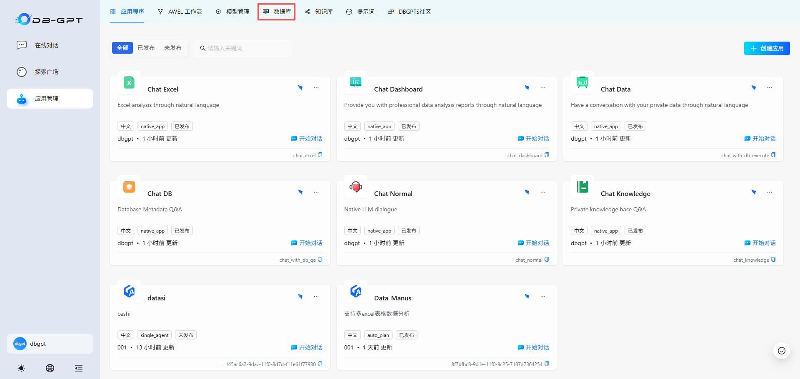
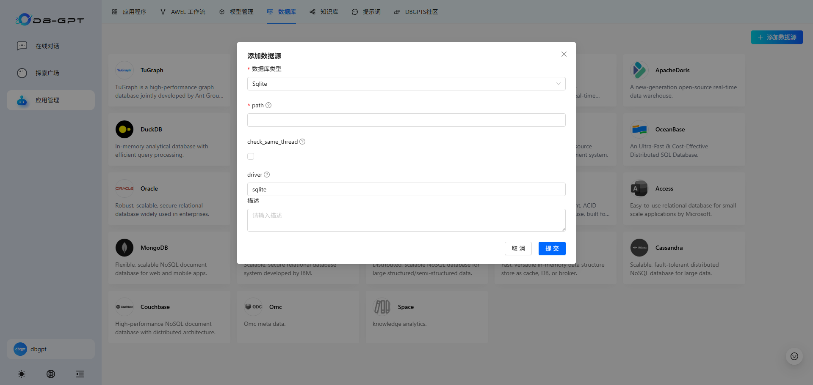
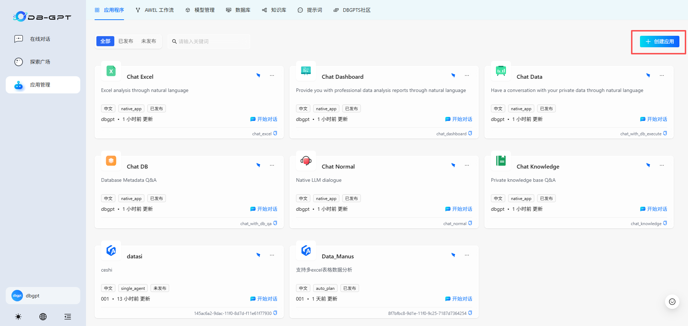
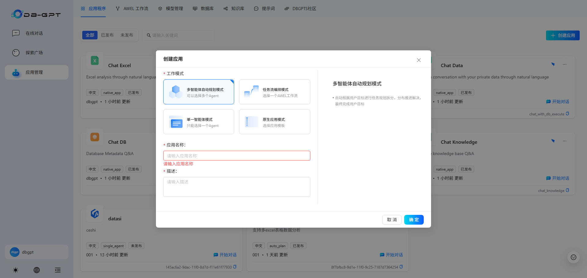
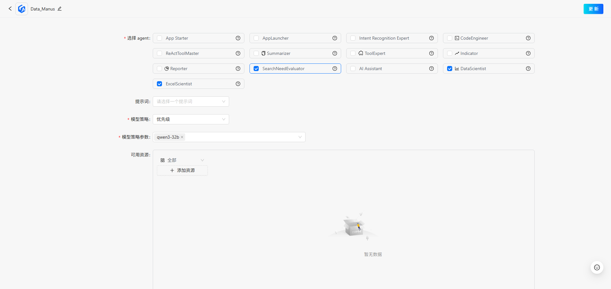
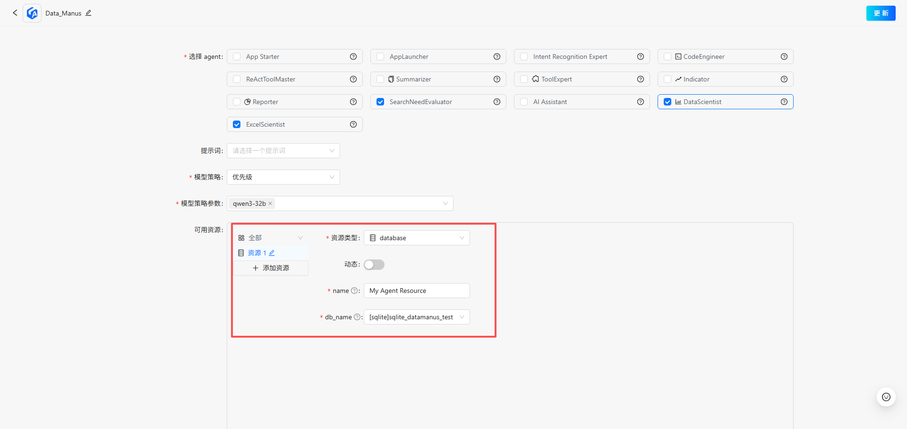
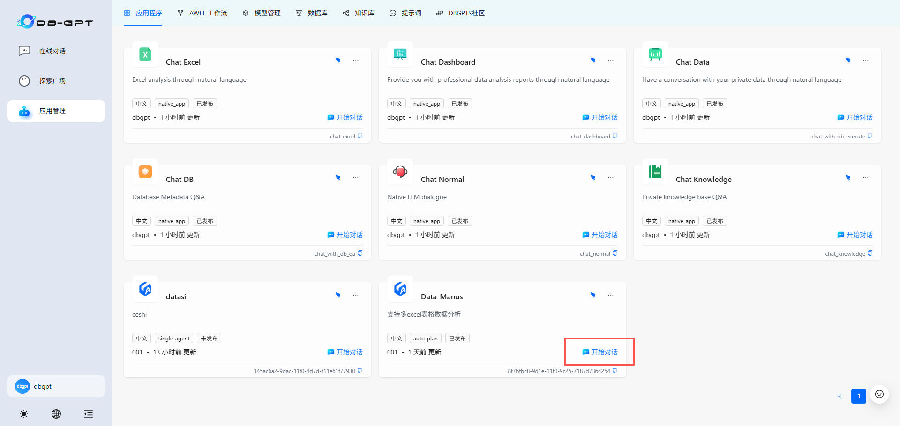
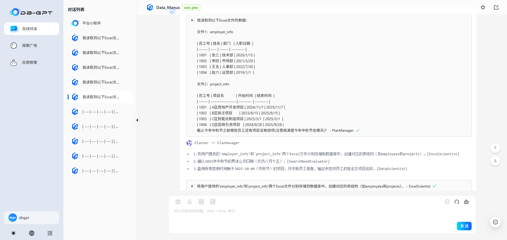

# Data_Manus多智能体应用实践指南

本指南旨在帮助入门者使用Data_Manus多智能体应用对表格（如Excel、CSV等）进行分析。本指南通过详细介绍数据准备到应用实践的所有步骤，教会您使用Data_Manus多智能体应用。

## 1.数据准备

Data_Manus多智能体应用是针对表格（如Excel、CSV等）文件进行分析，因此需要先行将需要分析的所有表格文件导入。

### 1.1 数据目录导入

**excel_table_agent.py**

```python
    async def thinking(
            self,
            messages: List[AgentMessage],
            sender: Optional[Agent] = None,
            prompt: Optional[str] = None,
        ) -> Tuple[Optional[str], Optional[str]]:
        #your_directory_path中包含你需要进行分析的所有Excel、CSV等文件
            excel_files = find_excel_files(your_directory_path) 

            all_file_data = []
            for excel_file in excel_files:
                filename_with_ext = os.path.basename(excel_file)
                headers, table_data = read_excel_headers_and_data(excel_file)
                mdstr = data2md(headers, table_data)
                all_file_data.append((filename_with_ext, mdstr))
            message_parts = ["Excel文件中的部分数据如下："]
            for i, (filename, mdstr) in enumerate(all_file_data, 1):
                message_parts.append(f"\n文件 {i}: {filename}")
                message_parts.append(f"数据内容：\n{mdstr}")
            prompt = "\n".join(message_parts)
            result = await super().thinking(messages, sender, prompt)
            return result
```

**insert_action.py**

```
    def __init__(self, file_paths: List[str] = excel_files, **kwargs):
        """Initialize Excel2TableAction with list of file paths."""
        super().__init__(** kwargs)
        self.file_paths = file_paths  # 每个文件对应一个表，与SQL和表名列表顺序一致

```

### 1.2 数据库准备

Data_Manus多智能体应用具备对表格文件进行多表格协同分析的功能，为了保证准确性，我们需要以数据库作为媒介，通过SQL语句实现准确的跨表格计算、统计功能。

**1.点击”应用管理“，选择上方菜单栏中的”数据库“**



**2.点击右侧”添加数据源“，在弹出的表单中配置自己的数据源信息**




## 2.基于Web端实现并应用

**1.进入”应用管理“页面，点击”创建应用“**



**2.在弹出来的菜单栏中，选择”多智能体自动规划模式“，并配置”应用名称“、”描述“**



**3.进入智能体应用构建页面后，选择我们data_manus必要的三个Agent：”SearchNeedEvaluator“、”DataScientist“、”ExcelScientist“**



**4.其中”DataScientist“和”ExcelScientist“这两个智能体必须要绑定数据库资源，在下方选择已添加的数据源，配置完毕后点击右上角”更新“完成应用创建**



**5.回到”应用管理“页面，点击自己刚刚创建的多智能体应用的”开始对话“按钮进行对话了**



**6.在输入框中输入问题，点击发送即可开始对话了**




3.基于后台代码实现并应用

为了方便用户进一步了解DB-GPT社区多智能体应用构建过程，方便对Data_manus中各个子Agent进行优化，我们在examples目录下提供多个开发示例以供学习：
**db_create**

```python
def read_excel_headers_and_data(file_path: str) -> Tuple[List[str], List[Dict[str, Any]]]:
    if not Path(file_path).exists():
        raise FileNotFoundError(f"文件不存在: {file_path}")
    
    if Path(file_path).suffix.lower() != '.xlsx':
        raise ValueError(f"不支持的文件格式: {Path(file_path).suffix}，仅支持.xlsx")
    
    try:
        df = pd.read_excel(
            file_path,
            sheet_name=0,  
            engine='openpyxl',
            keep_default_na=False 
        )
    except Exception as e:
        raise RuntimeError(f"读取Excel失败: {str(e)}")

    headers = list(df.columns)
    if not headers:
        raise ValueError("Excel文件没有表头信息（第一行为空）")

    data = []
    for _, row in df.iterrows():
        row_data = {}
        for header in headers:
            value = row[header]
            row_data[header] = value if value != "" else None
        data.append(row_data)
    
    return headers, data


def data2md(headers, table_data):
    md_lines = []

    md_lines.append("| " + " | ".join(headers) + " |")
    md_lines.append("| " + " | ".join(["---"] * len(headers)) + " |")

    for row in table_data:
        values = []
        for h in headers:
            val = row.get(h, "")
            if hasattr(val, "strftime"): 
                values.append(val.strftime("%Y-%m-%d"))
            else:
                values.append(str(val))
        md_lines.append("| " + " | ".join(values) + " |")

    markdown_table = "\n".join(md_lines)
    return markdown_table


async def main():
    excel_files = [
        "",
        ""
    ]
    all_file_data = []
    #读取Excel部分文件数据，可自行替换
    for excel_file in excel_files:
        filename_with_ext = os.path.basename(excel_file)
        headers, table_data = read_excel_headers_and_data(excel_file)
        mdstr = data2md(headers, table_data)
        all_file_data.append((filename_with_ext, mdstr))

    llm_client = TongyiLLMClient(
        api_base=api_base,
        api_key=api_key,
        model=model
    )


    context: AgentContext = AgentContext(
        conv_id="test123", language="zh", temperature=0.5, max_new_tokens=2048
    )
    agent_memory = AgentMemory()
    agent_memory.gpts_memory.init(conv_id="test123")

    user_proxy = await UserProxyAgent().bind(agent_memory).bind(context).build()


    excel_boy = (
        await Excel2TableAgent()
        .bind(context)
        .bind(LLMConfig(llm_client=llm_client))
        .bind(db_resource)
        .bind(agent_memory)
        .build()
    )

    message_parts = ["我读取到以下Excel文件的数据："]
    for i, (filename, mdstr) in enumerate(all_file_data, 1):
        message_parts.append(f"\n文件 {i}: {filename}")
        message_parts.append(f"数据内容：\n{mdstr}")
    full_message = "\n".join(message_parts) + "\n请帮我分析这些数据，为每个文件生成对应的建表语句和插入语句，并执行这些SQL语句创建数据表并插入数据。"

    await user_proxy.initiate_chat(
        recipient=excel_boy,
        reviewer=user_proxy,
        message=full_message,
    )

    print(await agent_memory.gpts_memory.app_link_chat_message("test123"))


if __name__ == "__main__":
    asyncio.run(main())
```

**auto_search_agent**

```python
async def main():
    excel_file = your_directory_path
    filename_with_ext = os.path.basename(excel_file)
    # 读取Excel数据到变量
    headers, table_data = read_excel_headers_and_data(excel_file)
    mdstr = data2md(headers, table_data)

    llm_client = TongyiLLMClient(
        api_base=api_base,
        api_key=api_key,
        model=model
    )
    context: AgentContext = AgentContext(
        conv_id="test123", language="zh", temperature=0.5, max_new_tokens=2048
    )
    agent_memory = AgentMemory()
    agent_memory.gpts_memory.init(conv_id="test123")

    user_proxy = await UserProxyAgent().bind(agent_memory).bind(context).build()

    sql_boy = (
        await WebSearchAgent()
        .bind(context)
        .bind(LLMConfig(llm_client=llm_client))
        .bind(db_resource)
        .bind(agent_memory)
        .build()
    )

    await user_proxy.initiate_chat(
        recipient=sql_boy,
        reviewer=user_proxy,
        message=f"今年的中秋节是多久？"
    )
    # dbgpt-vis message infos
    print(await agent_memory.gpts_memory.app_link_chat_message("test123"))


if __name__ == "__main__":
    asyncio.run(main())
```

**data_manus**

```python
async def main():
    # 多个Excel文件路径
    excel_files = [
        "/home/me/DB-GPT/examples/test_files/employer_info.xlsx",
        "/home/me/DB-GPT/examples/test_files/project_info.xlsx",
        # 可以添加更多Excel文件路径
        # "/path/to/second_file.xlsx",
        # "/path/to/third_file.xlsx"
    ]


    all_file_data = []
    for excel_file in excel_files:
        filename_with_ext = os.path.basename(excel_file)
        # 读取Excel数据
        headers, table_data = read_excel_headers_and_data(excel_file)
        mdstr = data2md(headers, table_data)
        all_file_data.append((filename_with_ext, mdstr))

    llm_client = TongyiLLMClient(
        api_base=api_base,
        api_key=api_key,
        model=model
    )
    context: AgentContext = AgentContext(
        conv_id="test123", language="zh", temperature=0.5, max_new_tokens=2048
    )
    agent_memory = AgentMemory()
    agent_memory.gpts_memory.init(conv_id="test123")

    user_proxy = await UserProxyAgent().bind(agent_memory).bind(context).build()


    excel_boy = (
        await Excel2TableAgent()
        .bind(context)
        .bind(LLMConfig(llm_client=llm_client))
        .bind(db_resource)
        .bind(agent_memory)
        .build()
    )

    sql_boy = (
        await DataScientistAgent()
        .bind(context)
        .bind(LLMConfig(llm_client=llm_client))
        .bind(db_resource)
        .bind(agent_memory)
        .build()
    )

    web_boy = (
        await WebSearchAgent()
        .bind(context)
        .bind(LLMConfig(llm_client=llm_client))
        .bind(agent_memory)
        .build()
    )

    manager = (
        await AutoPlanChatManager()
        .bind(context)
        .bind(agent_memory)
        .bind(LLMConfig(llm_client=llm_client))
        .build()
    )
    manager.hire([sql_boy])
    manager.hire([excel_boy])
    manager.hire([web_boy])

    # 构建消息内容，包含所有文件的数据
    message_parts = ["我读取到以下Excel文件的数据："]
    for i, (filename, mdstr) in enumerate(all_file_data, 1):
        message_parts.append(f"\n文件 {i}: {filename}")
        message_parts.append(f"数据内容：\n{mdstr}")
    full_message = "\n".join(message_parts) + "\n\n\n截止今年中秋节之前哪些员工还有项目没有结项？"
    print("完整消息内容：" + full_message )
    # 启动对话
    await user_proxy.initiate_chat(
        recipient=manager,
        reviewer=user_proxy,
        message=full_message,
    )


    # dbgpt-vis message infos
    print(await agent_memory.gpts_memory.app_link_chat_message("test123"))


if __name__ == "__main__":
    asyncio.run(main())
```

