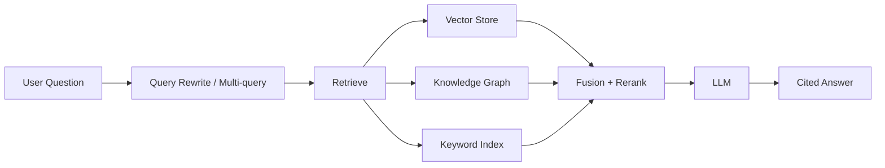

# RAG (Retrieval-Augmented Generation)

RAG enhances LLM responses by retrieving relevant context from your own data before generating an answer. DB-GPT provides a comprehensive RAG framework with multiple indexing and retrieval strategies, and runs knowledge-base chat as an **agentic RAG** loop.

## Two phases: indexing and conversation

```
INDEXING  (document-sync time)        CONVERSATION  (chat time)
─────────────────────────────         ──────────────────────────
upload → chunk → indexes              question
                       │                       │
        vector / keyword /                  agentic RAG loop:
        knowledge-graph                     rewrite → retrieve
        (+ structural tree,                 (maybe repeat) →
         + code graph for code)             fuse + rerank →
                                             cited answer
```

These two phases are decoupled — indexing runs once at sync time; chat only retrieves and never re-indexes.

## How the conversation works (agentic RAG)

DB-GPT does **not** do a single retrieve-then-generate. An agent drives the loop:



The agent can rewrite the query, retrieve multiple times, fuse and rerank results, and produce a cited answer — letting it handle complex or multi-part questions that one-shot RAG cannot. Full detail: [Agentic RAG Conversation Principles](/docs/design/agentic_rag_principles).

## Indexes

All indexes operate on the *same chunks*, so chunking quality is the foundation.

| Index | What it gives you | Built |
|---|---|---|
| **Vector** | semantic similarity via embeddings + cosine | at sync time |
| **Keyword (BM25)** | exact term matching | at sync time |
| **Knowledge Graph** | graph traversal over entities, document structure, headings, and code | at sync time |
| **Structural** | markdown-header tree / parent-child navigation | at query time (from chunk heading metadata) |
| **Code graph** | code AST as `function` / `class` nodes (for code files / git repos) | at sync time |

:::tip
The Knowledge Graph index is a **family of graphs**: LLM-extracted triplets, a document–paragraph structure graph, a Markdown heading-hierarchy graph, and a code AST graph (parsed with tree-sitter). See [Knowledge Base Indexing Principles](/docs/design/kb_index_principles).
:::

## Supported file formats

Upload and process a wide variety of document formats:

- **Documents**: PDF, Word (.docx), Markdown, TXT
- **Spreadsheets**: Excel (.xlsx), CSV
- **Web**: HTML, URLs
- **Code**: Python, Java, JavaScript, TypeScript, Go, Rust, C/C++ — parsed into the code graph

## Quick start with RAG

1. Open the DB-GPT Web UI
2. Navigate to **Knowledge Base** in the sidebar
3. Create a new knowledge base (choose index methods: Vector / Knowledge Graph / Full Text — combinable)
4. Upload your documents
5. Wait for processing to complete
6. Start chatting with your knowledge base (runs the agentic RAG loop)

For programmatic access, see the [RAG Cookbook](/docs/cookbook/rag/graph_rag_app_develop).

## What's next

- [Knowledge Base Indexing Principles](/docs/design/kb_index_principles) — how a document becomes searchable
- [Agentic RAG Conversation Principles](/docs/design/agentic_rag_principles) — how a question becomes a cited answer
- [Knowledge Base UI](/docs/getting-started/web-ui/knowledge-base) — Manage knowledge bases in the Web UI
- [Graph RAG](/docs/application/graph_rag) — Knowledge graph-based retrieval
- [RAG Module](/docs/modules/rag) — Deep dive into the RAG framework
- [RAG Development Guide](/docs/cookbook/rag/graph_rag_app_develop) — Build RAG apps programmatically