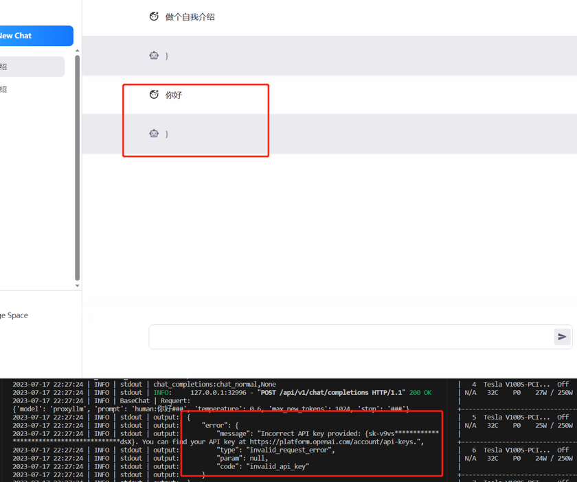
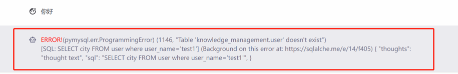

# FAQ
##### Q1: text2vec-large-chinese not found

##### A1: make sure you have download text2vec-large-chinese embedding model in right way

```tip
centos:yum install git-lfs
ubuntu:apt-get install git-lfs -y
macos:brew install git-lfs
```
```bash
cd models
git lfs clone https://huggingface.co/GanymedeNil/text2vec-large-chinese
```

##### Q2: execute `pip install -r requirements.txt` error, found some package cannot find correct version.


##### A2: change the pip source.

```bash
# pypi
$ pip install -r requirements.txt -i https://pypi.python.org/simple
```

or

```bash
# tsinghua
$ pip install -r requirements.txt -i https://pypi.tuna.tsinghua.edu.cn/simple/
```

or

```bash
# aliyun
$ pip install -r requirements.txt -i http://mirrors.aliyun.com/pypi/simple/
```


##### Q3:Access denied for user 'root@localhost'(using password :NO)

##### A3: make sure you have installed mysql instance in right way

Docker:
```bash
docker run --name=mysql -p 3306:3306 -e MYSQL_ROOT_PASSWORD=aa12345678 -dit mysql:latest
```
Normal:
[download mysql instance](https://dev.mysql.com/downloads/mysql/)

##### Q4:When I use openai(MODEL_SERVER=proxyllm) to chat
<p align="left">
  
</p>

##### A4: make sure your openapi API_KEY is available

##### Q5:When I Chat Data and Chat Meta Data, I found the error
<p align="left">
  
</p>

##### A5: you have not create your database and table
1.create your database.
```bash
mysql> create database {$your_name}
mysql> use {$your_name}
```

2.create table {$your_table} and insert your data. 
eg:
```bash
mysql>CREATE TABLE `users` (
  `id` int NOT NULL AUTO_INCREMENT,
  `username` varchar(50) NOT NULL COMMENT '用户名',
  `password` varchar(50) NOT NULL COMMENT '密码',
  `email` varchar(50) NOT NULL COMMENT '邮箱',
  `phone` varchar(20) DEFAULT NULL COMMENT '电话',
  PRIMARY KEY (`id`),
  KEY `idx_username` (`username`) COMMENT '索引：按用户名查询'
) ENGINE=InnoDB AUTO_INCREMENT=101 DEFAULT CHARSET=utf8mb4 COMMENT='聊天用户表'
```

##### Q6:When I use vicuna-13b, found some illegal character like this.
<p align="left">
  
</p>

##### A6: set KNOWLEDGE_SEARCH_TOP_SIZE smaller or set KNOWLEDGE_CHUNK_SIZE smaller, and reboot server.


