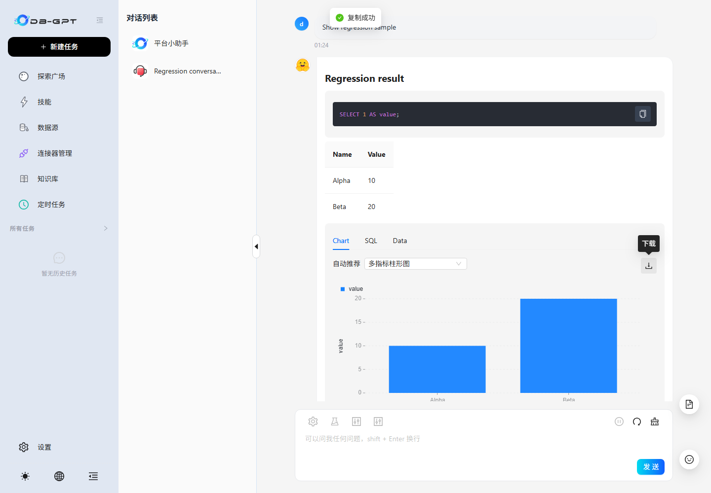
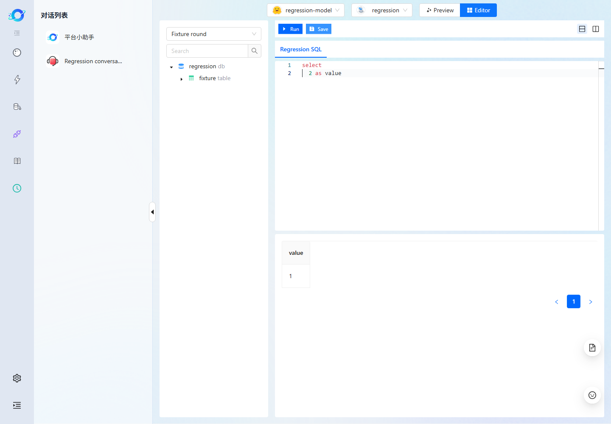

# PR #3277 frontend regression — 2026-09-30

The application source **`80d7c7035a4df69017870749665ee7e4a0a36bde`** passed the
scoped checks below in an independent PR checkout, without Dashboard PR #3278.
This report replaces the September 29 status. Checked boxes apply only to their
stated scope; fixture tests and live backend checks are identified separately.
Open review findings and coverage gaps remain listed below; passing these
regression checks does not establish readiness to merge.

Windows x64; Node **20.19.6**, npm **10.8.2**, Next **16.3.0**;
Playwright **1.62.1**. The Python backend source is unchanged by this PR.
[Exact-source Ubuntu/macOS CI](https://github.com/jcsdxhe/DB-GPT/actions/runs/36654709561)
and [per-case evidence](evidence/pr-3277/summary.json) support these results.

## Build, development and browser checklist

- [x] Clean dependency installation on Ubuntu and macOS CI.
- [x] Standalone TypeScript checking; build-time type checking remains enabled.
- [x] ESLint: **0 errors, 86 warnings**. Existing warnings remain visible; the
      Monaco dependency fix removes one of the previously reported 87.
      Current breakdown: 63 exhaustive-deps, 11 no-img-element, 10 unused disable
      directives, one alt-text and one no-anonymous-default-export warning.
- [x] Existing frontend tests plus share regression: **21 passed**.
- [x] Build/runtime contracts: **22 passed + 2 POSIX-only skips** on Windows;
      **24 passed** on each Ubuntu/macOS runner.
- [x] Windows `npm run build` and `npm start`: **60 generated HTML files and
      1,756 local asset references** verified.
- [x] Ubuntu and macOS: production build **and static export** both passed.
- [x] `npm run dev`, default **8 GiB heap**: **41/41**, one server process,
      no restart during the complete traversal.
- [x] Fast Refresh changes and restores a visible heading without replacing the
      document; before/after source SHA-256 is identical.
- [x] Production Chromium: **41/41**.
- [x] Production Firefox: **40/40 selected cases**.
- [x] Production WebKit: **40/40 selected cases**.
- [x] All four final suites: **zero console warnings/errors, uncaught exceptions,
      failed HTTP responses, unexpected fixture requests or non-aborted network
      failures**. There is no missing-asset or external-script allowlist.

The suite contains **29 page-entry checks and 12 interaction checks**.
Firefox/WebKit exclude the one compound clipboard/chart-tabs/PNG-download case
because Chromium's clipboard permission pair is unsupported there. That complete
case passes in Chromium; it is not counted as passed in the other browsers.
All runs use one worker, no retries and no navigation-timeout override.
WebKit here is Playwright on Windows, not a test on physical Safari/iOS devices.

The final dev traversal took about 4.3 minutes. Five-second samples from its
single Next server recorded a maximum observed heap use of **2,648.7 MiB** and
RSS of **3,833.6 MiB**. These are sampled values for this run, not a performance
benchmark or a guarantee for larger workloads. Disabling development Webpack
caching trades repeat-compilation time for lower retained memory; production
caching is retained. A separately observed first share-page compilation took
about 94 seconds.

## Frontend module checklist — deterministic API fixtures

“Pass” below means Chromium development and production assertions passed.
The portable Firefox/WebKit cases cover the same selected behavior, except
the explicitly excluded compound chat case described above.

| Module | Verified behavior | Result |
| --- | --- | --- |
| Home/navigation | Home, sidebar, construct tabs, return home and search controls | Pass |
| Conversations | List entry and existing chat-history rendering | Pass |
| Desktop chat | Human/assistant messages, Markdown, SQL code, table and math | Pass |
| Clipboard/charts | Copy SQL and verify clipboard; Chart/SQL/Data tabs; PNG download | Pass — Chromium |
| Mobile chat | Existing mobile chat route with valid scene/app parameters renders | Pass — route only |
| Data sources | List/type cards, required validation, SQLite selection, connection-test/create requests | Pass |
| Knowledge | Space list/search, detail and graph routes | Pass |
| Knowledge upload | Create form, Markdown file, advanced options, upload/sync and dialog completion | Pass |
| Applications | List/filter, create request and configuration navigation | Pass |
| AWEL | List/canvas, node search, mode switch, downloadable/parseable JSON export | Pass |
| Models/providers | List/configuration, required key validation and connection feedback | Pass |
| Plugins/DBGPTs | Management entry pages | Pass — rendering |
| Prompts | List and dynamic Markdown editor | Pass — rendering |
| Connectors | Management page | Pass — rendering |
| Skills | Search, enable toggle and detail Markdown | Pass |
| Scheduled tasks | List/history, search, enable toggle, name/question/frequency edit and save | Pass |
| SQL/chart editor | Monaco initialization, SELECT completion, typed SQL, format, Run result table, exact edited SQL in Run/Save requests | Pass |
| Evaluation | Evaluation/model/dataset entries, tabs and launch form | Pass — fixtures |
| Observability | Overview, traces and data-index entries | Pass — rendering |
| Share | Zero-step final answer without raw Thought prefix; restart replay | Pass |

The 60 generated HTML files include framework/component routes; they are not
claimed as 60 user workflows. Rendering-only rows are not full CRUD acceptance.

## Live checks — no API fixtures

These **nine integration checks** used the #3277 frontend at `80d7c703` with
the existing, unchanged Python backend loaded from the same isolated checkout.
They establish scoped frontend-to-backend compatibility; they are neither new
backend features delivered by this PR nor results from Dashboard PR #3278.
The recorded launcher verifies the imported backend's source directory. Runtime
overrides isolate metadata/vector storage, initialize the test schema and let
Next serve the frontend; they do not edit the repository's backend source.
The checks use the existing test model and test-owned records. Temporary apps,
tasks, flows, spaces and the new SQLite connection were cleaned up. Credentials
and runtime data are excluded from Git. See the sanitized
[provenance audit](evidence/pr-3277/review-audit.json).

- [x] **Model conversation:** configured `deepseek-v4-flash` streams a short
      answer; persisted history returns it and browser refresh restores it.
- [x] **SQLite:** browser creates a connection to a copy of the existing Walmart
      example; a real read-only SQL query returns one table; connection removed.
- [x] **Knowledge and Agent tools:** browser creates/uploads a Markdown document;
      one chunk is indexed; real vector recall returns the expected excerpt.
      A real model invokes **kb_grep and kb_cat** and displays `ORANGE-3277`.
- [x] **Published native app:** publish through the UI, verify persisted publish
      state, enter its conversation and see a real model answer; remove test app.
- [x] **Non-empty AWEL:** existing streaming-chat template, **3 nodes / 2 edges**;
      deploy, inspect the browser canvas, execute and receive `PR3277_FLOW_OK`.
- [x] **Scheduled-task UI:** create from a conversation, pause and verify
      persistence, open history, delete and verify cleanup.
- [x] **Actual scheduled execution:** scheduler runs a separate test task,
      records **success** and the expected model result; browser history shows it;
      task is paused and deleted.
- [x] **Zero-step share:** create/open a real share link and replay; final text
      is `PR3277_AGENT_OK`, matching the home page.
- [x] **Multi-step share:** replay real **kb_grep / kb_cat** execution steps and
      display the final knowledge answer, without an uncaught/console error.

The existing remote embedding configuration returned 404. The isolated test
launcher instead uses the project's **already cached roberta-base model** on
CPU, with mean pooling and normalized **768-dimensional** embeddings. This
verifies indexing, recall and the Agent workflow. It does **not** establish
semantic-retrieval quality or validate the broken remote embedding configuration.
No credential was transferred to another provider.

## Findings fixed in this follow-up

| Previously observed problem | Change and final evidence |
| --- | --- |
| Dev traversal exhausted retained memory and restarted | Keep generated OB SQL parsers out of page bundles, import MUI icons directly, bound page retention and disable dev Webpack caching; final 41-case traversal uses one server |
| macOS static export failed with EMFILE | Apply bounded filesystem preload on all platforms and handle paths with spaces; both final CI export jobs pass |
| Background 404/external iconfont failures | Correct local image path and use local icons; strict browser checks have no resource exceptions |
| Image/Ant Design/Next dev-indicator diagnostics | Correct image dimensions/sources, form lifecycle and contextual messages; disable faulty Pages Router badge while retaining HMR/error overlay |
| WebKit SQL completion worker failed to load | Load same-origin prebuilt workers directly instead of immediately revoking their blob URLs |
| SQL edits were reformatted/replaced while typing | Preserve exact controlled editor text and format explicitly; all three browsers verify exact Run/Save SQL |
| Shared answer leaked Thought prefix | Reuse the home page's final-content presentation helper; unit, fixture and live replay checks pass |

The failed September 29 development runs and the failed macOS export on
`90b837d0` remain historical failures; separate reruns do not change their
outcomes. They are superseded by the complete final-source checks above.
Fixture/selector and WebKit keyboard-convention corrections were harness fixes,
not product regressions. No old-toolchain browser comparison was performed.

## Explicit remaining coverage limits

- [ ] **Original remote embedding configuration:** still returns **404**.
      The local-model workaround verifies only the functional retrieval path.
- [ ] **Legacy live evaluation:** `/api/v1/evaluate/evaluations` and
      `/api/v1/evaluate/datasets` still return **404**. Their backend handlers
      are absent in this source. Those request paths/backend files are unchanged
      by the upgrade; fixture form checks do not establish live acceptance.
- [ ] **External authorization/services:** no usable third-party OAuth or
      connector authorization/sync credentials, or non-SQLite database instances,
      are available in the existing test resources.
- [ ] **Broader acceptance:** full Falcon benchmark jobs, semantic-retrieval
      quality, physical mobile/Safari devices and every destructive CRUD variant
      are not covered by this bounded frontend regression.
- [ ] **Old-toolchain browser/build comparison:** no complete same-environment
      run of the pre-upgrade dev/build/browser suite was performed. The earlier
      same-ESLint source comparison establishes lint attribution only.

These limits remain unchecked. This is not an assertion that every backend,
provider or real-device combination has been accepted.

## Open review and merge status — audited 2026-09-30

- [ ] **Heap-option detection:** the [open review finding](https://github.com/eosphoros-ai/DB-GPT/pull/3277#discussion_r4134504964)
      is reproducible in the current launcher. A valid title option containing
      `--max-old-space-size=4096` is mistaken for a heap flag, so the 8192 MB
      fallback is omitted. Existing default/explicit-heap tests do not cover
      this misleading argument value. The fix and focused regression remain pending.
- [ ] **Docstring coverage:** CodeRabbit's [reported warning](https://github.com/eosphoros-ai/DB-GPT/pull/3277#issuecomment-5887866559)
      is **20.51% versus an 80% threshold**, scoped to functions touched by its
      reviewed diff (39 functions across 79 files). It cannot be attributed to
      the upstream baseline from this evidence. The bot's review covers `f739b0f5`
      and is automatically paused; this is its latest published warning, not
      a new measurement of `80d7c703`. Documentation and a renewed review remain pending.
- [ ] **Required approvals:** the PR is **open**, its review decision is
      **REVIEW_REQUIRED**, and no approving review was observed. GitHub displays
      a minimum of **two approving reviews** before merge. Successful build
      checks do not satisfy this requirement.

This audit reconciled the recorded 87- and 86-warning lint logs, checked live-test
provenance and executed a small launcher reproduction. It did not rerun the full
browser/live suite or fix the two review findings. The
[audit evidence](evidence/pr-3277/review-audit.json) records the inspected head,
review snapshot, warning breakdown and sanitized backend provenance.

## Evidence and reproduction

[Machine-readable outcomes](evidence/pr-3277/summary.json) include all **162**
final browser assertions, per-suite diagnostics, the dev memory samples'
summary, HMR integrity, nine scoped live checks, current evaluation 404 probes
and exact-source CI results. The earlier failure descriptions remain visible.
Raw traces/logs stay local because live configuration and runtime paths are private.

Use [the isolated browser test package](../../tests/web-toolchain/README.md)
for fixture reproduction. Its Playwright dependency is separate from the
application package. For tooling checks, run in `web/`:

```sh
npm ci
npm run typecheck
npm run lint
npm run test:build
npm test
npm run build
npm run compile
```

Screenshots are from the final production Chromium fixture run.




