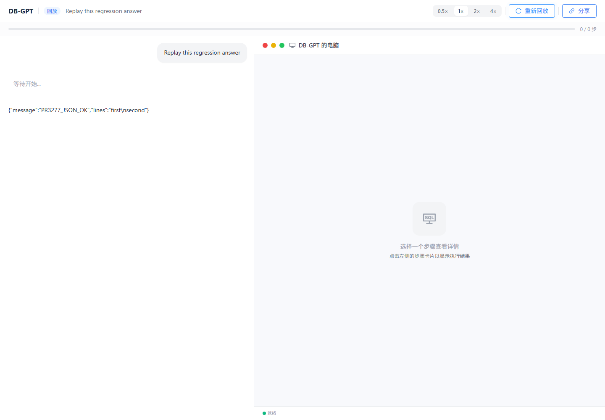

# PR #3277 frontend regression — 2026-09-30

## Main integration recheck — 2026-10-03

The local application tree at `8bed57bf` includes merge `63264219` of upstream
`5905245a6750bafa636aa36a904b7fd4ead75334`. It retains the upstream source-first
knowledge wizard and Wiki configuration, the App message context, and one source
of form defaults. The Wiki translation resources retain finite keys. A follow-up
normalizes the virtual type-test filename before comparing Windows paths.

Windows x64, Node **20.20.2**, npm **10.8.2**, dependencies installed with `npm ci`:

- Independent TypeScript passed; ESLint reported **0 errors / 89 warnings**.
- Build and merge contracts: **42 passed / 2 skipped**. The skipped cases require
  POSIX signal delivery and remain enabled for Ubuntu/macOS.
- Existing frontend tests: **24 passed**; the Wiki diff assertions also passed.
- Production build and default `npm run compile` static export passed. Both
  verified **60 HTML files / 1,782 local asset references** with type checking enabled.
- Chromium **151.0.7922.34** opened the exported frontend and exercised knowledge
  creation, the Wiki option/configuration, and the submitted index/Wiki settings.
  The create payload matched the selected options, with no browser page errors.
  API responses were mocked; this is not backend or external connector acceptance.

An earlier export attempt with a custom `NEXT_DIST_DIR` failed the launcher's
artifact-path check; the documented default export command above passed. The
earlier attempt is not counted as a pass. This local recheck does not substitute
for CI on the pushed commit. Each PR is reconciled separately with upstream main;
the shared paths between #3277 and #3278 still require a maintainer-selected merge
sequence and subsequent reconciliation. Historical source IDs below describe
their original runs.

Documentation follow-up, 2026-10-01: the [one-page acceptance summary](pr-3277-acceptance-summary.md)
separates recorded passes, existing issues, coverage gaps and maintainer decisions.
It supports PR review and OSPP closeout without treating PR merge as a prerequisite
for completing the project materials. No new regression run is represented here.

The latest application source **`763eba34c31a0ce4b07742bdcdfb05474f85f733`** passed the tooling
and browser checks below in an independent PR checkout, without Dashboard PR
#3278. This update includes the heap-option review fix, function documentation
and preservation of valid JSON answers in shared replay.

Windows x64; Node **20.19.6**, npm **10.8.2**, Next **16.3.0**;
Playwright **1.62.1**. The Python backend source is unchanged by this PR.

**Security scope:** the [official-advisory applicability review](pr-3277-security-advisories.md)
identifies a baseline server DoS issue and two rewrite-proxy request-smuggling
issues relevant to self-hosted Next server mode. Unused App Router, Server Action,
Middleware and Image Optimization features are not counted as benefits. The
review also discloses that **16.3.0 remains affected by the Windows-server RCE
advisory, first fixed in 16.3.3**, and the September 30 SSG cache and dev MCP
advisories applicable to the respective recorded server modes. The September
release fixes are in **16.3.8**; no version update was made. The remote-image SSRF
does not apply because remote image patterns are absent and Image Optimization
is disabled. Passing functional regression is not a security clearance, and
Python-only static serving has a different exposure scope.

**Warning attribution:** with the same **ESLint 9.39.5 configuration**, all
**86 current warnings match warnings reproduced on the official baseline
`d1d398eb`; 0 warnings were added**. The baseline comparison had 87 warnings;
the Monaco dependency fix removed one. This conclusion reconciles the recorded
same-configuration comparison with the final candidate lint log; lint was not
rerun for this documentation follow-up. It does not claim that the old ESLint 8
configuration reported the same diagnostics, including the 10 unused-disable
warnings surfaced by ESLint 9. See the [baseline follow-up evidence](evidence/pr-3277/baseline-followup.json).

**Old-version latency comparison:** the official baseline installed with its
original Node 18/Yarn toolchain and started dev, but both target pages timed out
during 120-second navigation before reaching their timing checkpoints. There
are **0 comparable old-version samples**. The separate ten-request backend probe
does not substitute for that missing browser comparison; upgrade involvement
cannot be excluded. See the [attempt, original errors and side-by-side timing
table](pr-3277-baseline-comparison.md).

[Latest-source Ubuntu/macOS CI](https://github.com/jcsdxhe/DB-GPT/actions/runs/36667552757) and
[per-case follow-up evidence](evidence/pr-3277/review-followup.json) support the
new results. The nine live integration checks and Fast Refresh evidence remain
from **`80d7c703`** and were **not rerun** in this review follow-up. Their original
[summary](evidence/pr-3277/summary.json) is retained unchanged.

Checked boxes apply only to their stated scope. Coverage gaps, historical
failures and the pending maintainer approvals remain disclosed below.

## Build, development and browser checklist

- [x] Clean dependency installation on Ubuntu and macOS CI.
- [x] Standalone TypeScript checking; build-time type checking remains enabled.
- [x] ESLint: **0 errors, 86 warnings**: 63 exhaustive-deps, 11 no-img-element,
      10 unused disable directives, one alt-text and one anonymous-default-export.
      The earlier 87-warning result predates the Monaco dependency fix at `80d7c703`.
- [x] Frontend unit tests: **24 passed** (17 decoder/content + 7 presentation).
- [x] Build/runtime contracts: **30 passed + 2 POSIX-only skips** on Windows;
      **32 passed** on each Ubuntu/macOS runner.
- [x] Windows `npm run build` and `npm start`: **60 generated HTML files and
      1,756 local asset references** verified.
- [x] Ubuntu and macOS: production build **and static export** both passed.
- [x] `npm run dev`, default **8 GiB heap**: **42/42**, one server process,
      no restart during the complete isolated traversal.
- [x] Production Chromium: **42/42**.
- [x] Production Firefox: **41/41 selected cases**.
- [x] Production WebKit: **41/41 selected cases**.
- [x] All four accepted suites: **zero console warnings/errors, uncaught
      exceptions, failed HTTP responses, unexpected fixture requests or
      non-aborted network failures**. No missing-resource allowlist is used.
- [x] Earlier Fast Refresh check at **`80d7c703`** changes/restores a visible
      heading without replacing the document and restores the source hash.
      This check was not rerun for the review fixes.

**Server modes are separate:** the three-browser results are from the
**`npm run build` output served by `npm start`**, using the same
`.next-pr3277-review-build` production artifact. Development was checked
separately with Chromium only. Existing server logs and execution records
confirm the commands below; this follow-up did not rerun these suites.

| Mode | Server command | Browser | Passed / selected |
| --- | --- | --- | --- |
| Development | `npm run dev` | Chromium | 42 / 42 |
| Production | `npm run build`, then `npm start` | Chromium | 42 / 42 |
| Production | `npm run build`, then `npm start` | Firefox | 41 / 41 |
| Production | `npm run build`, then `npm start` | WebKit | 41 / 41 |

The suite contains **29 page-entry checks and 13 interaction checks**. The sum
**166** is 42 + 42 + 41 + 41 assertion outcomes, not 166 distinct functions.
Firefox/WebKit exclude the compound clipboard/chart-tabs/PNG-download case
because Chromium's clipboard permission pair is unsupported there. That case
passes in Chromium; it is not counted as passed in the other browsers.
All suites use one worker, no automatic retries and no navigation-timeout override.
WebKit here is Playwright on Windows, not physical Safari/iOS testing.

The accepted isolated development run took about **9.8 minutes**.
Five-second samples from its single Next server recorded at most
**2,254.1 MiB heap use** and
**3,625.1 MiB RSS**. These sampled values are not a
performance benchmark or a guaranteed peak. Both actual dev/start commands were
also run with a valid title option containing heap-flag text: the child still
received the 8 GiB default. Explicit user heap options are tested separately.
Disabling development Webpack caching trades repeat-compilation time for lower
retained memory; production caching is retained.

**Earlier attempt retained:** the first dev run on the same source had **40
passes and 2 failures** while build/production verification overlapped. The skill
fixture response was delayed beyond Axios's 10-second timeout; SQL completion
remained loading at the 15-second assertion deadline. The unchanged application
and test suite then passed all 42 cases when run alone with a fresh output
directory and unchanged timeouts. That controlled rerun does not erase the
earlier failures. The evidence records both attempts.

**Targeted follow-up:** both original failures are waiting/deadline failures,
not wrong returned values. The skills page `/construct/skills/` missed its
Axios deadline before the switch locator timed out; the SQL editor at
`/chat/?scene=chat_dashboard&id=regression-editor&db_name=regression` remained
loading while waiting for the SELECT option. Twenty unchanged paired rounds,
including four fresh dev servers, passed **40/40** without automatic retries or
longer timeouts. The recorded failures do not establish a product defect
introduced by Next.js 16; their classification and targeted repetition are
closed within the documented scope. The slowest repeated skills request,
**8.268 seconds**, passed within the unchanged **10-second** limit; the original
fixture response crossed that deadline. See the [original errors, measured
distribution, slowest samples and scope of closeout](pr-3277-flaky-investigation.md).


## Frontend module checklist — deterministic API fixtures

“Pass” below means Chromium development and production assertions passed.
The portable Firefox/WebKit cases cover the same selected behavior, except
the explicitly excluded compound chat case described above.

| Module | Verified behavior | Result |
| --- | --- | --- |
| Home/navigation | Home, sidebar, construct tabs, return home and search controls | Pass |
| Conversations | List entry and existing chat-history rendering | Pass |
| Desktop chat | Human/assistant messages, Markdown, SQL code, table and math | Pass |
| Clipboard/charts | Copy SQL and verify clipboard; Chart/SQL/Data tabs; PNG download | Pass — Chromium |
| Mobile chat | Existing mobile chat route with valid scene/app parameters renders | Pass — route only |
| Data sources | List/type cards, required validation, SQLite selection, connection-test/create requests | Pass |
| Knowledge | Space list/search, detail and graph routes | Pass |
| Knowledge upload | Create form, Markdown file, advanced options, upload/sync and dialog completion | Pass |
| Applications | List/filter, create request and configuration navigation | Pass |
| AWEL | List/canvas, node search, mode switch, downloadable/parseable JSON export | Pass |
| Models/providers | List/configuration, required key validation and connection feedback | Pass |
| Plugins/DBGPTs | Management entry pages | Pass — rendering |
| Prompts | List and dynamic Markdown editor | Pass — rendering |
| Connectors | Management page | Pass — rendering |
| Skills | Search, enable toggle and detail Markdown | Pass |
| Scheduled tasks | List/history, search, enable toggle, name/question/frequency edit and save | Pass |
| SQL/chart editor | Monaco initialization, SELECT completion, typed SQL, format, Run result table, exact edited SQL in Run/Save requests | Pass |
| Evaluation | Evaluation/model/dataset entries, tabs and launch form | Pass — fixtures |
| Observability | Overview, traces and data-index entries | Pass — rendering |
| Share | Zero-step final answer; JSON object text and escapes survive reload/replay; no raw Thought prefix | Pass |

The 60 generated HTML files include framework/component routes; they are not
claimed as 60 user workflows. Rendering-only rows are not full CRUD acceptance.

## Earlier live checks — no API fixtures; source `80d7c703`

These checks were not rerun in this review follow-up. The review fixes concern
`NODE_OPTIONS` handling and JSON answer/replay presentation, with accompanying
tests and documentation; they do not change API request construction, transport,
or backend source. That scope is the reason for retaining the nine earlier
integration results without a rerun. Their source version remains explicitly
`80d7c703`; they are not presented as fresh results on the review-fix commit.

These **nine integration checks** used the #3277 frontend at `80d7c703` with
the existing, unchanged Python backend loaded from the same isolated checkout.
They establish scoped frontend-to-backend compatibility; they are neither new
backend features delivered by this PR nor results from Dashboard PR #3278.
The recorded launcher verifies the imported backend's source directory. Runtime
overrides isolate metadata/vector storage, initialize the test schema and let
Next serve the frontend; they do not edit the repository's backend source.
The checks use the existing test model and test-owned records. Temporary apps,
tasks, flows, spaces and the new SQLite connection were cleaned up. Credentials
and runtime data are excluded from Git. See the sanitized
[provenance audit](evidence/pr-3277/review-audit.json).

- [x] **Model conversation:** configured `deepseek-v4-flash` streams a short
      answer; persisted history returns it and browser refresh restores it.
- [x] **SQLite:** browser creates a connection to a copy of the existing Walmart
      example; a real read-only SQL query returns one table; connection removed.
- [x] **Knowledge and Agent tools:** browser creates/uploads a Markdown document;
      one chunk is indexed; real vector recall returns the expected excerpt.
      A real model invokes **kb_grep and kb_cat** and displays `ORANGE-3277`.
- [x] **Published native app:** publish through the UI, verify persisted publish
      state, enter its conversation and see a real model answer; remove test app.
- [x] **Non-empty AWEL:** existing streaming-chat template, **3 nodes / 2 edges**;
      deploy, inspect the browser canvas, execute and receive `PR3277_FLOW_OK`.
- [x] **Scheduled-task UI:** create from a conversation, pause and verify
      persistence, open history, delete and verify cleanup.
- [x] **Actual scheduled execution:** scheduler runs a separate test task,
      records **success** and the expected model result; browser history shows it;
      task is paused and deleted.
- [x] **Zero-step share:** create/open a real share link and replay; final text
      is `PR3277_AGENT_OK`, matching the home page.
- [x] **Multi-step share:** replay real **kb_grep / kb_cat** execution steps and
      display the final knowledge answer, without an uncaught/console error.

The existing remote embedding configuration returned 404. The isolated test
launcher instead uses the project's **already cached roberta-base model** on
CPU, with mean pooling and normalized **768-dimensional** embeddings. This
verifies indexing, recall and the Agent workflow. It does **not** establish
semantic-retrieval quality or validate the broken remote embedding configuration.
No credential was transferred to another provider.

## Findings fixed through this follow-up

| Previously observed problem | Change and final evidence |
| --- | --- |
| Dev traversal exhausted retained memory and restarted | Keep generated OB SQL parsers out of page bundles, import MUI icons directly, bound page retention and disable dev Webpack caching; accepted 42-case traversal uses one server |
| macOS static export failed with EMFILE | Apply bounded filesystem preload on all platforms and handle paths with spaces; both final CI export jobs pass |
| Background 404/external iconfont failures | Correct local image path and use local icons; strict browser checks have no resource exceptions |
| Image/Ant Design/Next dev-indicator diagnostics | Correct image dimensions/sources, form lifecycle and contextual messages; disable faulty Pages Router badge while retaining HMR/error overlay |
| WebKit SQL completion worker failed to load | Load same-origin prebuilt workers directly instead of immediately revoking their blob URLs |
| SQL edits were reformatted/replaced while typing | Preserve exact controlled editor text and format explicitly; all three browsers verify exact Run/Save SQL |
| Shared answer leaked Thought prefix | Reuse the home page's final-content presentation helper; unit, fixture and live replay checks pass |
| Heap-looking text inside an unrelated NODE_OPTIONS argument disabled the default | Prefix the default, then preserve user options for Node to parse; 11 real-child cases cover quoted/repeated/explicit flags and title values; the bot resolved the review |
| Touched-function docstrings failed the review threshold | Added focused documentation; emitted JavaScript was checked for the 70 documentation-only files; CodeRabbit now reports **92.11% / 80%**, passed |
| Shared valid JSON answers lost closing quote/brace or escaped characters | Preserve parseable JSON before display normalization; three new unit cases fail before the fix and pass after; new browser replay/reload case passes in all three browsers |

The failed September 29 development runs and the failed macOS export on
`90b837d0` remain historical failures; separate reruns do not change their
outcomes. They remain separate from the accepted checks above.
Fixture/selector and WebKit keyboard-convention corrections were harness fixes,
not product regressions. No complete old-toolchain browser suite was performed.
The later [two-case baseline attempt](pr-3277-baseline-comparison.md) failed at
navigation before either comparable latency checkpoint.

## Explicit remaining coverage limits

- [ ] **Original remote embedding configuration:** still returns **404**.
      The local-model workaround verifies only the functional retrieval path.
- [ ] **Legacy live evaluation:** `/api/v1/evaluate/evaluations` and
      `/api/v1/evaluate/datasets` still return **404**. Their backend handlers
      are absent in this source. Those request paths/backend files are unchanged
      by the upgrade; fixture form checks do not establish live acceptance.
- [ ] **External authorization/services:** no usable third-party OAuth or
      connector authorization/sync credentials, or non-SQLite database instances,
      are available in the existing test resources.
- [ ] **Broader acceptance:** full Falcon benchmark jobs, semantic-retrieval
      quality, physical mobile/Safari devices and every destructive CRUD variant
      are not covered by this bounded frontend regression.
      Physical iPhone validation was cancelled for this closeout and is not a
      pending task; Playwright WebKit does not become real-device evidence.
- [ ] **Old-toolchain browser/build comparison:** no complete same-environment
      run of the pre-upgrade dev/build/browser suite was performed. The targeted
      baseline attempt produced zero comparable latency samples after both
      navigations timed out; its separate backend probe cannot replace them.
      The same-ESLint source comparison establishes lint attribution only.

These limits remain unchecked. This is not an assertion that every backend,
provider or real-device combination has been accepted.

## Rollback scope and limits — inspected, not executed

At the inspected head `7ac93ead`, this PR contains **13 commits** on baseline
`d1d398eb`, beginning with `b6f0c2ae`; it is **not a single-commit change**.
The count is tied to that exact head and was reconfirmed against GitHub's live
PR API and uncached HTML on 2026-10-01. A later documentation publication adds
to the PR's displayed count; it does not change the tested application source.
Earlier captured page counts are not a different merge-count convention.
Reverting only the latest documentation commit or the initial dependency commit
would not undo the complete migration and its follow-up compatibility fixes.
The PR is still open, so no final merge/squash commit exists to name yet. After
merge, identify the actual resulting commits before selecting a rollback:

| Merge method | Rollback scope | Verification status |
| --- | --- | --- |
| Squash | Revert the resulting squash commit, subject to later overlapping changes | No final squash SHA exists; not executed |
| Merge commit | Revert the actual merge commit using the parent representing the target branch as mainline | Parent selection and rollback not exercised |
| Rebase | Revert the complete merged commit set in reverse order using its new post-merge SHAs | Final SHAs do not exist; not exercised |

**Cross-PR limitation:** #3277 and #3278 share baseline `d1d398eb`, and neither
inspected head is an ancestor of the other. However, #3278 at `f1977798` also pins
Next **16.3.0** / npm **10.8.2** and changes the package/lock files, Next config,
launchers and web CI; both PRs delete `web/yarn.lock`. Thus there is configuration
overlap: **90 changed paths** intersect, including shared frontend compatibility
code, types/locales, tests and toolchain documentation. This counts paths, not
identical patches. If both are merged, reverting #3277 alone may remove build or
compatibility fixes needed by the retained Dashboard frontend, and is not
guaranteed to restore Next 13 or apply without conflicts. Reverting #3278 may
also undo shared toolchain changes intended to remain from #3277, depending on
the actual merge resolution, as well as removing Dashboard features.
The actual combined tree must be reviewed while preserving the intended work;
this report does not change #3278 code or claim Dashboard acceptance on Next 13.
Both [#3277](https://github.com/eosphoros-ai/DB-GPT/pull/3277) and
[#3278](https://github.com/eosphoros-ai/DB-GPT/pull/3278) descriptions were corrected
on 2026-10-01 to disclose this overlap and ask maintainers to confirm ownership,
continuation and any split. Their heads remain unchanged.
See the [recorded commit/file comparison](evidence/pr-3277/rollback-review.json).

For a complete rollback of #3277 **without overlapping later changes**, the
contributor steps are:

1. Stop the current Next processes and use a fresh installation/build directory
   for the reverted source, retaining existing work rather than reusing the
   Next 16 `node_modules`, `.next` or exported artifacts.
2. Confirm the revert restores the original `web/package.json`, `web/yarn.lock`,
   **original `web/package-lock.json` as well**, Next 13.4.7 configuration and
   `.github/workflows/build-web.yml`. The baseline contains both lockfiles; do not
   regenerate one from the candidate or treat this as only a version-string edit.
3. Use Node **18** and Yarn Classic. The bounded baseline attempt used
   **18.20.8 / 1.22.22** and successfully ran `yarn install --frozen-lockfile`
   without changing the lockfile. Reinstall dependencies from the restored
   files; do not use the candidate's npm 10 lockfile/install state.
4. Rebuild with the restored `yarn build` before `yarn start`; use `yarn dev`
   for development and `yarn compile` when an exported Python-served distribution
   is required. Rebuild/redeploy matching assets rather than serving the previous
   Next 16 output. On Windows, the restored inline environment-variable scripts
   require a compatible shell; the earlier attempt used Git Bash.

**CI success after rollback is unverified.** A complete isolated revert restores
the original Ubuntu/macOS workflow: Node 18, `yarn install`, then `yarn build`.
The new npm/type/lint/build-contract/static-export checks would no longer be that
workflow. The prior control established installation and dev bootstrap only;
both target navigations failed and no old-version production build/CI was run.
The candidate's green CI cannot be relabeled as rollback CI evidence. No rollback,
reinstallation, build or regression was performed for this documentation update.

**Security consequence:** Next **13.4.7** and the current **16.3.0** both fall in
the affected range of **CVE-2026-75604**, an unauthenticated RCE affecting Next
Pages/App Router servers on Windows filesystems without Cache Components.
Its 16.x fix first shipped in **16.3.3**. Returning from a future patched candidate
to 13.4.7 would reintroduce this issue; reverting the current 16.3.0 candidate
would leave it unresolved. The old baseline is not a security-cleared fallback.
This concerns Next server deployments on Windows, not Python-only static-file
serving. See the [official advisory](https://github.com/vercel/next.js/security/advisories/GHSA-p293-qw3h-jr36)
and [project applicability review](pr-3277-security-advisories.md).

## Review and merge status — 2026-09-30

- [x] [Heap-option finding](https://github.com/eosphoros-ai/DB-GPT/pull/3277#discussion_r4134504964)
      fixed at `94c27d16`; focused red/green regressions and real dev/start checks
      pass. The bot resolved the thread.
- [x] [Touched-function docstring coverage](https://github.com/eosphoros-ai/DB-GPT/pull/3277#issuecomment-5887866559)
      now **92.11%**, above **80%**. The earlier 20.51% was a real review
      warning, not established as upstream baseline debt.
- [x] [JSON-answer review finding](https://github.com/eosphoros-ai/DB-GPT/pull/3277#discussion_r4140681916)
      fixed at `763eba34`; unit and cross-browser replay checks pass.
- [x] CodeRabbit [completed review of `763eba34`](https://github.com/eosphoros-ai/DB-GPT/pull/3277#issuecomment-5887866559);
      **zero unresolved review threads** at collection time.
- [ ] **Required approvals:** the PR remains **open**, **REVIEW_REQUIRED**.
      GitHub requires at least **two approving reviews**. Bot review and passing
      builds do not satisfy maintainer approval requirements.

The previous [audit snapshot](evidence/pr-3277/review-audit.json) remains unchanged
for provenance; its pending review statuses are historical. The
[new follow-up evidence](evidence/pr-3277/review-followup.json) supersedes those
statuses and records the latest lint, tools, browser attempts, memory and CI.

**Publication check — 2026-10-01:** the heap-option thread was already resolved
by CodeRabbit before the documentation publication. An explicit
[author reply](https://github.com/eosphoros-ai/DB-GPT/pull/3277#discussion_r4154079773)
now identifies `94c27d16` and the actual fix: remove regex detection and let Node
parse user options after the prefixed default. The fix is not described as a
word-boundary regex change. Earlier evidence JSON publication flags describe the
state at their own `recordedAt` timestamps, before these documents were published.

## Evidence and reproduction

[Latest follow-up outcomes](evidence/pr-3277/review-followup.json) include all
**166** accepted browser outcomes, per-suite diagnostics, sampled dev memory,
current tool/CI/review results and the separate first failed dev attempt.
The original [summary](evidence/pr-3277/summary.json) retains `80d7c703`'s 162
browser outcomes, nine live checks and HMR integrity; the
[audit](evidence/pr-3277/review-audit.json) retains the earlier pending review
snapshot. These sources represent different commits, not one combined latest run.
Raw traces/logs remain local; private live configuration and runtime paths are excluded.

Use [the isolated browser test package](../../tests/web-toolchain/README.md)
for fixture reproduction. Its Playwright dependency is separate from the
application package. For tooling checks, run in `web/`:

```sh
npm ci
npm run typecheck
npm run lint
npm run test:build
npm test
npm run build
npm run compile
```

Screenshots are from the latest `763eba34` production Chromium fixture run.



