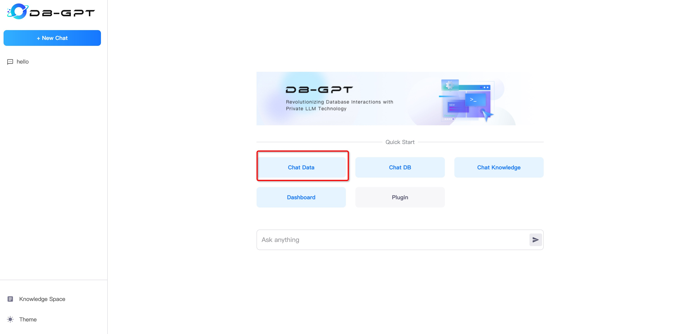
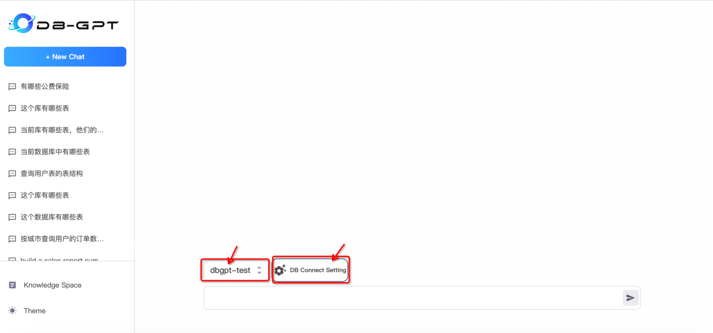
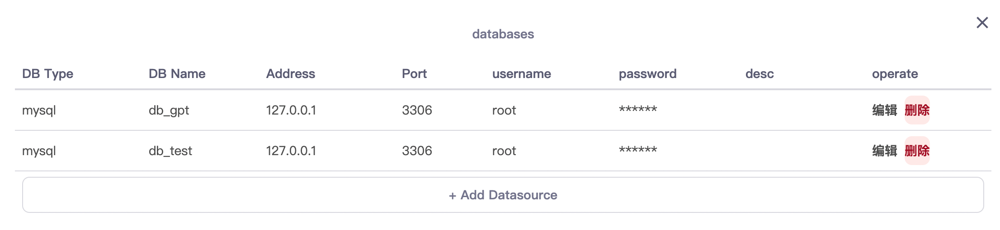
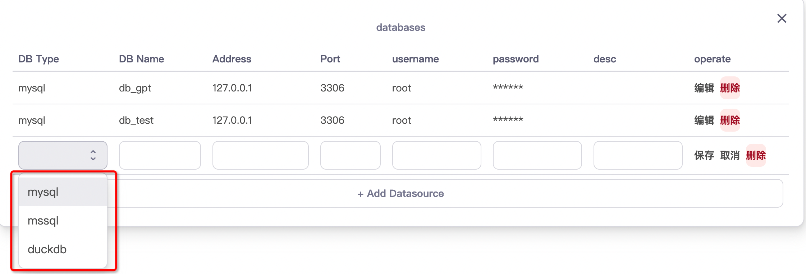
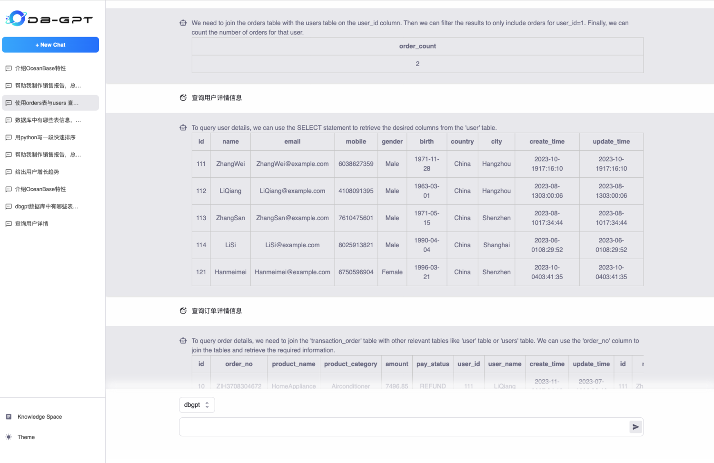

ChatData & ChatDB
==================================
ChatData generates SQL from natural language and executes it. ChatDB involves conversing with metadata from the
Database, including metadata about databases, tables, and
fields.

### 1.Choose Datasource

If you are using DB-GPT for the first time, you need to add a data source and set the relevant connection information
for the data source.

```{tip}
there are some example data in DB-GPT-NEW/DB-GPT/docker/examples

you can execute sql script to generate data.
```

#### 1.1 Datasource management



#### 1.2 Connection management



#### 1.3 Add Datasource



```{note}
now DB-GPT support Datasource Type

* Mysql
* Sqlite
* DuckDB
* Clickhouse
```

### 2.ChatData

After successfully setting up the data source, you can start conversing with the database. You can ask it to generate
SQL for you or inquire about relevant information on the database's metadata.


### 3.ChatDB


