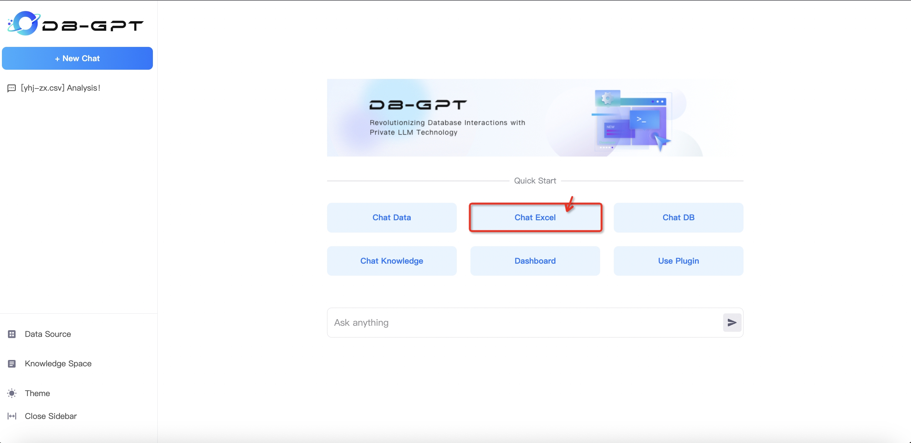
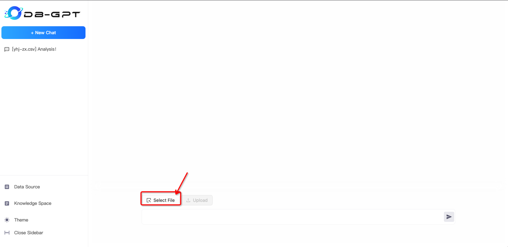
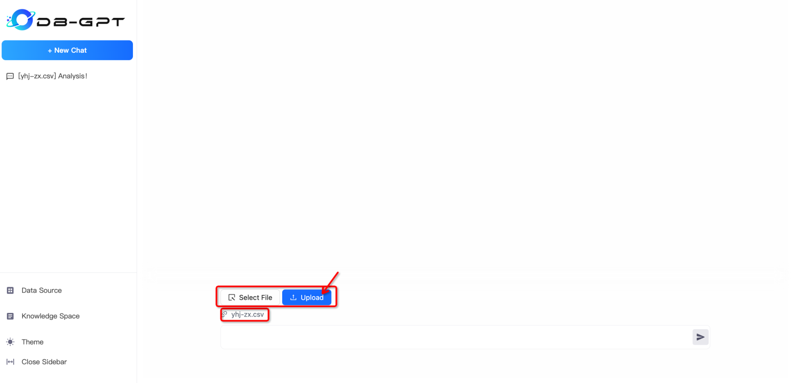
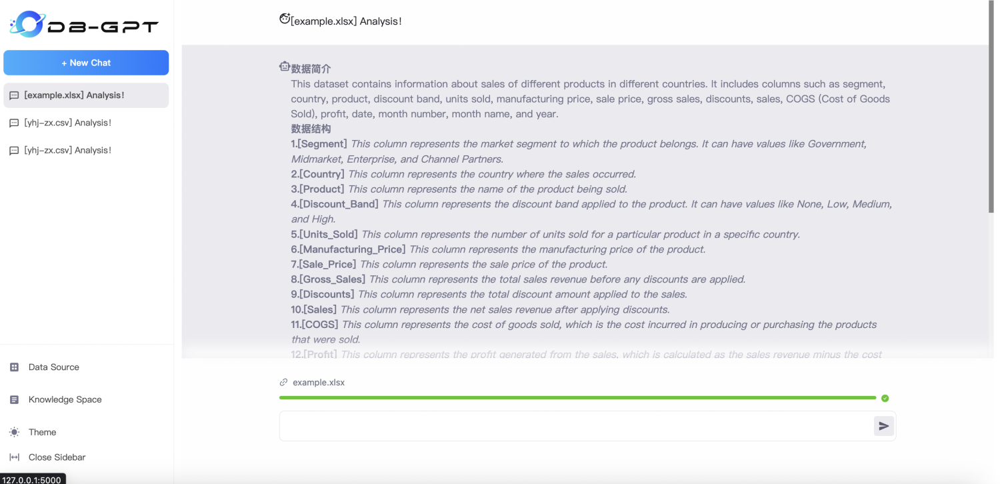
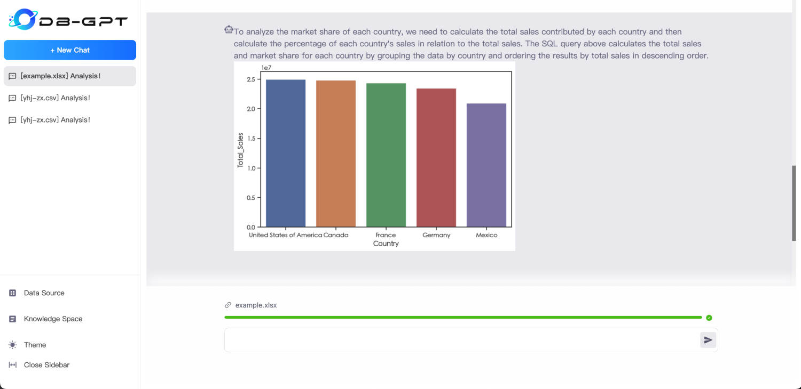
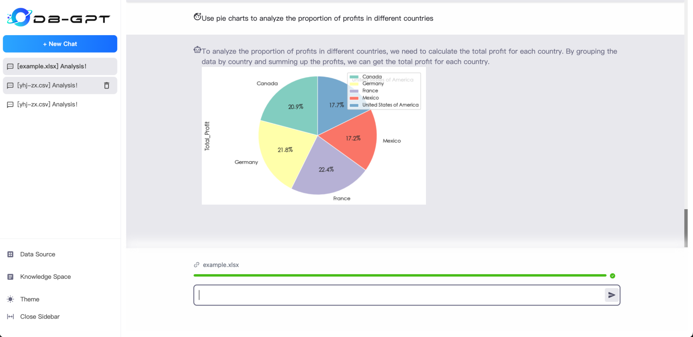
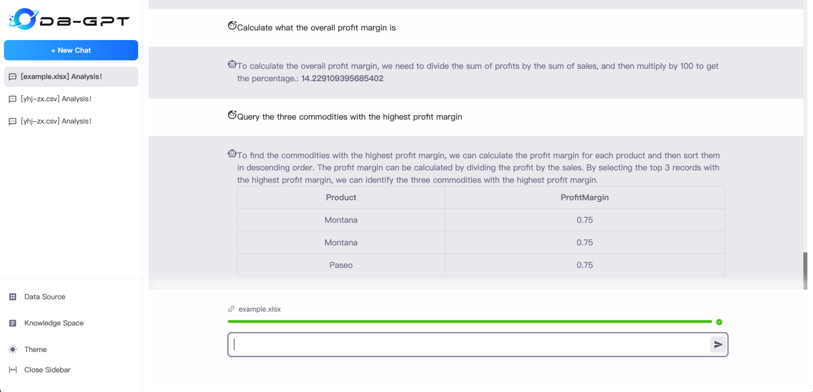

ChatExcel
==================================

ChatExcel uses natural language to analyze and query Excel data.

### 1.Select And Upload Excel or CSV File
Select your excel or csv file to upload and start the conversation.
```{tip}
ChatExcel 

The ChatExcel function supports Excel and CSV format files, select the corresponding file to use.
```



### 2.Wait for Data Processing
After the data is uploaded, it will first learn and process the data structure and field meaning.


### 3.Use Data Analysis Calculation
Now you can use natural language to analyze and query data in the dialog box.





