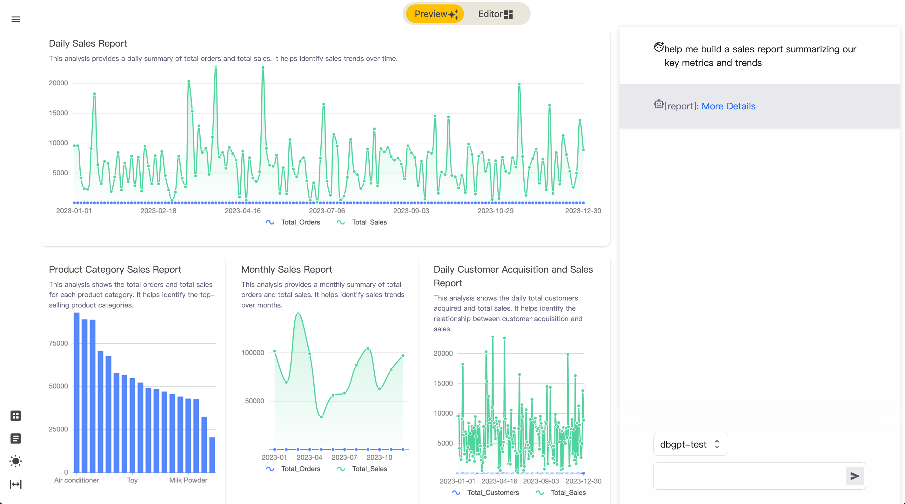

Dashboard
==================================
The purpose of the DB-GPT Dashboard is to empower data analysts with efficiency. DB-GPT provides intelligent reporting
technology, allowing business analysts to perform self-service analysis directly using natural language and gain
insights into their respective areas of business.

```{note} Dashboard now support Datasource Type
* Mysql
* Sqlite
* DuckDB
```

## Steps to Dashboard In DB-GPT

#### 1 add datasource

If you are using Dashboard for the first time, you need to mock some data to test. DB-GPT provide some dashboard test
data in pilot/mock_datas/, you should follow the steps.


#### 2.Choose Dashboard Mode


#### 3.Select Datasource


#### 4.Input your analysis goals




#### 5.Adjust and modify your report


