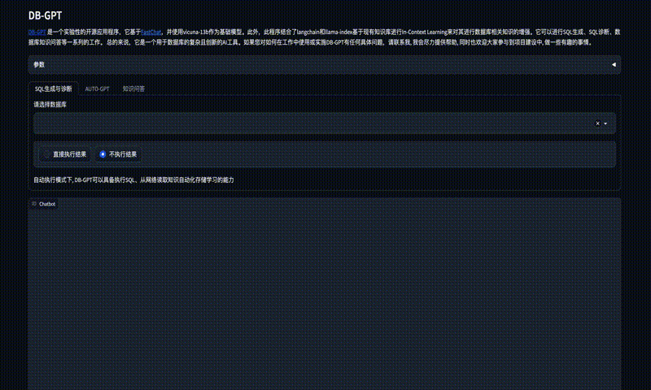
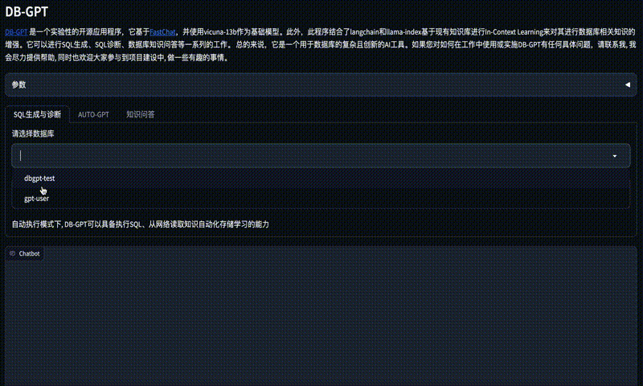

# Tutorials
-------------

This is a collection of DB-GPT tutorials on Medium.  

DB-GPT is divided into several functions, including chat with knowledge base, execute SQL, chat with database, and execute plugins.

### Introduction
[What is DB-GPT](https://www.youtube.com/watch?v=QszhVJerc0I)

### Knowledge

[How to Create your own knowledge repository](https://db-gpt.readthedocs.io/en/latest/modules/knownledge.html)

### SQL Generation

### SQL Execute

### Plugins
