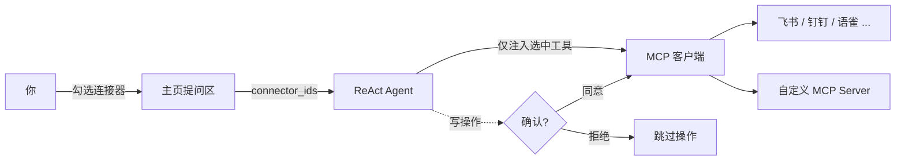

# MCP 连接器

**MCP 连接器**让 DB-GPT 的 Agent 突破数据库的边界——发消息、读写文档、管理 Issue、搜索网页——通过 **Model Context Protocol(MCP)** 协议连接各类外部服务。

激活一个内置模板,或接入任意自定义 MCP Server,然后在提问区按需勾选要用的连接器。Agent 只会看到你选中的工具;任何写操作都会先暂停等待你确认。

:::info 什么是 MCP?
[Model Context Protocol](https://modelcontextprotocol.io) 是一个开放标准,为 AI 应用提供了统一的方式去对接外部工具与服务。DB-GPT 中每个连接器背后都是一个 MCP Server,因此新增一项能力只需指向它的接入地址即可。
:::

## 功能亮点

- **内置模板**——飞书、钉钉、语雀、GitHub、Notion、Linear、Tavily、DeepWiki 一键激活。
- **自定义 MCP Server**——接入任意 SSE 或 Streamable HTTP 的 MCP 端点,自带鉴权。
- **按对话选择**——在提问区勾选本轮要挂载的连接器,Agent 的 prompt 保持聚焦、节省 token。
- **人工确认(HITL)**——写操作(创建 / 更新 / 删除)执行前弹出确认框。
- **工具透明**——可查看任意连接器暴露的完整工具列表,含参数与说明。
- **凭据安全**——Token 加密存储,进程重启后自动恢复。

## 工作原理

连接器有三种状态:

| 状态 | 含义 |
| --- | --- |
| **可用(Available)** | 目录中的模板,或"自定义 MCP"通用入口——尚未配置。 |
| **已激活(Active)** | 已填写凭据并连接成功,工具随时可用。 |
| **已挂载(Attached)** | 在当前对话中被勾选——Agent 实际注入它的工具。 |

## 内置连接器

| 连接器 | 分类 | 默认传输 | 典型工具 |
| --- | --- | --- | --- |
| 飞书 | 协作沟通 | SSE | 发消息、读写文档、日历 |
| 钉钉 | 协作沟通 | SSE | 群消息、机器人通知 |
| 语雀 | 知识管理 | SSE | 读写知识库文档 |
| GitHub | 项目 | Streamable HTTP | Issue、PR、仓库管理 |
| Notion | 知识管理 | Streamable HTTP | 页面 / 数据库读写 |
| Linear | 项目 | Streamable HTTP | Issue / Project 协作 |
| Tavily | 搜索增强 | Streamable HTTP | 为 LLM 优化的 Web 搜索,返回 Markdown |
| DeepWiki | 研发工具 | Streamable HTTP | 对任意 GitHub 仓库的 AI 解读与问答 |

## 管理连接器

打开**连接器管理**页,每个模板和自定义 Server 都以卡片呈现。卡片展示图标、名称、`模板` / `自定义` 徽章、所属分类、`MCP / SSE`(或 Streamable HTTP)传输标识,以及简短描述。可用搜索框和 **全部 / 已激活 / 未激活 / 需要关注** 标签筛选。

  

- **模板卡片**带「激活」按钮——点击后填写凭据并连接。
- **已激活卡片**显示 `● 已激活` 徽章,以及测试连接、编辑、删除的快捷操作。

### 添加连接器

点击**添加连接器**打开弹窗:

  

| 字段 | 说明 |
| --- | --- |
| **连接器名称** | 该连接器的显示名。 |
| **连接器类型** | 选择内置模板,或**自定义 MCP Server**。 |
| **传输协议** | **Streamable HTTP**(默认)或 **SSE**。 |
| **认证方式** | `none`、`bearer` 或 `token`——按需展示 Token / Header 字段。 |
| **连接器描述** | 可选,会展示在 Agent 的工具描述中。 |

对于自定义 Server,只需提供接入地址、传输协议和鉴权信息即可。凭据会在存储前加密。

### 查看工具

打开连接器详情可浏览它暴露的每个工具。面板列出每个工具名、描述,以及 **输入参数** 表格(名称、类型、是否必填、描述)——便于了解 Agent 究竟能调用什么。

  

## 在对话中使用连接器

1. 在主页提问区工具栏打开连接器选择器(**选择 MCP**)。
2. 勾选一个或多个连接器。提问区会显示已选数量,Agent 也只会拿到这些连接器的工具。
3. 正常提问。当 Agent 需要某个工具时会自动调用。
4. 若 Agent 触发**写操作**(例如新建文档、发送消息),会弹出确认框。点同意则执行,点拒绝则跳过——无论哪种,Agent 都会继续往下走。

:::tip 为什么"选择"很重要
只挂载需要的连接器,能让 Agent 的 prompt 更聚焦、减少 token 消耗,并避免模型选错工具。
:::

## 说明与限制

- 内置模板自带合理的 `confirm` 动作(写操作需确认);本期自定义 MCP 的工具暂不走确认。
- 凭据按用户隔离,进程重启后自动恢复。
- 若某个 Server 在启动时离线,其连接器会被标记,可在卡片上重新测试连接。
