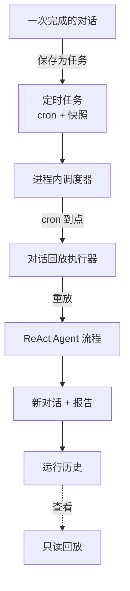

# 定时任务

**定时任务**把一次性的对话变成周期任务。做完一次数据分析后,将它保存为任务,DB-GPT 就会按 cron 周期自动重放整个 ReAct Agent 流程——每次都生成一份新的报告。

每次运行都会产出一个全新的对话,你随后可以回放查看,因此始终有一份"何时生成了什么"的完整历史。

:::info 开箱即用,无需配置
调度器随 webserver 进程内置启动,无需额外部署任何服务。
:::

## 功能亮点

- **保存任意对话**——把一次完成的对话(问题 + 模型 + 所选技能 / 连接器)冻结为可重复执行的任务。
- **灵活调度**——选择预设(每小时 / 每天 / 每周 / 每月)或编写自定义 cron 表达式,并实时预览"下次执行时间"。
- **自动重放**——每到 cron 时刻,Agent 重新执行完整流程并把结果写入历史。
- **执行历史**——每次运行都记录状态、耗时和结果摘要。
- **回放不重跑**——打开任意一次历史运行即可查看其对话快照——纯读取,零 LLM 调用。
- **重启自愈**——进程重启时,已启用的任务会被自动重新装载进调度器。

## 工作原理

## 把对话保存为任务

当一次对话已经产出报告后,在主页打开**保存为定时任务**。

  

| 字段 | 说明 |
| --- | --- |
| **任务名称** | 必填,任务的名称。 |
| **描述** | 可选,说明任务用途。 |
| **执行频率** | `每小时` / `每天` / `每周` / `每月`,或选择 `自定义` 填写原始 cron 表达式。 |
| **cron 表达式** | 随频率调整实时展示(例如 `0 9 * * *`)。 |

**"将复用本次对话的环境(只读)"** 区域展示了每次运行将要重放的冻结上下文——模型与原始问题。点击**保存并启用**即可创建并调度该任务。

## 管理任务

**定时任务**页列出每个任务的状态、cron 表达式、下次执行时间和创建人。可用搜索框和 **全部 / 已启用 / 已暂停** 标签筛选,用 **启用** 开关暂停或恢复任务。

  

| 列 | 说明 |
| --- | --- |
| **任务名称** | 名称与描述。 |
| **状态** | `已启用` 或 `已暂停`。 |
| **cron 表达式** | 当前生效的调度。 |
| **下次执行** | 任务下一次触发的时间。 |
| **创建人** | 任务的创建者。 |
| **启用** | 开关,暂停 / 恢复。 |
| **操作** | 编辑或删除。 |

## 任务详情与执行历史

打开任务可查看其完整配置和运行历史。

  

- **基本信息**——状态、cron 表达式、下次执行、创建人、创建时间。
- **任务环境(只读)**——每次运行会重放的原始问题、模型与数据库。
- **执行历史**——最近若干次运行,每条含状态(`成功` / `失败` / `超时` / `运行中`)、开始时间、耗时和结果摘要。

点击任意一次运行的**查看**,会跳转到主页**回放该次运行的对话**——完整的步骤流和报告从历史中还原,且不产生任何 LLM 调用。页面顶部会提示该对话由定时任务生成,并附返回任务详情的链接。

## 执行机制

1. 进程内调度器为每个已启用任务维护一个 job,以其 cron 表达式驱动。
2. job 触发时,执行器开启一个**新对话**,把保存的请求重放给 Agent。
3. 运行结果会被记录:状态、摘要,以及用于回放的新对话 id。
4. 各次运行相互独立——失败只会记录在该次运行上,任务静待下一个 cron 时刻。

:::tip 回放是只读的
"查看"从数据库加载某次历史运行存下的对话,绝不重新执行 Agent,因此既快又免费。
:::

## 说明与限制

- 任务失败不重试——失败或超时的运行会被记录,任务等待下一个调度时刻。
- 每次运行有硬性执行超时,防止 Agent 失控空转。
- 本期任务在所有用户间共享(展示创建人以便审计);按用户隔离与消息推送将在后续版本提供。
