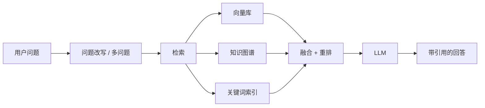

# RAG(检索增强生成)

RAG 通过在生成回答前从你自己的数据里检索相关上下文,来增强 LLM 的回答。DB-GPT 提供了完整的 RAG 框架,支持多种索引与检索策略,并把知识库对话跑成 **agentic RAG** 循环。

## 两个阶段:索引与对话

```
索引(文档同步时)                       对话(聊天时)
───────────────────                    ────────────────────
上传 → 切分 → 索引                     问题
                │                              │
    向量 / 关键词 /                          agentic RAG 循环:
    知识图谱                                 改写 → 检索
    (+ 结构树,                               (可能多轮) →
     + 代码文件的代码图谱)                    融合 + 重排 →
                                              带引用的回答
```

两个阶段解耦——索引在同步时执行一次,对话时只检索,不重新索引。

## 对话怎么工作(agentic RAG)

DB-GPT **不是**单次"检索-生成",而是由 agent 驱动循环:



agent 可以改写问题、多次检索、融合重排结果、产出带引用的回答——让它能处理单次 RAG 应付不了的复杂或多部分问题。完整细节见 [Agentic RAG 对话原理](/docs/design/agentic_rag_principles)。

## 索引

所有索引都作用在*同一批 chunk* 上,所以切分质量是地基。

| 索引 | 能给你什么 | 何时建 |
|---|---|---|
| **向量** | embedding + 余弦的语义相似度 | 同步时 |
| **关键词(BM25)** | 精确词匹配 | 同步时 |
| **知识图谱** | 对实体、文档结构、标题、代码做图遍历 | 同步时 |
| **结构** | Markdown 标题树 / 父子导航 | 查询时(按 chunk 标题元数据) |
| **代码图谱** | 代码 AST,产出 `function`/`class` 节点(代码文件 / git 仓库) | 同步时 |

:::tip
知识图谱索引是**一组图**:LLM 抽取的三元组图、文档-段落结构图、Markdown 标题层级图,以及代码 AST 图(用 tree-sitter 解析)。详见[知识库索引原理](/docs/design/kb_index_principles)。
:::

## 支持的文件格式

支持上传并处理多种文档格式:

- **文档**:PDF、Word(.docx)、Markdown、TXT
- **表格**:Excel(.xlsx)、CSV
- **网页**:HTML、URL
- **代码**:Python、Java、JavaScript、TypeScript、Go、Rust、C/C++——解析进代码图谱

## RAG 快速开始

1. 打开 DB-GPT Web UI
2. 侧边栏进入 **Knowledge Base**
3. 新建知识库(选择索引方法:Vector / Knowledge Graph / Full Text,可组合)
4. 上传文档
5. 等待处理完成
6. 开始与知识库对话(走 agentic RAG 循环)

编程访问见 [RAG Cookbook](/docs/cookbook/rag/graph_rag_app_develop)。

## 下一步

- [知识库索引原理](/docs/design/kb_index_principles)——一篇文档如何变得可被检索
- [Agentic RAG 对话原理](/docs/design/agentic_rag_principles)——一个问题如何变成带引用的回答
- [知识库 UI](/docs/getting-started/web-ui/knowledge-base)——在 Web UI 管理知识库
- [Graph RAG](/docs/application/graph_rag)——基于知识图谱的检索
- [RAG 模块](/docs/modules/rag)——RAG 框架深入
- [RAG 开发指南](/docs/cookbook/rag/graph_rag_app_develop)——编程构建 RAG 应用