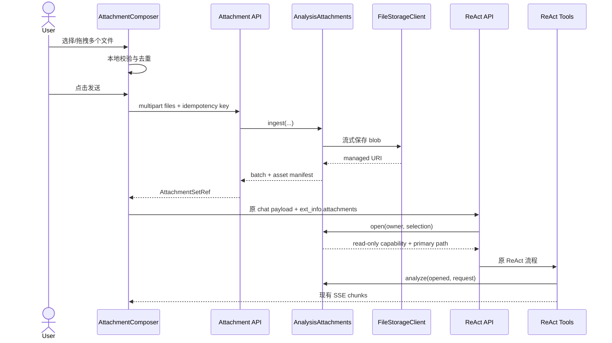
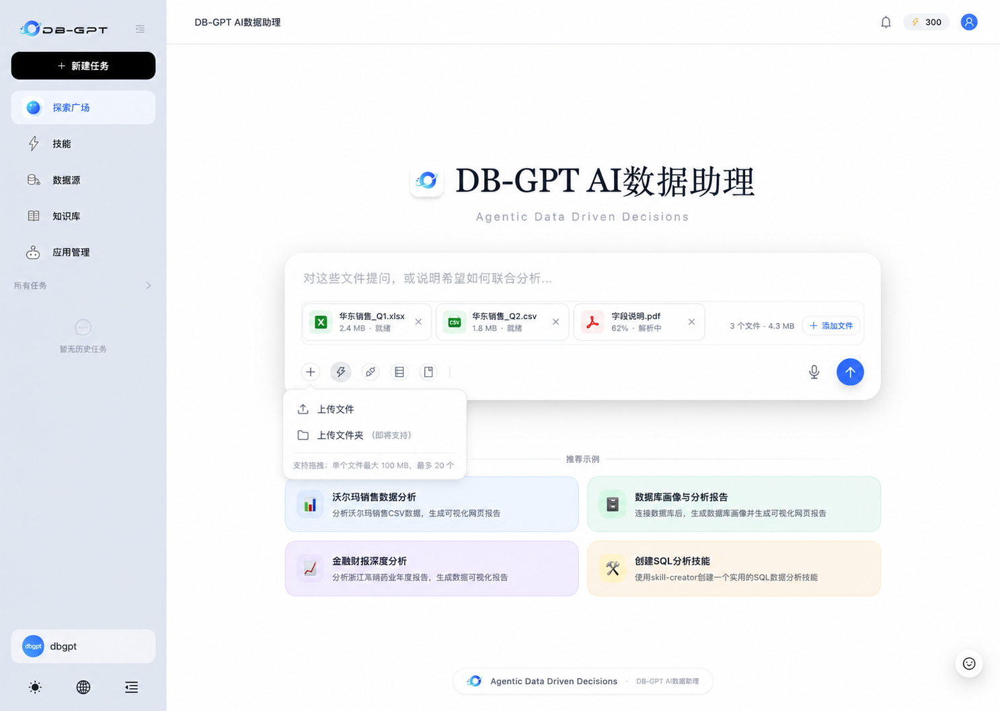
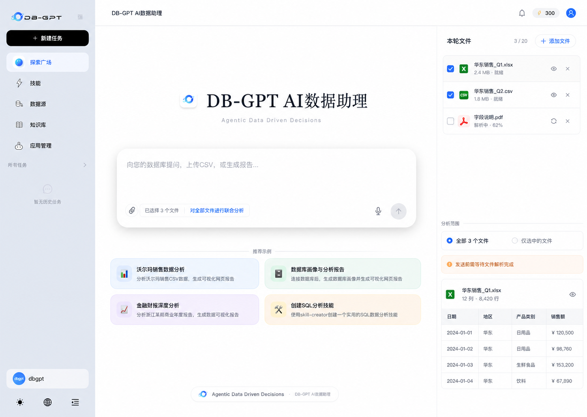
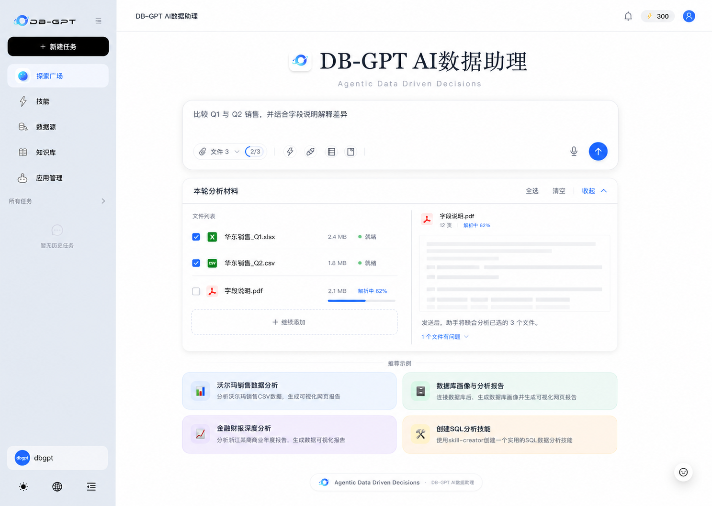

# DB-GPT 主页多文件上传与联合分析方案

> 状态：设计提案
> 范围：`/` 主页 → 文件上传 → `/api/v1/chat/react-agent` → ReAct 工具 → 会话历史/定时任务 → 前端产物面板
> 目标版本：兼容式增量演进，不替换现有单文件链路

## 1. 结论

推荐引入一个深 Module：`AnalysisAttachments`。

它把“文件上传、受管存储、所有权、批次清单、格式识别、生命周期、临时物化、联合分析和旧单文件兼容”收敛到同一处。主页和 ReAct 只交换稳定的 `batch_id` / `asset_id`，不再新增裸服务器路径。

核心 Interface 保持为三个入口：

```python
class AnalysisAttachments:
    async def ingest(self, command: IngestAttachments) -> AttachmentSetRef:
        """校验并保存一批文件，返回不可变附件集合。"""

    async def open(self, command: OpenAttachmentSet) -> OpenedAttachmentSet:
        """校验归属并为一次对话运行创建只读 capability。"""

    async def analyze(
        self,
        opened: OpenedAttachmentSet,
        request: AnalyzeAttachments,
    ) -> AttachmentAnalysisResult:
        """执行逐文件、对比或联合分析，并保留来源信息。"""
```

兼容策略：

- 0 文件：请求体、SSE、提示词和文本对话流程完全不变。
- 旧单文件：继续支持 `/api/v1/python/file/upload` 与 `ext_info.file_path`。
- 新单文件：走附件集合，但内部仍把第一个文件映射成 `FILE_PATH`。
- 新多文件：通过 `ext_info.attachments` 传入批次及选中文件。
- 现有 `load_file()`、`execute_analysis()`、SSE `chunks` 协议和报告右侧面板不删除。
- 不把 `file_paths: string[]` 作为长期方案；它会把当前路径、安全和生命周期问题复制 N 次。

建议分两阶段：

1. `v1`：受管附件批次、多文件上传、表格/文档联合分析、历史恢复、单文件兼容。
2. `v2`：远程 URI、S3/OSS 引用、图片/OCR、压缩包展开、可恢复异步解析和显式子 Agent 文件授权。

## 2. 当前链路与约束

### 2.1 前端

主页目前是独立实现，没有使用 `ChatPage` 或 `useReActAgentChat`：

- 单值文件状态：`web/pages/index.tsx:543`、`:565`
- 上传配置明确 `multiple: false`：`web/pages/index.tsx:2548-2558`
- 点击发送后才调用单文件上传：`web/pages/index.tsx:1542-1599`
- 上传成功后写入 `ext_info.file_path`：`web/pages/index.tsx:1682-1693`
- 主页自行读取 ReAct SSE：`web/pages/index.tsx:1709-2168`
- 定时任务快照同样保存裸 `file_path`：`web/pages/index.tsx:2499-2525`
- 欢迎态与会话态各有一份输入 UI：`web/pages/index.tsx:2782-3309`、`:3450-4213`

单文件语义还散落在：

- `ChatMessage.attachedFile`
- `ManusLeftPanelProps.attachedFile`
- `OpenCodeSessionTurn.attachedFile`
- 上传文件 Tag 与历史恢复

因此，只把 `multiple` 改成 `true` 不足以完成多文件支持。

### 2.2 上传与存储

当前主页调用的 `/api/v1/python/file/upload`：

- 只接收一个 `UploadFile`
- 一次性 `await file.read()` 到内存
- 以原文件名写入 `{work_dir}/python_uploads/{user_id}`
- 返回服务器绝对路径
- 已防止绝对路径、`..` 与符号链接逃逸
- 没有数量、单文件大小、批总大小、MIME、重复名、TTL 与配额语义

证据：`packages/dbgpt-app/src/dbgpt_app/openapi/api_v1/python_upload_api.py:16-73`。

仓库已有更适合复用的通用文件能力：

- `FileStorageClient` / `FileStorageSystem`
- `dbgpt-fs://{storage_type}/{bucket}/{file_id}` URI
- 本地、分布式、S3、OSS Adapter
- 文件 metadata 与 hash 校验
- `/api/v2/serve/file/files/{bucket}` 多文件 transport
- metadata batch 查询

相关实现位于：

- `packages/dbgpt-core/src/dbgpt/core/interface/file.py`
- `packages/dbgpt-serve/src/dbgpt_serve/file/`
- `packages/dbgpt-ext/src/dbgpt_ext/storage/file/`

本方案复用上述存储 Implementation，但不会直接把通用文件 endpoint 当成附件领域模型。

### 2.3 ReAct Agent

当前后端链路为：

```text
ConversationVo.ext_info.file_path
    → _react_agent_stream.file_path
    → react_state["file_path"]
    → prompt 的 User Uploaded File
    → load_file / execute_analysis / code_interpreter / skill_tools
```

关键位置：

- `ConversationVo.ext_info` 仍是无类型字典：
  `packages/dbgpt-app/src/dbgpt_app/openapi/api_view_model.py:43-92`
- 读取单个 `file_path`：
  `packages/dbgpt-app/src/dbgpt_app/openapi/api_v1/agentic_data_api.py:995-1016`
- 写入 `react_state`：
  `agentic_data_api.py:1275-1280`
- 创建文件工具：
  `agentic_data_api.py:1787-1800`
- 拼接单文件 prompt：
  `agentic_data_api.py:2011-2017`
- ReAct SSE 路由：
  `agentic_data_api.py:3314-3348`

`load_file` 和 `execute_analysis` 仍只识别一个路径：

- `packages/dbgpt-app/src/dbgpt_app/openapi/api_v1/tools/load_file.py`
- `packages/dbgpt-app/src/dbgpt_app/openapi/api_v1/tools/execute_analysis.py`

会话历史只保存用户文本与 Agent 输出，没有保存输入附件清单。因此刷新或恢复历史后，输入文件卡和文件作用域都会丢失。

### 2.4 需要先记录的现有问题

这些问题不是多文件方案本身造成的，但会干扰落地验证：

- `web/pages/index.tsx:2555` 调用的 `parseLocalFilePreview` 在仓库中没有定义或导入。
- `tools/execute_analysis.py:13` 从 `agentic_data_api` 导入模块级 `get_code_server`，但目标文件没有该导出。
- 上传后的 `uploadedFile` 没有在发送成功后清理，后续轮次可能重复上传。
- `/v1/resource/file/read` 与 `ext_info.file_path` 缺少附件 owner 校验。
- 文件路径被插值进生成的 Python 源码，特殊文件名存在代码拼接风险。

建议将这些作为 Phase 0 回归修复，避免与多文件改动混在同一个风险面里。

## 3. 备选方案比较

| 方案 | Interface | 兼容性 | 扩展性 | 主要问题 |
| --- | --- | --- | --- | --- |
| A. `file_paths: string[]` | 路径数组 | 高 | 低 | 复制路径暴露、所有权、覆盖、TTL 与代码注入问题 |
| B. `AttachmentSet` | `batch_id + asset_ids` | 高 | 高 | 需要附件 manifest 与生命周期表 |
| C. 完整 `AnalysisRun` | `batch/run/event` | 中 | 最高 | 首期引入队列、事件游标和运行状态，改动过重 |

推荐 B，并为 C 预留演进位：

- Phase 1 继续使用现有 ReAct SSE 作为“分析运行”。
- 附件集合与分析运行解耦；同一批文件可在多轮对话中复用。
- 当解析或分析迁移到独立 worker 时，再增加 `run_id` 与事件游标。

这个选择的 Depth 来自：调用者只学习三个入口，却获得存储、安全、配额、manifest、格式路由、联合分析、生命周期与兼容行为。删除该 Module 后，这些复杂度会重新散落到主页、Agent、工具、知识库与定时任务，符合 deletion test。

## 4. 领域模型

### 4.1 核心类型

```python
AttachmentBatchId = NewType("AttachmentBatchId", str)
AttachmentAssetId = NewType("AttachmentAssetId", str)


class AttachmentAssetState(str, Enum):
    UPLOADING = "uploading"
    INSPECTING = "inspecting"
    READY = "ready"
    PARTIAL = "partial"
    FAILED = "failed"
    EXPIRED = "expired"


@dataclass(frozen=True)
class AttachmentAsset:
    asset_id: AttachmentAssetId
    batch_id: AttachmentBatchId
    ordinal: int
    display_name: str
    detected_media_type: str
    asset_kind: Literal["table", "document", "image", "archive", "binary"]
    size_bytes: int
    sha256: str
    storage_uri: str
    state: AttachmentAssetState
    parser_metadata: Mapping[str, Any]
    problem: Optional["AttachmentProblem"]


@dataclass(frozen=True)
class AttachmentSetRef:
    batch_id: AttachmentBatchId
    assets: Tuple[AttachmentAsset, ...]
    primary_asset_id: AttachmentAssetId


@dataclass(frozen=True)
class AttachmentSelection:
    batch_id: AttachmentBatchId
    asset_ids: Optional[Tuple[AttachmentAssetId, ...]] = None
    scope: Literal["turn", "conversation"] = "turn"
```

### 4.2 不变量

1. `READY` 后的 blob、hash 与 `asset_id` 不可变。
2. 所有 batch/asset 都绑定 owner；任何读取、分析、下载、删除都重新校验。
3. 批内顺序稳定，第一个文件是 `primary_asset`。
4. `asset_ids` 为空表示选中整个 batch；非空必须是该 batch 的子集。
5. ReAct、浏览器和 LLM 看不到服务器绝对路径。
6. 远程来源必须先 materialize 为受管 blob，再交给 parser/代码执行。
7. 单文件兼容的 `FILE_PATH` 永远映射到 primary asset。
8. 部分文件失败时保留成功文件，批次状态为 `PARTIAL`；不会静默丢弃失败项。
9. 临时对话附件默认 TTL 清理；会话长期上下文或定时任务引用会 pin。
10. 输入附件与 Agent 生成的 `Artifact` 是不同领域对象，只在展示 Adapter 中合并。

### 4.3 建议持久化

`attachment_batch`

```text
id, owner_id, state, idempotency_key,
created_at, expires_at, pinned_until, metadata
```

`attachment_asset`

```text
id, batch_id, ordinal, display_name,
storage_uri, detected_media_type, asset_kind,
size_bytes, sha256, state, parser_metadata,
error_code, error_message, created_at
```

首期不新增独立 `analysis_run` 表；当前 chat round 与 SSE 已承担运行语义。

## 5. 对外协议

### 5.1 新增多文件上传

```http
POST /api/v1/agent/attachments/batches
Content-Type: multipart/form-data

files=@sales_q1.csv
files=@sales_q2.xlsx
files=@field_dictionary.pdf
idempotency_key=client-generated-key
```

响应：

```json
{
  "success": true,
  "data": {
    "batch_id": "attb_01K...",
    "state": "ready",
    "primary_asset_id": "atta_01K...A",
    "assets": [
      {
        "asset_id": "atta_01K...A",
        "name": "sales_q1.csv",
        "media_type": "text/csv",
        "kind": "table",
        "size": 18234,
        "state": "ready",
        "ordinal": 0
      },
      {
        "asset_id": "atta_01K...B",
        "name": "sales_q2.xlsx",
        "media_type": "application/vnd.openxmlformats-officedocument.spreadsheetml.sheet",
        "kind": "table",
        "size": 42110,
        "state": "ready",
        "ordinal": 1
      }
    ],
    "problems": []
  }
}
```

上传 transport 可以返回 `207` 式的逐文件结果，但 DB-GPT 现有 `Result` 约定下，更建议保持 HTTP 成功并在 `data.state/problems` 中表达 `PARTIAL`。批级鉴权、配额或协议错误仍使用 4xx。

### 5.2 Chat 请求

新请求使用版本化的嵌套结构：

```json
{
  "conv_uid": "conv-123",
  "chat_mode": "chat_react_agent",
  "model_name": "model-name",
  "user_input": "比较两个季度的销售变化，并结合字段说明解释差异",
  "ext_info": {
    "attachments": {
      "version": 1,
      "batch_id": "attb_01K...",
      "asset_ids": ["atta_01K...A", "atta_01K...B"],
      "scope": "turn"
    }
  }
}
```

旧请求保持原样：

```json
{
  "conv_uid": "conv-legacy",
  "user_input": "分析这个文件",
  "ext_info": {
    "file_path": "/existing/python_uploads/alice/sales.csv"
  }
}
```

当 `attachments` 与 `file_path` 同时出现时：

- 若 `file_path` 是同一批次 primary asset 的兼容物化路径，接受并记录迁移指标。
- 否则返回 `CONFLICTING_ATTACHMENT_SPEC`，不能静默选一个。

### 5.3 Capabilities

前端限制不能硬编码，新增：

```http
GET /api/v1/agent/attachments/capabilities
```

示例：

```json
{
  "max_files": 20,
  "max_file_bytes": 104857600,
  "max_batch_bytes": 524288000,
  "upload_concurrency": 3,
  "accepted_kinds": ["table", "document"],
  "accepted_extensions": [
    ".csv", ".tsv", ".xls", ".xlsx",
    ".json", ".jsonl", ".parquet",
    ".pdf", ".doc", ".docx", ".pptx", ".md", ".txt"
  ]
}
```

以上数值只是默认示例，最终由服务端配置决定。

## 6. 后端 Module 与 Adapter

### 6.1 Seam 位置

Seam 放在以下两侧之间：

```text
FastAPI / ReAct / Skill / Scheduled Task
                    │
          AnalysisAttachments Interface
                    │
存储、ACL、manifest、parser、materialization、analysis
```

外部调用者不需要知道：

- 文件最终位于本地、分布式存储、S3 还是 OSS
- 文件名清洗、随机 storage key、hash 与去重
- staging、失败清理与孤儿 blob reconciliation
- CSV 编码、Excel sheet、PDF 页数等 parser 细节
- pandas / KnowledgeFactory / CodeServer 的选择
- 临时工作目录与真实绝对路径
- 多文件并发度、超时与部分失败聚合
- TTL、pin、引用计数和物理 GC
- prompt manifest 压缩与 token 控制

### 6.2 内部 Adapter

| 内部 Seam | 生产 Adapter | 测试 Adapter | 依赖类别 |
| --- | --- | --- | --- |
| Blob 存储 | 现有 `FileStorageClient` | temp-dir + in-memory metadata | local-substitutable |
| 表格读取 | CSV / Excel / JSON / Parquet reader | fixture reader | in-process |
| 文档解析 | `KnowledgeFactory` 包装 Adapter | deterministic parser | local-substitutable |
| 分析执行 | CodeServer / AWEL | in-memory executor | local-substitutable |
| manifest repository | SQLAlchemy | SQLite / in-memory | local-substitutable |
| 恶意文件扫描 | 后续 ClamAV/外部扫描 | mock scanner | true external |
| 远程来源抓取 | 后续 hardened HTTP client | fixture HTTP | true external |

“一个 Adapter 意味着假想 Seam，两个 Adapter 才是真实 Seam”。因此首期不会为了尚未接入的外部队列或 OCR 服务制造公共 port。

### 6.3 建议代码位置

不要继续扩大已经超过 3,000 行的 `agentic_data_api.py`：

```text
packages/dbgpt-serve/src/dbgpt_serve/attachment/
  api/schemas.py
  models/models.py
  models/dao.py
  domain.py
  service.py
  parser_registry.py

packages/dbgpt-app/src/dbgpt_app/openapi/api_v1/
  attachment_api.py
  attachment_react_adapter.py
  python_upload_api.py              # 旧 endpoint Adapter
  agentic_data_api.py               # 只做解析/编排
  tools/load_file.py
  tools/execute_analysis.py
  tools/code_interpreter.py
  tools/skill_tools.py
```

通用 blob/metadata 能力继续留在 `dbgpt_serve.file`，附件的对话语义、batch、selection 和 TTL 留在新的 `dbgpt_serve.attachment`，避免把通用文件 Module 变成浅层业务杂物箱。

## 7. ReAct 集成

### 7.1 初始化

`_react_agent_stream` 在构造 prompt 和 tools 前完成一次 `open()`：

```python
attachment_spec = parse_attachment_spec(dialogue.ext_info)
opened_attachments = await analysis_attachments.open(
    OpenAttachmentSet(
        owner_id=dialogue.user_name,
        conv_id=dialogue.conv_uid,
        selection=attachment_spec,
        purpose="interactive",
    )
)

react_state["attachments"] = opened_attachments
react_state["file_path"] = opened_attachments.primary_local_path
```

兼容点：

- 无新字段时，走当前 `file_path` 分支。
- 新多文件分支仍设置内部 `file_path`，只供旧工具和旧 skill 使用。
- `primary_local_path` 不写回前端、不写入 prompt、不进入历史 payload。

### 7.2 Prompt

从：

```text
## User Uploaded File
- File path: /abs/path/file.csv
```

改为：

```text
## User Attachments
1. [atta_A] sales_q1.csv — table, text/csv, 18 KB, ready
2. [atta_B] sales_q2.xlsx — table, 42 KB, ready
3. [atta_C] field_dictionary.pdf — document, 12 pages, ready

- Use attachment IDs when selecting files.
- Do not guess or expose server paths.
- Preserve source IDs in comparisons and conclusions.
```

只注入 manifest，不把文件正文直接塞进系统提示词。

### 7.3 Tools

保留现有工具名，并让 Interface 变深：

```python
@tool(description="Load uploaded attachment manifest.")
def load_file(
    asset_ids: Optional[List[str]] = None,
) -> str:
    ...


@tool(description="Analyze one or more uploaded attachments.")
async def execute_analysis(
    asset_ids: Optional[List[str]] = None,
    mode: Literal["auto", "per_file", "compare", "joint"] = "auto",
) -> str:
    ...
```

行为：

- 旧无参单文件调用输出保持兼容。
- 多文件无参调用分析本轮全部选中文件。
- `per_file`：分别画像。
- `compare`：对齐 schema 后比较，不能盲目 `concat`。
- `joint`：根据用户目标联合推理，并返回来源引用。
- 单文件失败不会吞掉其他文件结果。
- 全部失败才返回 hard error。

输出继续使用现有：

```text
code / json / table / chart / text / file / html
```

因此前端 SSE parser 与右侧报告面板不需要换协议。

### 7.4 Code 与 Skill 兼容

`code_interpreter` / `shell_interpreter`：

- 新增只读 `FILES_JSON` 或 manifest 文件。
- 继续提供 primary file 的 `FILE_PATH`。
- 路径通过环境或安全 JSON 传递，不能再拼接到 Python 源码字符串。
- 每次运行使用独立临时目录，结束后清理。

Skill：

- 未声明多文件能力的旧 skill 只收到 primary file。
- 多文件 skill 显式声明 capability 后收到 `input_files` manifest。
- 现有 path-like 参数覆盖逻辑继续映射 primary file。
- 如果用户选了多个文件但 skill 只支持一个，UI/Agent 明确提示“将使用主文件”，不能静默假装完成联合分析。

子 Agent：

- 第一阶段维持当前“不继承文件”行为，避免回归。
- 后续通过显式、只读、选定 asset 的 capability 委派，而不是复制路径。

## 8. 多文件分析策略

### 8.1 处理顺序

```text
鉴权与幂等
→ 预留数量/大小配额
→ 流式写入受管存储
→ SHA-256 与 MIME sniff
→ 安全扫描（启用时）
→ 建立不可变 manifest
→ 按类型选择 parser
→ 有界并行逐文件 profile
→ 根据 intent 执行 per-file / compare / joint
→ 聚合结果和来源
→ 返回现有 chunks
```

### 8.2 表格

- 探测编码、分隔符、sheet、列类型、行列数。
- 同名列不能仅凭字符串自动视为同一语义；结合 dtype、样例和字段说明。
- `compare` 先产出 schema compatibility report。
- 发现缺少 join key、时间粒度冲突或指标定义不一致时，调用现有 `question` 工具确认。
- 所有结论带 `asset_id + sheet + row/column range`。

### 8.3 文档

- 复用 `KnowledgeFactory` 的 PDF、DOC/DOCX、PPTX、Markdown、TXT Adapter。
- 首期只做按需解析，不强制创建知识空间或向量索引。
- 文档引用保留 `asset_id + page/section`。

### 8.4 混合文件

典型场景：

```text
2 个销售表 + 1 个字段说明 PDF
```

流程：

1. 分别 profile 两个表。
2. 从 PDF 提取字段定义和口径。
3. 生成 schema 对齐计划。
4. 执行比较。
5. 在最终报告中把结论回链到表格与说明文档。

### 8.5 部分失败

结果结构：

```python
AttachmentAnalysisResult(
    per_asset=(
        AssetAnalysis(asset_id="A", status="success", ...),
        AssetAnalysis(asset_id="B", status="failed", problem=...),
    ),
    combined=...,
    chunks=...,
)
```

UI 必须显示“2 个成功 / 1 个失败”，并让用户重试、移除失败项或明确继续。不得把包含 `FAILED` 的批次展示为全量成功。

## 9. 前端 Module

### 9.1 不再把数组状态散进首页

建议新增：

```text
web/modules/attachments/
  types.ts
  use-attachment-composer.ts
  attachment-upload-adapter.ts
  react-attachment-adapter.ts
  AttachmentRail.tsx
  AttachmentItem.tsx
  AttachmentMessageGroup.tsx
  AttachmentPreview.tsx
```

外部 Interface：

```ts
interface AttachmentComposer {
  readonly items: readonly AttachmentDraft[];
  add(files: File[]): void;
  remove(clientId: string): void;
  retry(clientId: string): void;
  setScope(clientId: string, scope: 'turn' | 'conversation'): void;
  prepare(convUid: string): Promise<AttachmentSelectionSnapshot>;
  commit(turnId: string): void;
}
```

Implementation 隐藏：

- 数量、类型、单文件和总大小校验
- 重复文件检测
- 上传并发、进度、取消
- Result 响应归一化
- batch/asset ID
- 失败重试
- 单文件 wire 兼容
- 发送后的 turn/conversation 生命周期

生产 `HttpAttachmentUploadAdapter` 与测试 `InMemoryAttachmentUploadAdapter` 形成真实 Seam。

### 9.2 状态模型

不要用一个巨型枚举，使用正交状态：

```ts
interface AttachmentDraft {
  clientId: string;
  file: File;
  validation: 'pending' | 'valid' | 'invalid';
  upload: 'idle' | 'uploading' | 'done' | 'error' | 'cancelled';
  parse: 'idle' | 'queued' | 'parsing' | 'ready' | 'partial' | 'error';
  progress: number;
  ref?: AttachmentRef;
  error?: {
    code: string;
    message: string;
    retryable: boolean;
  };
}
```

发送 hard gate：

- 本地校验通过
- 上传完成
- 安全扫描通过

预览解析失败属于 soft warning：原文件可被安全读取时允许 Agent 继续尝试，不应把“无法生成预览”误当成“不能分析”。

### 9.3 发送时序



纯文本路径在 `items.length === 0` 时跳过整个附件调用。

### 9.4 作用域

默认“仅本轮”：

- 发送成功后从 composer 清除。
- 保留在该轮用户消息快照中。

可选“此会话持续使用”：

- 后续轮次复用 asset ID，不重复上传。
- UI 始终明确显示仍在生效的文件。
- 从历史消息可以选择“继续用于对话”。

移除已发送附件只影响未来上下文，不立刻物理删除 blob；历史、定时任务或其他 pin 仍可能引用它。

## 10. UI 与交互

### 10.1 设计原则

1. 文本对话保持零额外操作。
2. 单文件仍是“添加 → 发送”，不要求先选择分析模式。
3. 多文件状态必须逐项可见，不能只显示一个总 spinner。
4. 上传、解析、分析是不同状态。
5. 输入文件与生成文件在右侧面板分组，不混淆来源。
6. 使用当前 Ant Design、黑白主色、蓝色状态色、圆角和阴影，不另建视觉系统。

### 10.2 推荐布局

首期推荐“紧凑文件带”：

- 位于 textarea 与底部工具行之间。
- 桌面高度 56px；最多两行，超过后内部滚动。
- 每项最小宽度约 220px。
- 显示文件类型图标、单行文件名、大小、状态、移除。
- 右侧显示“共 N 个文件 / 总大小”与“添加文件”。
- 只有 drag-enter 时才出现“释放以添加文件”遮罩。
- 输入框没有附件时与当前像素结构保持一致。

重度联合分析可在发送后复用现有右侧面板：

- “任务文件”分为“输入文件”和“生成文件”。
- 输入文件支持表格预览、文本预览、PDF 元信息。
- HTML 报告、图片、代码和下载仍走现有产物逻辑。

不建议首期常驻新的右侧文件工作台，因为它会改变普通文本用户的首页重心。

### 10.3 三个视觉方向

#### 方向 1：紧凑文件带

最符合“不影响当前流程”，推荐作为 Phase 1。



#### 方向 2：文件工作台

适合文件较多、需要频繁预览和选范围的重度场景，可作为右侧面板展开态。



#### 方向 3：上下文抽屉

适合发送前集中核对文件；信息完整，但会把推荐示例和会话内容下推。



### 10.4 交互细节

入口：

- 保留当前 `+` 菜单，第一个动作是“上传文件”。
- 文件选择器启用 `multiple`。
- 输入框整体支持拖拽；拖拽不是唯一入口。
- 未来远程 URL、对象存储引用继续进入同一个附件队列。

状态文案：

```text
正在校验
等待上传
上传中 42%
正在解析
已就绪
部分解析成功
上传失败
解析失败
```

发送：

- 无文件：完全执行当前逻辑。
- 只有附件无文本：允许发送，wire Adapter 补本地化提示“请分析这些文件”。
- 正在上传：发送按钮进入“上传后发送”，防止重复提交。
- 上传失败：提供“重试失败项”和“移除失败项”，不能静默忽略。
- 解析失败但原文件可用：黄色提示，允许继续。

用户消息：

- 文件卡在文本上方。
- 桌面两列，窄屏单列。
- 默认展示前 4 个，更多显示“+N 个文件”。
- 点击文件在现有右侧面板打开预览。
- “会话持续使用”的文件显示小型上下文标记。

### 10.5 响应式

- `>= 1024px`：维持当前双栏报告布局。
- `< 1024px`：聊天单栏，右侧产物面板改 Drawer。
- `640–1023px`：Drawer 宽 `min(720px, 90vw)`。
- `< 640px`：Drawer 全屏，附件列表单列。
- composer 外边距：桌面 24px，窄屏 12–16px。
- 发送按钮不因文件名或状态文案被挤压。

### 10.6 无障碍

- 回形针使用 `aria-label="添加文件"` 与 Tooltip。
- 状态变化用 `aria-live="polite"`。
- 总进度使用 `role="status"`。
- 进度条提供 `aria-valuenow/min/max`。
- 移除、重试按钮的名称包含文件名。
- 错误必须有文字和图标，不能只靠颜色。
- 触控目标至少 44×44px。
- 删除后焦点回到 composer。
- 尊重 `prefers-reduced-motion`。

## 11. 会话历史与定时任务

历史 payload 升级为 version 2：

```json
{
  "version": 2,
  "type": "react-agent",
  "input_attachments": [
    {
      "asset_id": "atta_A",
      "batch_id": "attb_1",
      "name": "sales_q1.csv",
      "media_type": "text/csv",
      "size": 18234,
      "scope": "turn"
    }
  ],
  "final_content": "...",
  "steps": [],
  "task_plan": [],
  "generated_images": [],
  "sub_agents": {}
}
```

恢复规则：

- version 2：恢复附件气泡、预览入口与 conversation-scoped 文件。
- version 1：执行现有恢复逻辑。
- 历史展示使用稳定 snapshot，不读取草稿上传进度。

定时任务：

- 新任务保存 `batch_id + asset_ids`，不保存临时绝对路径。
- 创建任务时 pin batch。
- 删除/失效任务时 release。
- 老任务继续重放 `file_path`。
- 同名文件重新上传不能改变已 pin 任务的内容。

## 12. 安全、配额与生命周期

首期必须包含：

- owner/tenant 校验覆盖 upload、inspect、open、download、delete。
- 流式写入，禁止整文件一次性读入内存。
- 文件数、单文件、批总大小、用户存储配额。
- 随机 storage key，display name 与真实 key 分离。
- SHA-256、MIME magic sniff 与扩展名一致性检查。
- staging 后原子提交；失败清理。
- 不向浏览器、LLM、日志暴露绝对路径。
- 代码执行使用参数/环境传路径，禁止字符串插值。
- 临时附件 TTL 与后台 GC。
- idempotency key 防重复发送。

远程 URI 与压缩包启用时再加入：

- SSRF、重定向、DNS rebinding、私网地址与响应大小限制。
- archive entry 数、解压总大小、压缩比、嵌套深度。
- 拒绝 path traversal、symlink、device entry。
- malware/quarantine。

建议错误码：

```text
EMPTY_BATCH
TOO_MANY_FILES
FILE_TOO_LARGE
BATCH_TOO_LARGE
UNSUPPORTED_MEDIA_TYPE
EXTENSION_MIME_MISMATCH
ATTACHMENT_NOT_FOUND
ATTACHMENT_ACCESS_DENIED
INVALID_SELECTION
CONFLICTING_ATTACHMENT_SPEC
PARSE_FAILED
ANALYSIS_TIMEOUT
NO_ANALYZABLE_FILES
```

`ACCESS_DENIED` 在 HTTP 展示层可与 not-found 同样返回 404，避免枚举其他用户资源。

## 13. 兼容矩阵

| 场景 | 上传 | Chat ext_info | Agent 内部 | 结果 |
| --- | --- | --- | --- | --- |
| 纯文本 | 无 | 无附件字段 | `file_path=None` | 完全原流程 |
| 老单文件 | 旧 endpoint | `file_path` | Legacy Adapter | 完全原流程 |
| 新单文件 | batch endpoint | `attachments` | primary → `FILE_PATH` | 新存储、旧工具可用 |
| 新多文件 | batch endpoint | `attachments` | manifest + primary | 联合分析 |
| 老 skill | 任意 | 任意 | 只注入 primary | 行为确定 |
| 多文件 skill | batch | `attachments` | 注入 `input_files` | 完整多文件 |
| 老历史 | 无结构附件 | version 1 | 原解析 | 不回归 |
| 新历史 | batch snapshot | version 2 | 恢复附件 | 可预览/复用 |
| 老定时任务 | `file_path` | 原样重放 | Legacy Adapter | 不回归 |
| 新定时任务 | batch pin | `attachments` | resolve batch | 输入不可变 |

## 14. 落地阶段

### Phase 0：基线修复

- 修复 `parseLocalFilePreview` 未定义。
- 修复 `get_code_server` 错误导入。
- 为当前单文件路径补 owner/allowed-root 校验。
- 锁定旧 endpoint、旧 prompt、旧 chunks 的契约测试。

### Phase 1：后端加法

- 新增 attachment domain、表与 `AnalysisAttachments`。
- 复用 `FileStorageClient`。
- 新增 batch upload 与 capabilities endpoint。
- 在 `agentic_data_api` 增加 attachment spec 解析。
- 升级 `load_file`、`execute_analysis`、code/skill Adapter。
- 保留旧 endpoint 与 `file_path`。

### Phase 2：前端灰度

- 新增 `AttachmentComposer` Module。
- 在欢迎态和会话态复用同一个 `AttachmentRail`。
- 上传队列、多文件快照、逐项错误和重试。
- 0 文件请求做 byte-for-byte payload 回归。
- 通过 feature flag `agent_multi_attachment_v1` 灰度。

### Phase 3：历史与长期引用

- 历史 payload version 2。
- conversation scope。
- 定时任务 batch pin/release。
- 右侧面板输入/输出文件分组。

### Phase 4：扩展来源与执行

- 远程 URL、S3/OSS managed ref。
- 图片/OCR、压缩包。
- 可恢复 worker、`run_id`、事件 sequence、取消与断线续传。
- 显式子 Agent 文件 capability。

旧协议只有在 legacy 使用率接近零、定时任务迁移完成后才进入弃用流程，首期不删除。

## 15. 测试与验收

### 15.1 后端

- 旧 `/python/file/upload` 请求与返回契约不变。
- 旧 `ext_info.file_path` 端到端 SSE 不变。
- 0/1/N 文件 normalization。
- primary file 按上传顺序稳定。
- owner、跨租户、非法 selection、混合新旧字段。
- 同名文件不覆盖。
- 大小/数量/批总量与空文件。
- MIME 不一致、损坏文件、部分失败。
- `load_file()` 单文件兼容输出与多文件 manifest。
- `execute_analysis()` per-file/compare/joint。
- `FILE_PATH` primary + `FILES_JSON` 全量。
- prompt 与日志不包含绝对路径。
- TTL、pin、scheduled replay。

### 15.2 前端

- reducer 的合法/非法状态转换。
- 去重、移除、取消、单项/批量重试。
- 0 文件 payload 与当前快照完全一致。
- 单文件与多文件 payload。
- 点击发送时 immutable snapshot，避免 React 异步 state 读旧值。
- 发送成功后清理 turn-scoped 文件。
- conversation-scoped 文件跨轮复用但不重复上传。
- version 1/2 历史恢复。
- 键盘、焦点、ARIA、窄屏布局。

### 15.3 E2E

必须通过：

1. 纯文本聊天无任何行为和视觉变化。
2. 当前沃尔玛单文件示例仍能生成报告。
3. 上传两个 CSV，比较同一指标的季度变化。
4. 上传两个表格加一个字段说明 PDF，生成带来源的联合报告。
5. 一个文件失败，其他文件仍可选择继续。
6. 刷新页面后附件卡、结果和预览入口仍存在。
7. 新定时任务重放的是固定内容，而不是被同名新上传覆盖的路径。

### 15.4 性能与可观测性

- 上传并发默认 3，由 capabilities 返回。
- parser/analysis 有界并行，不能按文件数无限开任务。
- 用 20 个文件与最大批总量做内存/延迟测试。
- 指标：批文件数、字节数、上传/解析/分析耗时、阶段失败率、partial rate。
- 记录 legacy `file_path` 使用率，作为未来弃用依据。
- 日志只记录 batch/asset ID，不记录绝对路径或文件正文。

## 16. 验收定义

方案完成的判断不是“`multiple=true`”，而是：

- 文本和旧单文件链路不回归。
- 多文件能被逐项识别、选择、分析和引用。
- LLM 不接触受信边界外的服务器路径。
- 历史、定时任务与后续轮次具有明确且一致的附件生命周期。
- 新格式通过 Adapter 增加，而不是修改主页和 ReAct 的公共 Interface。
- UI 能解释每个文件发生了什么，以及最终结论来自哪个文件。
