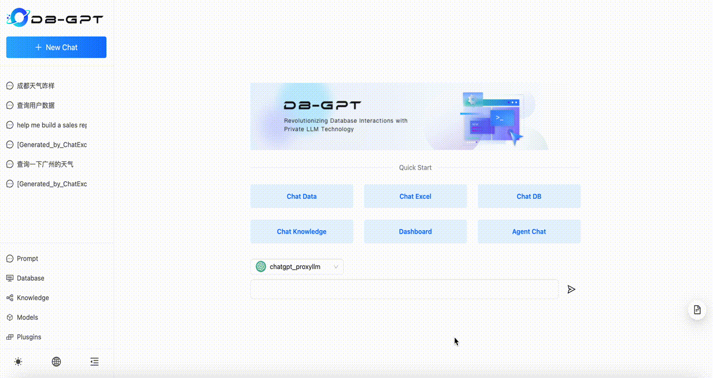
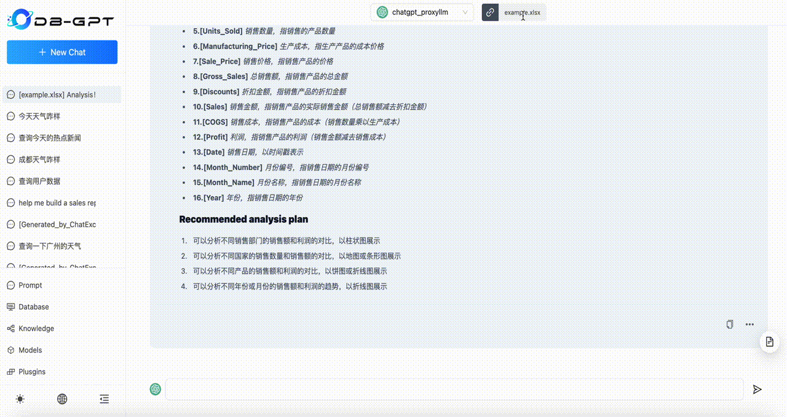
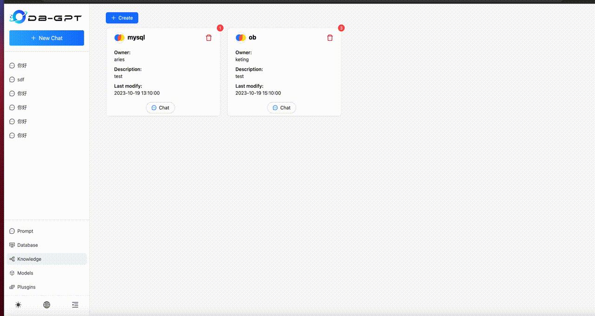
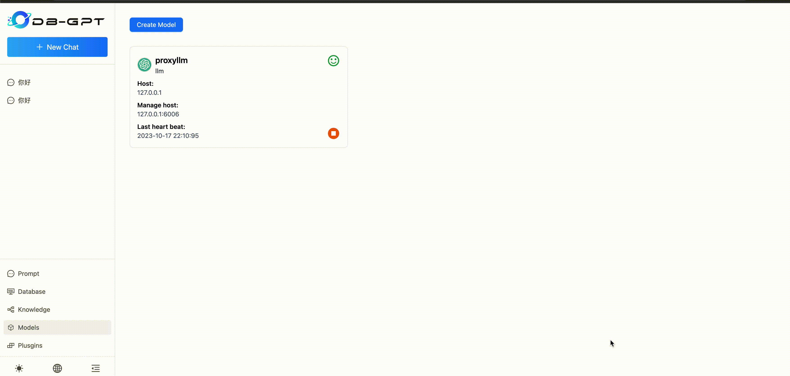

<h1 align="center">
  <a href="https://dbgpt.site"></a>
  <br>
  DB-GPT-Web
</h1>

_<p align="center">DB-GPT Chat UI, LLM to Vision.</p>_

<p align="center">
  <a href="https://github.com/eosphoros-ai/DB-GPT-Web/blob/main/LICENSE">
    
  </a>
  <a href="https://github.com/eosphoros-ai/DB-GPT/releases">
    
  </a>
  <a href="https://github.com/eosphoros-ai/DB-GPT-Web/issues">
    
  </a>
  <a href="https://discord.gg/7uQnPuveTY">
    
  </a>
</p>

---

## 👋 Introduction

***DB-GPT-Web*** is an **Open source chat UI** for [**DB-GPT**](https://github.com/eosphoros-ai/DB-GPT).
Also, it is a **LLM to Vision** solution. 

[DB-GPT-Web](https://dbgpt.site) is an Open source Tailwind and Next.js based chat UI for AI and GPT projects. It beautify a lot of markdown labels, such as `table`, `thead`, `th`, `td`, `code`, `h1`, `h2`, `ul`, `li`, `a`, `img`. Also it define some custom labels to adapted to AI-specific scenarios. Such as `plugin running`, `knowledge name`, `Chart view`, and so on.

## 💪🏻 Getting Started

### Prerequisites

- [Node.js](https://nodejs.org/) >= 16
- [npm](https://npmjs.com/) >= 8
- Supported OSes: Linux, macOS and Windows

### Installation

```sh
# Install dependencies
npm install
```

### Usage
```sh
cp .env.example .env
```
edit the `API_BASE_URL` to the real address

```sh
# development model
npm run dev
```

## 🚀 Use In DB-GPT

```sh
npm run compile

# copy compile file to DB-GPT static file dictory
cp -r -f /Db-GPT-Web/out/* /DB-GPT/pilot/server/static/

```

## 📚 Documentation

For full documentation, visit [document](https://db-gpt.readthedocs.io/en/latest/index.html).

## 📺 Screenshots
Run on an RTX 4090 GPU.

#### Agent

#### ChatExcel

#### Knowledge

#### Models

#### FastChat

#### vllm


## Usage

  [react-markdown](https://github.com/remarkjs/react-markdown#readme) for markdown support.
  [ant-design](https://github.com/ant-design/ant-design) for ui components.
  [next.js](https://github.com/vercel/next.js) for server side rendering.
  [@antv/g2](https://github.com/antvis/g2#readme) for charts.

## License

DB-GPT-Web is licensed under the [MIT License](LICENSE).

---

Enjoy using DB-GPT-Web to build stunning UIs for your AI and GPT projects.

🌟 If you find it helpful, don't forget to give it a star on GitHub! Stars are like little virtual hugs that keep us going! We appreciate every single one we receive.

For any queries or issues, feel free to open an [issue](https://github.com/eosphoros-ai/DB-GPT-Web/issues) on the repository.

Happy coding! 😊